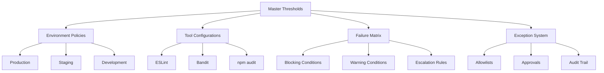
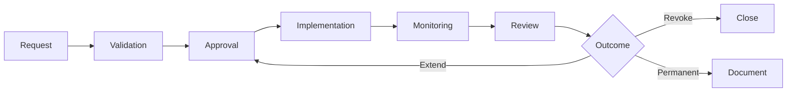

# aclue Platform Security Thresholds Documentation

## Executive Summary

This document provides comprehensive documentation for the aclue platform's security threshold configuration system. The system defines precise security limits, failure conditions, and automated responses that balance security rigour with development velocity.

**Current Security Score**: 89/100
**Deployment Frequency**: Multiple per day
**Risk Tolerance**: Low (Enterprise-grade requirements)

---

## Table of Contents

1. [Overview](#overview)
2. [Architecture](#architecture)
3. [Threshold Categories](#threshold-categories)
4. [Environment Policies](#environment-policies)
5. [Failure Conditions](#failure-conditions)
6. [Exception Management](#exception-management)
7. [Implementation Guide](#implementation-guide)
8. [Monitoring and Alerting](#monitoring-and-alerting)
9. [Maintenance Procedures](#maintenance-procedures)
10. [Quick Reference](#quick-reference)

---

## Overview

### Purpose

The security threshold system provides:
- **Automated enforcement** of security standards across all environments
- **Graduated responses** based on severity and environment
- **Clear escalation paths** for security events
- **Audit trails** for compliance and governance
- **Balance** between security and development velocity

### Key Principles

1. **Zero-tolerance in production** - Critical vulnerabilities always block deployment
2. **Education in development** - Focus on learning and improvement
3. **Automated remediation** - Where safe and appropriate
4. **Time-bounded exceptions** - All exceptions must expire
5. **Continuous improvement** - Regular threshold review and adjustment

### System Components

```
ci-cd/security/
├── thresholds/
│   └── security-thresholds-master.yml    # Master threshold configuration
├── policies/
│   ├── production.yml                     # Production environment policy
│   ├── staging.yml                        # Staging environment policy
│   └── development.yml                    # Development environment policy
├── tool-configs/
│   └── eslint-security-config.yml        # ESLint security configuration
├── failure-conditions/
│   └── failure-matrix.yml                # Failure condition matrix
├── exceptions/
│   └── exception-management.yml          # Exception management system
└── monitoring-alerting-config.yml        # Monitoring configuration
```

---

## Architecture

### Configuration Hierarchy



### Integration Points

1. **CI/CD Pipeline**: GitHub Actions workflows
2. **Pre-commit Hooks**: Local developer validation
3. **IDE Extensions**: Real-time security feedback
4. **Monitoring Systems**: PostHog, custom dashboards
5. **Alerting Channels**: Slack, PagerDuty, email

---

## Threshold Categories

### A. Vulnerability Thresholds (CVSS-based)

| Severity | CVSS Range | Production | Staging | Development | Feature Branches |
|----------|------------|------------|---------|-------------|------------------|
| Critical | 9.0-10.0   | 0          | 0       | 0           | 1                |
| High     | 7.0-8.9    | 0          | 1       | 3           | 5                |
| Medium   | 4.0-6.9    | 2          | 5       | 10          | 20               |
| Low      | 0.1-3.9    | 10         | 20      | 50          | 100              |

#### Age-based Escalation

- **Critical**: Immediate action required
- **High**: 7-day grace period, escalates to critical after 14 days
- **Medium**: 30-day grace period, escalates to high after 60 days
- **Low**: 90-day grace period, escalates to medium after 180 days

### B. Secret Detection Thresholds

| Confidence Level | Production | Staging | Development | Action |
|-----------------|------------|---------|-------------|---------|
| Confirmed       | 0          | 0       | 0           | Block + Rotate |
| High            | 0          | 0       | 0           | Block + Review |
| Medium          | 0          | 1       | 2           | Manual Review |
| Low             | 0          | 5       | 10          | Log + Batch Review |

### C. Dependency Vulnerabilities

#### Direct Dependencies
- **Critical**: 0 tolerance across all environments
- **High**: 0 in production, 1 in staging, 2 in development
- **Update SLA**: Critical = immediate, High = 24 hours, Medium = 7 days

#### Transitive Dependencies
- **More relaxed thresholds** due to indirect control
- **Monitoring for upstream fixes** required
- **Monthly review cycles** for medium/low severity

### D. Container Security

| Check Type | Production | Staging | Development |
|-----------|------------|---------|-------------|
| Critical OS vulns | 0 | 0 | 0 |
| High OS vulns | 2 | 5 | 10 |
| Unsigned images | Not allowed | Allowed | Allowed |
| Latest tags | Not allowed | Allowed | Allowed |
| Max image age | 30 days | 30 days | No limit |

---

## Environment Policies

### Production (Zero-Tolerance)

```yaml
Key Requirements:
- Zero critical/high vulnerabilities
- All changes require security approval
- Automatic rollback on degradation
- MFA required for all access
- Full audit logging enabled
- 99.99% uptime requirement
```

**Special Features**:
- War room activation for incidents
- Executive notification for critical events
- Regulatory compliance mandatory
- No exceptions without executive approval

### Staging (Balanced)

```yaml
Key Requirements:
- 1 high vulnerability allowed with review
- Security review required (not approval)
- Testing exceptions allowed (7-day max)
- Enhanced monitoring enabled
- Weekly security reviews
```

**Special Features**:
- Security testing allowed
- Penetration testing permitted
- Beta packages allowed
- Self-service exceptions available

### Development (Educational)

```yaml
Key Requirements:
- Focus on education over enforcement
- Gamification of security compliance
- High vulnerability tolerance
- Self-service everything
- Learning metrics tracked
```

**Special Features**:
- Security sandbox environment
- Capture-the-flag exercises
- Achievement badges system
- Pair programming for security

---

## Failure Conditions

### Deployment Blocking Matrix

| Condition | Production | Staging | Development | Override |
|-----------|------------|---------|-------------|----------|
| Confirmed secrets | Block | Block | Block | Not allowed |
| Critical vuln | Block | Block | Warn | Executive only |
| Malware detected | Block | Block | Block | Not allowed |
| Compliance violation | Block | Warn | Log | Legal required |
| Unsigned code | Block | Warn | Allow | Security required |

### Escalation Procedures

#### Critical Issues (P0)
1. **0-15 min**: On-call security engineer
2. **15-30 min**: Security lead
3. **30-60 min**: Engineering manager
4. **60+ min**: CTO/Executive team

#### High Issues (P1)
1. **0-60 min**: Security team
2. **2-4 hours**: Tech lead
3. **4+ hours**: Engineering manager

### Rollback Triggers

**Automatic Rollback**:
- New critical vulnerability detected
- Authentication failures > 100 in 5 minutes
- Data exposure detected
- Error rate spike > 10%
- Availability < 99%

**Manual Rollback**:
- Requires approval from tech lead (production)
- Self-service in development
- Full documentation required

---

## Exception Management

### Exception Workflow



### Approval Matrix

| Severity | Approvers | Min Approvals | Max Duration | Review Frequency |
|----------|-----------|---------------|--------------|------------------|
| Critical | CTO, Security Lead | 2 | 30 days | Weekly |
| High | Security Lead, Tech Lead | 2 | 90 days | Biweekly |
| Medium | Tech Lead | 1 | 180 days | Monthly |
| Low | Senior Dev | 1 | 365 days | Quarterly |

### Common Exception Templates

1. **Legacy Dependency**: For systems that cannot be upgraded
2. **POC Testing**: Time-limited testing exceptions
3. **Third-party Requirements**: Vendor-imposed constraints
4. **False Positives**: Confirmed incorrect detections

### Exception Lifecycle

1. **Request**: Submit with justification and compensating controls
2. **Approval**: Route to appropriate approvers
3. **Implementation**: Update allowlists and configurations
4. **Monitoring**: Track usage and effectiveness
5. **Review**: Regular review based on severity
6. **Expiry**: Automatic expiry and cleanup

---

## Implementation Guide

### 1. Initial Setup

```bash
# Clone the security configurations
cd /path/to/aclue-preprod
cp -r ci-cd/security /your/project/

# Install security tools
npm install --save-dev eslint-plugin-security eslint-plugin-no-secrets
pip install bandit safety detect-secrets

# Initialise baselines
detect-secrets scan --baseline .secrets.baseline
```

### 2. GitHub Actions Integration

```yaml
# .github/workflows/security.yml
- name: Load Security Thresholds
  run: |
    echo "Loading security thresholds..."
    export SECURITY_CONFIG=ci-cd/security/thresholds/security-thresholds-master.yml

- name: Determine Environment
  run: |
    if [[ "${{ github.ref }}" == "refs/heads/main" ]]; then
      export ENV_POLICY=ci-cd/security/policies/production.yml
    elif [[ "${{ github.ref }}" == "refs/heads/staging" ]]; then
      export ENV_POLICY=ci-cd/security/policies/staging.yml
    else
      export ENV_POLICY=ci-cd/security/policies/development.yml
    fi
```

### 3. Threshold Validation Script

```python
#!/usr/bin/env python3
"""
Validate security scan results against thresholds
"""

import yaml
import json
import sys

def load_thresholds(env):
    with open(f'ci-cd/security/policies/{env}.yml') as f:
        return yaml.safe_load(f)

def check_vulnerabilities(scan_results, thresholds):
    failures = []

    for severity in ['critical', 'high', 'medium', 'low']:
        count = scan_results.get(severity, 0)
        max_allowed = thresholds['vulnerabilities'][severity]['max_allowed']

        if count > max_allowed:
            failures.append({
                'severity': severity,
                'count': count,
                'threshold': max_allowed,
                'action': thresholds['vulnerabilities'][severity]['action']
            })

    return failures

def main():
    env = sys.argv[1] if len(sys.argv) > 1 else 'development'

    # Load configurations
    thresholds = load_thresholds(env)

    # Load scan results
    with open('security-results.json') as f:
        scan_results = json.load(f)

    # Check thresholds
    failures = check_vulnerabilities(scan_results, thresholds)

    if failures:
        print(f"Security threshold violations detected:")
        for failure in failures:
            print(f"  - {failure['severity']}: {failure['count']} found, max {failure['threshold']}")

        # Determine exit code based on action
        if any(f['action'] == 'block' for f in failures):
            sys.exit(1)

    print("All security thresholds passed!")
    sys.exit(0)

if __name__ == '__main__':
    main()
```

### 4. Pre-commit Hook Integration

```yaml
# .pre-commit-config.yaml addition
- repo: local
  hooks:
    - id: security-thresholds
      name: Check Security Thresholds
      entry: python scripts/check-thresholds.py
      language: python
      files: .*
      pass_filenames: false
```

---

## Monitoring and Alerting

### Alert Priority Matrix

| Priority | Response Time | Channels | Escalation |
|----------|--------------|----------|------------|
| P0 Critical | 5 min | PagerDuty, Phone, Slack | Automatic after 15 min |
| P1 High | 30 min | Slack, Email | After 2 hours |
| P2 Medium | 4 hours | Email, Ticket | After 24 hours |
| P3 Low | 24 hours | Dashboard | Weekly review |

### Dashboard URLs

- **Security Dashboard**: https://monitoring.aclue.app/security
- **Executive Dashboard**: https://monitoring.aclue.app/executive
- **Operations Dashboard**: https://monitoring.aclue.app/ops

### Key Metrics Tracked

1. **Security Score**: Weighted average of all security metrics
2. **MTTD**: Mean Time To Detect (target < 5 minutes)
3. **MTTR**: Mean Time To Respond (target < 30 minutes)
4. **Exception Count**: Active exceptions by severity
5. **Vulnerability Trend**: Week-over-week comparison

---

## Maintenance Procedures

### Monthly Review Process

1. **Week 1**: Review exception list and expiries
2. **Week 2**: Analyse vulnerability trends
3. **Week 3**: Update thresholds based on metrics
4. **Week 4**: Security training and updates

### Threshold Adjustment Criteria

**When to tighten thresholds**:
- Security score consistently > 95
- No violations for 30 days
- Team skill improvement demonstrated

**When to relax thresholds**:
- Blocking legitimate development
- False positive rate > 10%
- Business requirement changes

### Documentation Updates

- **Configuration changes**: Document in git commit
- **Exception approvals**: Store in exception-log/
- **Threshold adjustments**: Update this README
- **Incident learnings**: Add to runbooks/

---

## Quick Reference

### Common Commands

```bash
# Check current security score
./scripts/security-score.sh

# Validate against production thresholds
./scripts/validate-thresholds.sh production

# Request exception
./scripts/request-exception.sh --severity high --duration 30

# View active exceptions
./scripts/list-exceptions.sh --active

# Emergency override (production)
./scripts/emergency-override.sh --ticket INC-12345
```

### Environment Variables

```bash
# Required for threshold validation
export SECURITY_ENV=production|staging|development
export SECURITY_CONFIG_PATH=/path/to/ci-cd/security
export THRESHOLD_ENFORCEMENT=strict|balanced|educational

# For alerting
export SLACK_WEBHOOK_URL=https://hooks.slack.com/...
export PAGERDUTY_API_KEY=...
```

### Useful Links

- [OWASP Top 10](https://owasp.org/www-project-top-ten/)
- [CWE Top 25](https://cwe.mitre.org/top25/)
- [CVSS Calculator](https://www.first.org/cvss/calculator/3.1)
- [Security Runbooks](./runbooks/)
- [Exception Request Form](https://forms.aclue.app/security-exception)

---

## Contact and Support

### Security Team

- **Email**: security@aclue.app
- **Slack**: #security-team
- **On-call**: Via PagerDuty

### Escalation

1. **Security Issues**: security@aclue.app
2. **Urgent/Critical**: security-oncall@aclue.app
3. **Compliance**: compliance@aclue.app
4. **Executive**: cto@aclue.app

---

## Appendices

### A. Security Score Calculation

```
Security Score = (
    Vulnerability Score × 0.30 +
    Compliance Score × 0.25 +
    Configuration Score × 0.25 +
    Incident Score × 0.20
)

Where:
- Vulnerability Score = 100 - (critical×10 + high×5 + medium×2 + low×0.5)
- Compliance Score = (passed_policies / total_policies) × 100
- Configuration Score = (secure_configs / total_configs) × 100
- Incident Score = 100 - (incidents_this_month × 5)
```

### B. Compliance Mapping

| Requirement | Implementation |
|------------|---------------|
| OWASP Top 10 | All rules configured in ESLint/Bandit |
| CWE Top 25 | Semgrep patterns enabled |
| PCI DSS | Encryption, access control, monitoring |
| GDPR | Data classification, retention, audit |
| ISO 27001 | Risk assessment, security review, training |

### C. Tool Versions

```yaml
Tools:
  ESLint: 8.56.0
  Bandit: 1.8.6
  Semgrep: 1.45.0
  GitLeaks: 8.21.2
  Detect-Secrets: 1.5.0
  Trivy: 0.46.0
  Safety: 3.0.1
```

---

**Last Updated**: September 2025
**Version**: 1.0.0
**Next Review**: October 2025