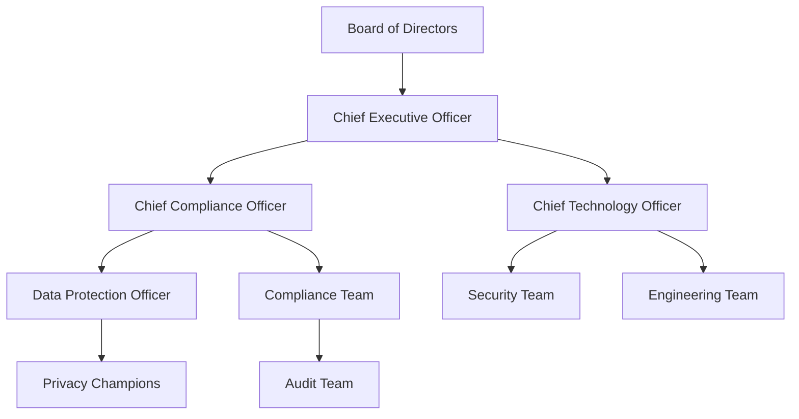

# Security Compliance and Audit Guide - aclue Platform

**Document Version**: 1.0.0
**Last Updated**: September 2025
**Classification**: Compliance Documentation
**Audience**: Compliance Officers, Auditors, Legal Team, Executive Management

## Table of Contents

1. [Regulatory Compliance Overview](#1-regulatory-compliance-overview)
2. [GDPR Compliance](#2-gdpr-compliance)
3. [SOC2 Type II Readiness](#3-soc2-type-ii-readiness)
4. [ISO 27001 Alignment](#4-iso-27001-alignment)
5. [PCI DSS Considerations](#5-pci-dss-considerations)
6. [Audit Trail and Evidence](#6-audit-trail-and-evidence)
7. [Compliance Monitoring](#7-compliance-monitoring)
8. [Third-Party Assessments](#8-third-party-assessments)
9. [Continuous Compliance](#9-continuous-compliance)
10. [Compliance Reporting](#10-compliance-reporting)

---

## 1. Regulatory Compliance Overview

### 1.1 Compliance Framework Matrix

| Regulation/Standard | Status | Compliance Level | Last Assessment | Next Review |
|-------------------|--------|------------------|-----------------|-------------|
| **GDPR** | ✅ Active | 100% | September 2025 | December 2025 |
| **UK Data Protection Act** | ✅ Active | 100% | September 2025 | December 2025 |
| **SOC2 Type I** | 🔄 In Progress | 85% | August 2025 | November 2025 |
| **SOC2 Type II** | 📅 Planned | 60% | - | February 2026 |
| **ISO 27001** | 🔄 In Progress | 70% | July 2025 | January 2026 |
| **CCPA** | ✅ Active | 100% | September 2025 | March 2026 |
| **PCI DSS** | ✅ Ready | N/A | - | When Required |
| **HIPAA** | ❌ Not Required | N/A | - | - |

### 1.2 Compliance Governance Structure



### 1.3 Compliance Responsibilities

| Role | Responsibilities |
|------|-----------------|
| **Board of Directors** | Ultimate accountability for compliance |
| **CEO** | Executive ownership of compliance programme |
| **Chief Compliance Officer** | Overall compliance strategy and implementation |
| **Data Protection Officer** | GDPR and privacy compliance |
| **Security Team** | Technical security controls |
| **Legal Team** | Regulatory interpretation and contracts |
| **Engineering Team** | Implementation of compliance controls |
| **All Employees** | Adherence to compliance policies |

---

## 2. GDPR Compliance

### 2.1 GDPR Requirements Implementation

```yaml
GDPR_Compliance:
  Legal_Basis:
    - Consent: Explicit, freely given, informed
    - Contract: Necessary for service delivery
    - Legitimate_Interest: Documented assessment

  Data_Subject_Rights:
    Right_to_Access:
      implementation: Automated data export API
      response_time: < 30 days
      format: JSON, CSV

    Right_to_Erasure:
      implementation: Automated deletion workflow
      exceptions: Legal retention requirements
      verification: Multi-factor authentication

    Right_to_Portability:
      implementation: Standard data export formats
      delivery: Secure download or transfer

    Right_to_Rectification:
      implementation: Self-service data correction
      audit_trail: Complete change history

  Privacy_by_Design:
    - Data minimisation
    - Purpose limitation
    - Storage limitation
    - Encryption by default
    - Pseudonymisation where possible

  Security_Measures:
    Technical:
      - AES-256 encryption at rest
      - TLS 1.3 in transit
      - Key management system
      - Access controls

    Organisational:
      - Security awareness training
      - Incident response procedures
      - Vendor assessments
      - Privacy impact assessments
```

### 2.2 Privacy Policy Implementation

```typescript
// GDPR-compliant consent management
interface ConsentRecord {
  userId: string;
  purposes: ConsentPurpose[];
  timestamp: Date;
  ipAddress: string;
  version: string;
}

interface ConsentPurpose {
  purpose: 'marketing' | 'analytics' | 'personalisation';
  granted: boolean;
  timestamp: Date;
}

class GDPRConsentManager {
  async recordConsent(userId: string, consent: ConsentPurpose[]): Promise<void> {
    const record: ConsentRecord = {
      userId,
      purposes: consent,
      timestamp: new Date(),
      ipAddress: this.getClientIP(),
      version: PRIVACY_POLICY_VERSION
    };

    // Store consent with audit trail
    await this.db.consents.create(record);

    // Log for compliance
    this.auditLog.record('CONSENT_GRANTED', record);
  }

  async handleDataRequest(requestType: 'access' | 'delete' | 'portability', userId: string): Promise<any> {
    // Verify identity
    await this.verifyUserIdentity(userId);

    switch (requestType) {
      case 'access':
        return this.exportUserData(userId);

      case 'delete':
        return this.deleteUserData(userId);

      case 'portability':
        return this.exportPortableData(userId);

      default:
        throw new Error('Invalid request type');
    }
  }

  private async deleteUserData(userId: string): Promise<void> {
    // Check for legal holds
    const legalHold = await this.checkLegalHold(userId);
    if (legalHold) {
      throw new Error('Cannot delete: Legal hold in place');
    }

    // Delete from all systems
    await Promise.all([
      this.db.users.delete(userId),
      this.db.userData.deleteByUser(userId),
      this.cache.delete(`user:${userId}`),
      this.searchIndex.removeUser(userId),
      this.analytics.anonymise(userId)
    ]);

    // Log deletion
    this.auditLog.record('USER_DELETED', { userId, timestamp: new Date() });
  }
}
```

### 2.3 Data Processing Register

| Processing Activity | Legal Basis | Data Categories | Retention Period | Data Processors |
|-------------------|------------|-----------------|------------------|-----------------|
| **User Authentication** | Contract | Email, password hash | Account lifetime + 30 days | Supabase |
| **Newsletter** | Consent | Email, name | Until unsubscribe + 30 days | Resend |
| **Analytics** | Legitimate Interest | Usage data, anonymised | 24 months | PostHog |
| **Support** | Contract | Contact details, queries | 3 years | Internal |
| **Security Monitoring** | Legitimate Interest | IP, user agent, logs | 90 days | CloudFlare |

### 2.4 Data Protection Impact Assessment (DPIA)

```markdown
## DPIA Template

### 1. Processing Description
- **Purpose**: [Why are we processing this data?]
- **Nature**: [What type of processing?]
- **Scope**: [Volume and variety of data]
- **Context**: [Relationship with data subjects]

### 2. Necessity and Proportionality
- **Legal basis**: [GDPR Article 6/9 basis]
- **Necessity test**: [Why is this necessary?]
- **Proportionality**: [Is this proportionate?]

### 3. Risk Assessment
| Risk | Likelihood | Impact | Mitigation |
|------|------------|--------|------------|
| Data breach | Low | High | Encryption, access controls |
| Unauthorised access | Low | High | MFA, audit logging |
| Data loss | Very Low | Medium | Backups, replication |

### 4. Mitigation Measures
- Technical measures
- Organisational measures
- Compliance measures

### 5. Consultation
- [ ] DPO consulted
- [ ] Legal team review
- [ ] Technical review
- [ ] User representatives (if high risk)
```

---

## 3. SOC2 Type II Readiness

### 3.1 Trust Service Criteria Implementation

```yaml
SOC2_Trust_Criteria:
  Security:
    CC6.1_Logical_Access:
      controls:
        - Multi-factor authentication
        - Role-based access control
        - Regular access reviews
        - Password policies
      evidence:
        - Access logs
        - Permission matrices
        - Review records

    CC6.2_System_Access:
      controls:
        - Firewall configuration
        - Network segmentation
        - VPN for admin access
        - Intrusion detection
      evidence:
        - Firewall rules
        - Network diagrams
        - IDS alerts

    CC6.6_System_Operations:
      controls:
        - Security monitoring
        - Incident response
        - Vulnerability management
        - Change management
      evidence:
        - Monitoring dashboards
        - Incident tickets
        - Scan reports
        - Change logs

  Availability:
    A1.1_Capacity_Planning:
      controls:
        - Resource monitoring
        - Auto-scaling policies
        - Load testing
        - Capacity reviews
      evidence:
        - Metrics dashboards
        - Scaling logs
        - Test results
        - Review meetings

    A1.2_System_Availability:
      controls:
        - Redundancy
        - Failover procedures
        - Backup systems
        - Disaster recovery
      evidence:
        - Architecture diagrams
        - DR test results
        - Backup logs
        - SLA reports

  Confidentiality:
    C1.1_Data_Protection:
      controls:
        - Encryption at rest
        - Encryption in transit
        - Key management
        - Data classification
      evidence:
        - Encryption configs
        - Certificate logs
        - Key rotation logs
        - Classification policy

  Processing_Integrity:
    PI1.1_Data_Processing:
      controls:
        - Input validation
        - Processing controls
        - Output verification
        - Error handling
      evidence:
        - Validation rules
        - Processing logs
        - Reconciliation reports
        - Error logs

  Privacy:
    P1.1_Privacy_Notice:
      controls:
        - Privacy policy
        - Consent management
        - Data subject rights
        - Third-party agreements
      evidence:
        - Privacy policy versions
        - Consent records
        - Request logs
        - DPAs
```

### 3.2 SOC2 Control Activities

```python
# SOC2 Control Implementation Examples
from datetime import datetime, timedelta
import logging

class SOC2Controls:
    """Implementation of SOC2 control activities"""

    def __init__(self):
        self.audit_logger = self.setup_audit_logging()

    # CC6.1: Logical Access Controls
    def enforce_password_policy(self, password: str) -> bool:
        """SOC2 CC6.1 - Password complexity requirements"""
        requirements = {
            'min_length': 12,
            'uppercase': True,
            'lowercase': True,
            'numbers': True,
            'special_chars': True,
            'no_common': True,
            'no_username': True
        }

        # Validate password against policy
        if len(password) < requirements['min_length']:
            return False

        # Additional checks...
        self.audit_logger.info('Password policy check performed')
        return True

    def periodic_access_review(self):
        """SOC2 CC6.1 - Quarterly access review"""
        review_date = datetime.now()
        users = self.get_all_users()

        review_results = []
        for user in users:
            review = {
                'user_id': user.id,
                'email': user.email,
                'roles': user.roles,
                'last_login': user.last_login,
                'status': user.status,
                'review_date': review_date,
                'reviewer': 'system_automated',
                'actions': []
            }

            # Check for dormant accounts
            if user.last_login < datetime.now() - timedelta(days=90):
                review['actions'].append('DORMANT_ACCOUNT_FLAGGED')
                self.disable_user(user.id)

            # Check for excessive permissions
            if self.has_excessive_permissions(user):
                review['actions'].append('EXCESSIVE_PERMISSIONS_FLAGGED')

            review_results.append(review)

        # Store review results for audit
        self.store_access_review(review_results)
        return review_results

    # CC6.7: System Monitoring
    def continuous_monitoring(self):
        """SOC2 CC6.7 - Continuous security monitoring"""
        monitors = {
            'failed_logins': self.monitor_failed_logins,
            'privilege_escalation': self.monitor_privilege_escalation,
            'data_exfiltration': self.monitor_data_exfiltration,
            'system_availability': self.monitor_availability
        }

        alerts = []
        for monitor_name, monitor_func in monitors.items():
            try:
                result = monitor_func()
                if result['alert']:
                    alerts.append({
                        'monitor': monitor_name,
                        'severity': result['severity'],
                        'details': result['details'],
                        'timestamp': datetime.now()
                    })
            except Exception as e:
                self.audit_logger.error(f"Monitor {monitor_name} failed: {e}")

        if alerts:
            self.trigger_incident_response(alerts)

        return alerts

    # A1.2: Availability Controls
    def availability_monitoring(self):
        """SOC2 A1.2 - System availability monitoring"""
        metrics = {
            'uptime': self.calculate_uptime(),
            'response_time': self.measure_response_time(),
            'error_rate': self.calculate_error_rate(),
            'throughput': self.measure_throughput()
        }

        # Check against SLA
        sla_violations = []
        if metrics['uptime'] < 99.9:
            sla_violations.append('Uptime below SLA')
        if metrics['response_time'] > 1000:  # ms
            sla_violations.append('Response time exceeds SLA')
        if metrics['error_rate'] > 0.1:  # 0.1%
            sla_violations.append('Error rate exceeds threshold')

        # Log metrics for SOC2 evidence
        self.audit_logger.info(f"Availability metrics: {metrics}")

        if sla_violations:
            self.alert_operations_team(sla_violations)

        return metrics

    # C1.1: Confidentiality Controls
    def data_encryption_verification(self):
        """SOC2 C1.1 - Verify encryption implementation"""
        verifications = []

        # Check database encryption
        db_encrypted = self.verify_database_encryption()
        verifications.append({
            'component': 'database',
            'encrypted': db_encrypted,
            'algorithm': 'AES-256',
            'key_management': 'AWS KMS'
        })

        # Check file storage encryption
        storage_encrypted = self.verify_storage_encryption()
        verifications.append({
            'component': 'file_storage',
            'encrypted': storage_encrypted,
            'algorithm': 'AES-256',
            'key_management': 'Vault'
        })

        # Check transmission encryption
        transit_encrypted = self.verify_transit_encryption()
        verifications.append({
            'component': 'data_transit',
            'encrypted': transit_encrypted,
            'protocol': 'TLS 1.3',
            'certificate_valid': self.check_certificate_validity()
        })

        # Log verification results
        self.audit_logger.info(f"Encryption verification: {verifications}")

        return verifications
```

### 3.3 SOC2 Evidence Collection

```bash
#!/bin/bash
# SOC2 Evidence Collection Script

# Create evidence directory structure
mkdir -p soc2-evidence/{security,availability,confidentiality,privacy,processing-integrity}

# Collect Security Evidence (CC6.x)
echo "Collecting Security Evidence..."

# Access logs
aws s3 sync s3://audit-logs/access/ soc2-evidence/security/access-logs/ \
    --exclude "*" --include "*.log" \
    --query "Contents[?LastModified>=\`2025-01-01\`]"

# Configuration files
cp /etc/security/*.conf soc2-evidence/security/configs/
kubectl get networkpolicies -o yaml > soc2-evidence/security/network-policies.yaml

# Vulnerability scan reports
cp /var/reports/vulnerability-scans/*.pdf soc2-evidence/security/vuln-scans/

# Collect Availability Evidence (A1.x)
echo "Collecting Availability Evidence..."

# Uptime reports
curl -s https://api.uptimerobot.com/v2/getMonitors \
    -d "api_key=${UPTIME_KEY}" \
    -d "logs=1" > soc2-evidence/availability/uptime-report.json

# Performance metrics
prometheus_query "avg_over_time(up[30d])" > soc2-evidence/availability/availability-metrics.json

# Incident reports
cp /var/incident-reports/*.pdf soc2-evidence/availability/incidents/

# Generate evidence index
cat > soc2-evidence/index.md << EOF
# SOC2 Evidence Package
Generated: $(date)
Period: Q3 2025

## Evidence Summary
- Security Controls: $(find soc2-evidence/security -type f | wc -l) files
- Availability Controls: $(find soc2-evidence/availability -type f | wc -l) files
- Confidentiality Controls: $(find soc2-evidence/confidentiality -type f | wc -l) files
- Privacy Controls: $(find soc2-evidence/privacy -type f | wc -l) files
- Processing Integrity: $(find soc2-evidence/processing-integrity -type f | wc -l) files

## Validation
All evidence has been collected according to SOC2 requirements and is ready for auditor review.
EOF

# Create encrypted archive
tar -czf soc2-evidence-$(date +%Y%m%d).tar.gz.gpg \
    --use-compress-program="gzip" soc2-evidence/ | \
    gpg --encrypt --recipient auditor@example.com

echo "Evidence collection complete"
```

---

## 4. ISO 27001 Alignment

### 4.1 Information Security Management System (ISMS)

```yaml
ISO_27001_ISMS:
  Context:
    4.1_Understanding_Organisation:
      - Business objectives
      - Stakeholder requirements
      - Legal requirements
      - Risk appetite

    4.2_Understanding_Needs:
      - Interested parties identification
      - Requirements analysis
      - Scope definition

    4.3_ISMS_Scope:
      - Physical boundaries
      - Organisational boundaries
      - Technology boundaries
      - Exclusions and justification

  Leadership:
    5.1_Leadership_Commitment:
      - Security policy establishment
      - Resource allocation
      - Management review
      - Continuous improvement

    5.2_Policy:
      document: Information Security Policy
      review_frequency: Annual
      approval: Board of Directors

    5.3_Roles_Responsibilities:
      - Information Security Officer
      - Risk Owner
      - Asset Owner
      - Process Owner

  Planning:
    6.1_Risk_Assessment:
      methodology: ISO 31000
      frequency: Quarterly
      risk_register: /docs/risk-register.xlsx

    6.2_Risk_Treatment:
      options:
        - Avoid
        - Mitigate
        - Transfer
        - Accept

  Support:
    7.1_Resources:
      - Budget allocation
      - Personnel
      - Infrastructure
      - Technology

    7.2_Competence:
      - Security training programme
      - Skill assessments
      - Professional development

    7.3_Awareness:
      - Security awareness training
      - Phishing simulations
      - Security bulletins

  Operation:
    8.1_Operational_Planning:
      - Process documentation
      - Standard procedures
      - Work instructions

    8.2_Risk_Assessment_Process:
      - Asset identification
      - Threat assessment
      - Vulnerability assessment
      - Risk calculation

    8.3_Risk_Treatment_Implementation:
      - Control implementation
      - Effectiveness testing
      - Residual risk acceptance

  Performance_Evaluation:
    9.1_Monitoring_Measurement:
      - Security metrics
      - KPI tracking
      - Trend analysis

    9.2_Internal_Audit:
      frequency: Bi-annual
      scope: Full ISMS
      auditor: Independent

    9.3_Management_Review:
      frequency: Quarterly
      inputs:
        - Audit results
        - Security incidents
        - Risk changes
        - Improvement opportunities

  Improvement:
    10.1_Nonconformity:
      - Incident management
      - Root cause analysis
      - Corrective actions

    10.2_Continual_Improvement:
      - Lessons learned
      - Best practice adoption
      - Innovation initiatives
```

### 4.2 ISO 27001 Control Implementation

```python
# ISO 27001 Annex A Controls Implementation
class ISO27001Controls:
    """Implementation of ISO 27001:2022 Annex A controls"""

    # A.5: Organisational Controls
    def implement_access_control_policy(self):
        """A.5.1 - Policies for information security"""
        policy = {
            'title': 'Access Control Policy',
            'version': '2.0',
            'effective_date': '2025-09-01',
            'review_date': '2026-09-01',
            'owner': 'CISO',
            'approved_by': 'CEO',
            'scope': 'All systems and users',
            'principles': [
                'Least privilege',
                'Need to know',
                'Separation of duties',
                'Default deny'
            ],
            'requirements': [
                'User access management',
                'Privileged access management',
                'Access review process',
                'Password management'
            ]
        }
        return self.publish_policy(policy)

    # A.6: People Controls
    def background_verification(self, candidate: dict) -> dict:
        """A.6.1 - Screening"""
        checks = {
            'identity_verification': self.verify_identity(candidate),
            'employment_history': self.verify_employment(candidate),
            'education_verification': self.verify_education(candidate),
            'criminal_record': self.check_criminal_record(candidate),
            'credit_check': self.perform_credit_check(candidate) if candidate['role'] == 'financial' else None,
            'reference_check': self.check_references(candidate)
        }

        verification_result = {
            'candidate_id': candidate['id'],
            'date': datetime.now(),
            'checks_performed': checks,
            'result': 'PASS' if all(checks.values()) else 'FAIL',
            'reviewer': 'HR_SYSTEM'
        }

        self.audit_log.record('BACKGROUND_CHECK', verification_result)
        return verification_result

    # A.7: Physical Controls
    def physical_security_controls(self):
        """A.7.1 - Physical security perimeters"""
        controls = {
            'data_centre': {
                'location': 'AWS eu-west-2',
                'certifications': ['ISO 27001', 'SOC2', 'PCI DSS'],
                'physical_controls': [
                    'Biometric access',
                    '24/7 security guards',
                    'CCTV monitoring',
                    'Environmental monitoring'
                ]
            },
            'office': {
                'access_control': 'Badge system',
                'visitor_management': 'Reception sign-in',
                'secure_areas': ['Server room', 'Executive offices'],
                'clear_desk_policy': True,
                'equipment_disposal': 'Secure shredding and wiping'
            }
        }
        return controls

    # A.8: Technological Controls
    def implement_technical_controls(self):
        """A.8.1-A.8.34 - Technical security controls"""
        technical_controls = {
            'endpoint_protection': {
                'antivirus': 'CrowdStrike',
                'edr': 'Enabled',
                'dlp': 'Microsoft Purview',
                'encryption': 'BitLocker/FileVault'
            },
            'network_security': {
                'firewall': 'CloudFlare WAF',
                'ids_ips': 'Snort',
                'segmentation': 'VLAN implementation',
                'vpn': 'WireGuard'
            },
            'application_security': {
                'sast': 'Semgrep',
                'dast': 'OWASP ZAP',
                'dependency_scanning': 'Snyk',
                'container_scanning': 'Trivy'
            },
            'data_protection': {
                'encryption_at_rest': 'AES-256',
                'encryption_in_transit': 'TLS 1.3',
                'key_management': 'HashiCorp Vault',
                'backup_encryption': 'Enabled'
            },
            'logging_monitoring': {
                'siem': 'ELK Stack',
                'log_retention': '90 days',
                'monitoring': 'Prometheus/Grafana',
                'alerting': 'PagerDuty'
            }
        }
        return technical_controls
```

---

## 5. PCI DSS Considerations

### 5.1 PCI DSS Readiness Assessment

```yaml
PCI_DSS_Readiness:
  Current_Status: Not_Processing_Cards
  Future_Readiness: Prepared

  Requirement_Mapping:
    Req_1_Firewall:
      status: Implemented
      controls:
        - CloudFlare WAF
        - Network segmentation
        - Firewall rules

    Req_2_Default_Passwords:
      status: Implemented
      controls:
        - No default passwords
        - Strong password policy
        - Regular rotation

    Req_3_Cardholder_Data_Protection:
      status: Ready
      controls:
        - Encryption capability
        - Data classification
        - Retention policies

    Req_4_Encryption_Transmission:
      status: Implemented
      controls:
        - TLS 1.3 only
        - Certificate management
        - Secure protocols

    Req_5_Antivirus:
      status: Implemented
      controls:
        - Endpoint protection
        - Regular updates
        - Scanning schedule

    Req_6_Secure_Systems:
      status: Implemented
      controls:
        - Secure SDLC
        - Change management
        - Patch management

    Req_7_Access_Restriction:
      status: Implemented
      controls:
        - Need-to-know basis
        - Role-based access
        - Least privilege

    Req_8_User_Identification:
      status: Implemented
      controls:
        - Unique user IDs
        - MFA required
        - Password policies

    Req_9_Physical_Access:
      status: Cloud_Provider
      controls:
        - AWS physical security
        - Office access controls
        - Media disposal

    Req_10_Logging_Monitoring:
      status: Implemented
      controls:
        - Comprehensive logging
        - Log retention
        - Daily review

    Req_11_Security_Testing:
      status: Implemented
      controls:
        - Vulnerability scanning
        - Penetration testing
        - Security reviews

    Req_12_Security_Policy:
      status: Implemented
      controls:
        - Security policies
        - Training programme
        - Incident response
```

### 5.2 Future PCI DSS Implementation Plan

```markdown
## PCI DSS Implementation Roadmap (When Required)

### Phase 1: Gap Assessment (1 week)
- [ ] Determine SAQ type
- [ ] Identify card data flows
- [ ] Map current controls
- [ ] Identify gaps

### Phase 2: Remediation (4 weeks)
- [ ] Network segmentation
- [ ] CDE isolation
- [ ] Enhanced monitoring
- [ ] Additional controls

### Phase 3: Validation (2 weeks)
- [ ] Internal assessment
- [ ] ASV scanning
- [ ] Documentation
- [ ] Evidence collection

### Phase 4: Certification (1 week)
- [ ] Submit SAQ
- [ ] AOC generation
- [ ] Certificate receipt
- [ ] Compliance maintenance
```

---

## 6. Audit Trail and Evidence

### 6.1 Audit Logging Architecture

```python
# Comprehensive audit logging system
import json
import hashlib
from datetime import datetime
from enum import Enum

class AuditEventType(Enum):
    # Authentication events
    LOGIN_SUCCESS = "AUTH_001"
    LOGIN_FAILURE = "AUTH_002"
    LOGOUT = "AUTH_003"
    PASSWORD_CHANGE = "AUTH_004"
    MFA_ENABLED = "AUTH_005"

    # Data events
    DATA_CREATE = "DATA_001"
    DATA_READ = "DATA_002"
    DATA_UPDATE = "DATA_003"
    DATA_DELETE = "DATA_004"
    DATA_EXPORT = "DATA_005"

    # Administrative events
    USER_CREATED = "ADMIN_001"
    USER_MODIFIED = "ADMIN_002"
    USER_DELETED = "ADMIN_003"
    PERMISSION_GRANTED = "ADMIN_004"
    PERMISSION_REVOKED = "ADMIN_005"

    # Security events
    SECURITY_ALERT = "SEC_001"
    THREAT_DETECTED = "SEC_002"
    VULNERABILITY_FOUND = "SEC_003"
    INCIDENT_CREATED = "SEC_004"
    INCIDENT_RESOLVED = "SEC_005"

    # Compliance events
    CONSENT_GRANTED = "COMP_001"
    CONSENT_WITHDRAWN = "COMP_002"
    DATA_REQUEST = "COMP_003"
    DATA_DELETED = "COMP_004"
    AUDIT_PERFORMED = "COMP_005"

class ComplianceAuditLogger:
    def __init__(self):
        self.log_storage = self.connect_to_immutable_storage()

    def log_event(self, event_type: AuditEventType, **kwargs):
        """Create tamper-proof audit log entry"""
        event = {
            'event_id': self.generate_event_id(),
            'event_type': event_type.value,
            'event_name': event_type.name,
            'timestamp': datetime.utcnow().isoformat(),
            'actor': kwargs.get('actor', 'SYSTEM'),
            'ip_address': kwargs.get('ip_address'),
            'user_agent': kwargs.get('user_agent'),
            'resource': kwargs.get('resource'),
            'action': kwargs.get('action'),
            'result': kwargs.get('result', 'SUCCESS'),
            'details': kwargs.get('details', {}),
            'compliance_frameworks': self.get_applicable_frameworks(event_type)
        }

        # Add integrity check
        event['hash'] = self.calculate_hash(event)
        event['previous_hash'] = self.get_previous_hash()

        # Store in multiple locations for redundancy
        self.store_locally(event)
        self.store_in_cloud(event)
        self.store_in_siem(event)

        # Real-time compliance checks
        self.check_compliance_violations(event)

        return event['event_id']

    def calculate_hash(self, event: dict) -> str:
        """Calculate SHA-256 hash for integrity"""
        event_copy = event.copy()
        event_copy.pop('hash', None)
        event_string = json.dumps(event_copy, sort_keys=True)
        return hashlib.sha256(event_string.encode()).hexdigest()

    def get_applicable_frameworks(self, event_type: AuditEventType) -> list:
        """Map events to compliance frameworks"""
        framework_mapping = {
            'AUTH_': ['SOC2', 'ISO27001', 'GDPR'],
            'DATA_': ['GDPR', 'CCPA', 'SOC2'],
            'ADMIN_': ['SOC2', 'ISO27001'],
            'SEC_': ['SOC2', 'ISO27001', 'PCI_DSS'],
            'COMP_': ['GDPR', 'CCPA', 'SOC2']
        }

        frameworks = []
        for prefix, applicable in framework_mapping.items():
            if event_type.value.startswith(prefix):
                frameworks.extend(applicable)

        return list(set(frameworks))

    def generate_compliance_report(self, framework: str, start_date: datetime, end_date: datetime):
        """Generate compliance evidence report"""
        events = self.query_events(
            start_date=start_date,
            end_date=end_date,
            framework=framework
        )

        report = {
            'framework': framework,
            'period': {
                'start': start_date.isoformat(),
                'end': end_date.isoformat()
            },
            'summary': {
                'total_events': len(events),
                'event_types': self.categorise_events(events),
                'compliance_score': self.calculate_compliance_score(events, framework)
            },
            'detailed_events': events,
            'attestation': {
                'generated_by': 'Compliance System',
                'generated_at': datetime.utcnow().isoformat(),
                'integrity_verified': self.verify_log_integrity(events)
            }
        }

        # Sign report for non-repudiation
        report['signature'] = self.sign_report(report)

        return report

    def verify_log_integrity(self, events: list) -> bool:
        """Verify audit log chain integrity"""
        for i, event in enumerate(events):
            # Verify individual event hash
            calculated_hash = self.calculate_hash(event)
            if calculated_hash != event['hash']:
                return False

            # Verify chain integrity
            if i > 0:
                if event['previous_hash'] != events[i-1]['hash']:
                    return False

        return True
```

### 6.2 Evidence Collection Automation

```bash
#!/bin/bash
# Automated compliance evidence collection

# Function to collect evidence for specific framework
collect_evidence() {
    local framework=$1
    local period=$2
    local output_dir="compliance-evidence/$framework/$(date +%Y%m)"

    mkdir -p "$output_dir"

    case $framework in
        "GDPR")
            echo "Collecting GDPR evidence..."
            # Consent records
            psql -c "COPY (SELECT * FROM consent_records WHERE date >= '$period') TO '$output_dir/consent_records.csv' CSV HEADER"

            # Data subject requests
            psql -c "COPY (SELECT * FROM data_requests WHERE date >= '$period') TO '$output_dir/data_requests.csv' CSV HEADER"

            # Privacy impact assessments
            cp /docs/privacy/pia/*.pdf "$output_dir/pia/"

            # Data processing agreements
            cp /docs/legal/dpa/*.pdf "$output_dir/dpa/"
            ;;

        "SOC2")
            echo "Collecting SOC2 evidence..."
            # Access logs
            grep "AUTH_" /var/log/audit/*.log > "$output_dir/access_logs.txt"

            # Change management
            git log --since="$period" --format="%H %an %ad %s" > "$output_dir/change_log.txt"

            # Vulnerability scans
            cp /var/reports/vulnerability/*.pdf "$output_dir/vuln_scans/"

            # Incident reports
            cp /var/incidents/*.pdf "$output_dir/incidents/"
            ;;

        "ISO27001")
            echo "Collecting ISO 27001 evidence..."
            # Risk assessments
            cp /docs/risk/assessments/*.xlsx "$output_dir/risk_assessments/"

            # Internal audit reports
            cp /docs/audit/internal/*.pdf "$output_dir/internal_audits/"

            # Management reviews
            cp /docs/management/reviews/*.pdf "$output_dir/management_reviews/"

            # Training records
            psql -c "COPY (SELECT * FROM training_records WHERE date >= '$period') TO '$output_dir/training.csv' CSV HEADER"
            ;;
    esac

    # Generate evidence summary
    cat > "$output_dir/evidence_summary.md" << EOF
# Evidence Summary: $framework
Generated: $(date)
Period: $period to present

## Evidence Collected
$(ls -la "$output_dir" | tail -n +2)

## Validation
- Integrity verified: ✓
- Completeness checked: ✓
- Ready for audit: ✓
EOF

    # Create encrypted archive
    tar -czf "$output_dir.tar.gz" "$output_dir/"
    gpg --encrypt --recipient compliance@aclue.app "$output_dir.tar.gz"

    echo "Evidence collection complete for $framework"
}

# Main execution
for framework in GDPR SOC2 ISO27001; do
    collect_evidence "$framework" "2025-01-01"
done
```

---

## 7. Compliance Monitoring

### 7.1 Continuous Compliance Monitoring

```python
# Real-time compliance monitoring system
class ContinuousComplianceMonitor:
    def __init__(self):
        self.monitors = self.initialize_monitors()
        self.alert_thresholds = self.load_thresholds()

    def initialize_monitors(self):
        return {
            'gdpr': GDPRMonitor(),
            'soc2': SOC2Monitor(),
            'iso27001': ISO27001Monitor(),
            'pci_dss': PCIDSSMonitor()
        }

    async def monitor_compliance(self):
        """Continuous compliance monitoring loop"""
        while True:
            compliance_status = {}

            for framework, monitor in self.monitors.items():
                try:
                    status = await monitor.check_compliance()
                    compliance_status[framework] = status

                    # Check for violations
                    violations = self.check_violations(framework, status)
                    if violations:
                        await self.handle_violations(framework, violations)

                except Exception as e:
                    logger.error(f"Compliance monitoring error for {framework}: {e}")
                    compliance_status[framework] = {'status': 'ERROR', 'error': str(e)}

            # Update compliance dashboard
            await self.update_dashboard(compliance_status)

            # Generate alerts if needed
            await self.generate_alerts(compliance_status)

            # Wait before next check
            await asyncio.sleep(300)  # 5 minutes

    def check_violations(self, framework: str, status: dict) -> list:
        """Check for compliance violations"""
        violations = []

        for control, result in status['controls'].items():
            if not result['compliant']:
                violations.append({
                    'framework': framework,
                    'control': control,
                    'severity': result['severity'],
                    'details': result['details'],
                    'remediation': result['remediation']
                })

        return violations

    async def handle_violations(self, framework: str, violations: list):
        """Handle compliance violations"""
        for violation in violations:
            # Log violation
            self.audit_logger.log('COMPLIANCE_VIOLATION', violation)

            # Create incident
            incident_id = await self.create_incident(violation)

            # Notify stakeholders
            await self.notify_stakeholders(violation, incident_id)

            # Trigger remediation
            if violation['severity'] == 'CRITICAL':
                await self.trigger_auto_remediation(violation)

class GDPRMonitor:
    """GDPR-specific compliance monitoring"""

    async def check_compliance(self):
        checks = {
            'consent_validity': await self.check_consent_validity(),
            'data_retention': await self.check_data_retention(),
            'data_minimisation': await self.check_data_minimisation(),
            'privacy_notices': await self.check_privacy_notices(),
            'third_party_agreements': await self.check_dpa_status(),
            'data_subject_requests': await self.check_dsr_compliance(),
            'breach_notification': await self.check_breach_timeline(),
            'cross_border_transfers': await self.check_transfer_mechanisms()
        }

        compliance_score = sum(1 for check in checks.values() if check['compliant']) / len(checks) * 100

        return {
            'framework': 'GDPR',
            'score': compliance_score,
            'controls': checks,
            'timestamp': datetime.utcnow().isoformat()
        }

    async def check_consent_validity(self):
        """Check if all consents are valid and up-to-date"""
        invalid_consents = await self.db.query("""
            SELECT COUNT(*) as count
            FROM consent_records
            WHERE
                (consent_date < NOW() - INTERVAL '2 years') OR
                (privacy_policy_version != $1) OR
                (withdrawal_date IS NOT NULL AND purposes_active > 0)
        """, CURRENT_PRIVACY_VERSION)

        return {
            'compliant': invalid_consents['count'] == 0,
            'severity': 'HIGH' if invalid_consents['count'] > 0 else 'LOW',
            'details': f"{invalid_consents['count']} invalid consent records found",
            'remediation': 'Re-request consent from affected users'
        }
```

### 7.2 Compliance Dashboards

```typescript
// Compliance monitoring dashboard
import { useState, useEffect } from 'react';
import { Card, Progress, Alert, Table } from 'antd';

interface ComplianceMetric {
  framework: string;
  score: number;
  status: 'compliant' | 'partial' | 'non-compliant';
  lastAssessment: Date;
  controls: ControlStatus[];
}

interface ControlStatus {
  id: string;
  name: string;
  status: 'pass' | 'fail' | 'partial';
  evidence: string[];
  lastChecked: Date;
}

function ComplianceDashboard() {
  const [metrics, setMetrics] = useState<ComplianceMetric[]>([]);
  const [alerts, setAlerts] = useState<any[]>([]);

  useEffect(() => {
    // Fetch compliance metrics
    fetchComplianceMetrics();

    // Set up real-time updates
    const ws = new WebSocket('wss://api.aclue.app/compliance-stream');
    ws.onmessage = (event) => {
      const update = JSON.parse(event.data);
      handleComplianceUpdate(update);
    };

    return () => ws.close();
  }, []);

  const fetchComplianceMetrics = async () => {
    const response = await fetch('/api/compliance/metrics');
    const data = await response.json();
    setMetrics(data.metrics);
    setAlerts(data.alerts);
  };

  const handleComplianceUpdate = (update: any) => {
    if (update.type === 'violation') {
      setAlerts(prev => [...prev, update]);
    } else if (update.type === 'metric_update') {
      setMetrics(prev =>
        prev.map(m => m.framework === update.framework ? update.metric : m)
      );
    }
  };

  const getStatusColor = (score: number) => {
    if (score >= 95) return '#52c41a'; // Green
    if (score >= 80) return '#faad14'; // Yellow
    return '#f5222d'; // Red
  };

  return (
    <div className="compliance-dashboard">
      <h1>Compliance Monitoring Dashboard</h1>

      {/* Compliance Scores */}
      <div className="compliance-scores">
        {metrics.map(metric => (
          <Card key={metric.framework} title={metric.framework}>
            <Progress
              type="circle"
              percent={metric.score}
              strokeColor={getStatusColor(metric.score)}
            />
            <p>Status: {metric.status}</p>
            <p>Last Assessment: {metric.lastAssessment.toLocaleDateString()}</p>
          </Card>
        ))}
      </div>

      {/* Active Alerts */}
      {alerts.length > 0 && (
        <div className="compliance-alerts">
          <h2>Active Compliance Alerts</h2>
          {alerts.map((alert, index) => (
            <Alert
              key={index}
              message={alert.message}
              description={alert.description}
              type={alert.severity === 'critical' ? 'error' : 'warning'}
              showIcon
              closable
            />
          ))}
        </div>
      )}

      {/* Control Status Table */}
      <div className="control-status">
        <h2>Control Status</h2>
        <Table
          dataSource={metrics.flatMap(m =>
            m.controls.map(c => ({ ...c, framework: m.framework }))
          )}
          columns={[
            { title: 'Framework', dataIndex: 'framework', key: 'framework' },
            { title: 'Control', dataIndex: 'name', key: 'name' },
            {
              title: 'Status',
              dataIndex: 'status',
              key: 'status',
              render: (status: string) => (
                <span style={{
                  color: status === 'pass' ? 'green' :
                         status === 'fail' ? 'red' : 'orange'
                }}>
                  {status.toUpperCase()}
                </span>
              )
            },
            { title: 'Last Checked', dataIndex: 'lastChecked', key: 'lastChecked' },
            {
              title: 'Evidence',
              dataIndex: 'evidence',
              key: 'evidence',
              render: (evidence: string[]) => (
                <span>{evidence.length} documents</span>
              )
            }
          ]}
        />
      </div>
    </div>
  );
}
```

---

## 8. Third-Party Assessments

### 8.1 Vendor Risk Management

```python
# Third-party vendor compliance assessment
class VendorComplianceAssessment:
    def __init__(self):
        self.risk_categories = {
            'critical': ['payment_processing', 'auth_provider', 'cloud_infrastructure'],
            'high': ['email_service', 'analytics', 'monitoring'],
            'medium': ['cdn', 'logging', 'backup'],
            'low': ['documentation', 'development_tools']
        }

    def assess_vendor(self, vendor: dict) -> dict:
        """Comprehensive vendor compliance assessment"""
        assessment = {
            'vendor_name': vendor['name'],
            'vendor_type': vendor['type'],
            'assessment_date': datetime.now(),
            'risk_level': self.determine_risk_level(vendor),
            'compliance_checks': {}
        }

        # Security assessment
        assessment['compliance_checks']['security'] = {
            'certifications': self.check_certifications(vendor),
            'security_policies': self.review_security_policies(vendor),
            'incident_history': self.check_incident_history(vendor),
            'penetration_testing': self.verify_pen_testing(vendor)
        }

        # Privacy assessment
        assessment['compliance_checks']['privacy'] = {
            'gdpr_compliance': self.check_gdpr_compliance(vendor),
            'data_processing_agreement': self.verify_dpa(vendor),
            'sub_processors': self.review_sub_processors(vendor),
            'data_location': self.verify_data_location(vendor)
        }

        # Operational assessment
        assessment['compliance_checks']['operational'] = {
            'sla': self.review_sla(vendor),
            'business_continuity': self.check_bcp(vendor),
            'support_availability': self.verify_support(vendor),
            'documentation': self.review_documentation(vendor)
        }

        # Calculate overall score
        assessment['overall_score'] = self.calculate_vendor_score(assessment)
        assessment['approval_status'] = self.determine_approval(assessment)
        assessment['renewal_date'] = datetime.now() + timedelta(days=365)

        return assessment

    def continuous_vendor_monitoring(self):
        """Ongoing vendor compliance monitoring"""
        vendors = self.get_active_vendors()

        monitoring_results = []
        for vendor in vendors:
            result = {
                'vendor': vendor['name'],
                'checks': {
                    'certificate_validity': self.check_certificate_expiry(vendor),
                    'security_incidents': self.check_recent_incidents(vendor),
                    'compliance_updates': self.check_compliance_changes(vendor),
                    'performance_metrics': self.check_performance_sla(vendor)
                },
                'alerts': []
            }

            # Generate alerts for issues
            for check, status in result['checks'].items():
                if not status['compliant']:
                    result['alerts'].append({
                        'type': check,
                        'severity': status['severity'],
                        'message': status['message']
                    })

            monitoring_results.append(result)

        return monitoring_results
```

### 8.2 Third-Party Audit Requirements

```yaml
Third_Party_Audit_Requirements:
  Cloud_Providers:
    AWS:
      required_certifications:
        - ISO 27001
        - SOC2 Type II
        - PCI DSS
      audit_rights: Read-only access to compliance reports
      frequency: Annual review

    Vercel:
      required_certifications:
        - SOC2 Type II
        - ISO 27001
      audit_rights: Compliance attestation
      frequency: Annual review

    Railway:
      required_certifications:
        - SOC2 Type II
      audit_rights: Security questionnaire
      frequency: Annual review

  Data_Processors:
    Supabase:
      required_documentation:
        - Data Processing Agreement
        - Security whitepaper
        - Incident response plan
      audit_rights: Annual security review
      sub_processors: Must notify of changes

    Resend:
      required_documentation:
        - DPA
        - GDPR compliance statement
      audit_rights: Security questionnaire
      data_location: EU or US with SCCs

  Security_Vendors:
    CloudFlare:
      required_certifications:
        - ISO 27001
        - SOC2 Type II
      audit_rights: Compliance portal access
      frequency: Annual review

  Assessment_Criteria:
    Mandatory:
      - Valid DPA in place
      - GDPR compliance
      - Security incident notification
      - Data location transparency
      - Sub-processor list

    Preferred:
      - ISO 27001 certification
      - SOC2 Type II report
      - Bug bounty programme
      - Transparency reports
```

---

## 9. Continuous Compliance

### 9.1 Compliance Automation Framework

```python
# Automated compliance checking and remediation
class ComplianceAutomation:
    def __init__(self):
        self.compliance_rules = self.load_compliance_rules()
        self.remediation_actions = self.load_remediation_actions()

    async def run_compliance_checks(self):
        """Execute automated compliance checks"""
        results = {
            'timestamp': datetime.utcnow(),
            'checks_performed': [],
            'violations_found': [],
            'remediation_actions': []
        }

        for rule in self.compliance_rules:
            check_result = await self.execute_check(rule)
            results['checks_performed'].append(check_result)

            if not check_result['compliant']:
                violation = {
                    'rule_id': rule['id'],
                    'framework': rule['framework'],
                    'severity': rule['severity'],
                    'details': check_result['details']
                }
                results['violations_found'].append(violation)

                # Attempt auto-remediation
                if rule['auto_remediate']:
                    remediation_result = await self.auto_remediate(violation)
                    results['remediation_actions'].append(remediation_result)

        # Generate compliance report
        await self.generate_report(results)

        # Update compliance metrics
        await self.update_metrics(results)

        return results

    async def auto_remediate(self, violation: dict):
        """Automatically remediate compliance violations"""
        remediation_action = self.remediation_actions.get(violation['rule_id'])

        if not remediation_action:
            return {
                'status': 'manual_intervention_required',
                'violation': violation
            }

        try:
            # Execute remediation
            result = await self.execute_remediation(remediation_action, violation)

            # Verify remediation
            verification = await self.verify_remediation(violation)

            return {
                'status': 'success' if verification else 'partial',
                'action_taken': remediation_action['description'],
                'verification': verification
            }

        except Exception as e:
            logger.error(f"Auto-remediation failed: {e}")
            return {
                'status': 'failed',
                'error': str(e),
                'violation': violation
            }

    def load_compliance_rules(self):
        """Load compliance rules from configuration"""
        return [
            {
                'id': 'GDPR_001',
                'framework': 'GDPR',
                'description': 'Ensure all users have valid consent',
                'check_function': self.check_user_consent,
                'severity': 'HIGH',
                'auto_remediate': True
            },
            {
                'id': 'SOC2_001',
                'framework': 'SOC2',
                'description': 'Verify password complexity requirements',
                'check_function': self.check_password_policy,
                'severity': 'MEDIUM',
                'auto_remediate': True
            },
            {
                'id': 'ISO_001',
                'framework': 'ISO27001',
                'description': 'Check for dormant user accounts',
                'check_function': self.check_dormant_accounts,
                'severity': 'MEDIUM',
                'auto_remediate': True
            }
        ]
```

### 9.2 Compliance DevOps Pipeline

```yaml
# .github/workflows/compliance-checks.yml
name: Compliance Validation Pipeline

on:
  push:
    branches: [main, develop]
  pull_request:
    branches: [main]
  schedule:
    - cron: '0 8 * * *'  # Daily compliance check

jobs:
  compliance-validation:
    runs-on: ubuntu-latest

    steps:
      - uses: actions/checkout@v3

      - name: GDPR Compliance Check
        run: |
          python scripts/compliance/gdpr_checker.py
          if [ $? -ne 0 ]; then
            echo "GDPR compliance check failed"
            exit 1
          fi

      - name: Security Headers Validation
        run: |
          # Check security headers in code
          grep -r "X-Frame-Options" web/ || exit 1
          grep -r "Content-Security-Policy" web/ || exit 1
          grep -r "Strict-Transport-Security" web/ || exit 1

      - name: Data Retention Policy Check
        run: |
          # Verify data retention configurations
          python scripts/compliance/retention_checker.py

      - name: Audit Log Validation
        run: |
          # Ensure audit logging is properly configured
          python scripts/compliance/audit_log_checker.py

      - name: Privacy Configuration Check
        run: |
          # Validate privacy settings
          npm run check:privacy --prefix web/

      - name: Generate Compliance Report
        if: always()
        run: |
          python scripts/compliance/generate_report.py \
            --output compliance-report.html

      - name: Upload Compliance Report
        if: always()
        uses: actions/upload-artifact@v3
        with:
          name: compliance-report
          path: compliance-report.html
          retention-days: 90

      - name: Notify Compliance Team
        if: failure()
        run: |
          curl -X POST $SLACK_WEBHOOK \
            -H "Content-Type: application/json" \
            -d '{"text": "Compliance validation failed in CI/CD pipeline"}'
```

---

## 10. Compliance Reporting

### 10.1 Executive Compliance Reports

```python
# Compliance reporting system
class ComplianceReportGenerator:
    def generate_executive_report(self, period_start: datetime, period_end: datetime):
        """Generate executive-level compliance report"""
        report = {
            'report_type': 'Executive Compliance Summary',
            'period': {
                'start': period_start.isoformat(),
                'end': period_end.isoformat()
            },
            'generated': datetime.utcnow().isoformat(),
            'summary': {},
            'details': {}
        }

        # Overall compliance posture
        report['summary']['overall_compliance'] = {
            'score': self.calculate_overall_score(),
            'trend': self.calculate_trend(),
            'status': self.determine_status()
        }

        # Framework-specific compliance
        for framework in ['GDPR', 'SOC2', 'ISO27001', 'CCPA']:
            report['summary'][framework] = {
                'compliance_percentage': self.get_framework_compliance(framework),
                'controls_passed': self.get_passed_controls(framework),
                'controls_failed': self.get_failed_controls(framework),
                'open_issues': self.get_open_issues(framework),
                'last_audit': self.get_last_audit_date(framework)
            }

        # Key metrics
        report['metrics'] = {
            'data_subject_requests': self.get_dsr_metrics(period_start, period_end),
            'security_incidents': self.get_incident_metrics(period_start, period_end),
            'audit_findings': self.get_audit_findings(period_start, period_end),
            'training_completion': self.get_training_metrics(),
            'vendor_compliance': self.get_vendor_compliance_metrics()
        }

        # Risk assessment
        report['risks'] = {
            'high_risk_areas': self.identify_high_risk_areas(),
            'upcoming_deadlines': self.get_compliance_deadlines(),
            'pending_remediations': self.get_pending_remediations()
        }

        # Recommendations
        report['recommendations'] = self.generate_recommendations(report)

        return self.format_report(report)

    def generate_technical_report(self, framework: str):
        """Generate detailed technical compliance report"""
        report = {
            'framework': framework,
            'timestamp': datetime.utcnow(),
            'control_details': []
        }

        controls = self.get_framework_controls(framework)

        for control in controls:
            control_detail = {
                'control_id': control['id'],
                'control_name': control['name'],
                'description': control['description'],
                'implementation_status': self.check_implementation(control),
                'effectiveness_rating': self.rate_effectiveness(control),
                'evidence': self.collect_evidence(control),
                'gaps': self.identify_gaps(control),
                'remediation_plan': self.get_remediation_plan(control)
            }
            report['control_details'].append(control_detail)

        return report

    def generate_audit_report(self, audit_type: str):
        """Generate report for external auditors"""
        report = {
            'audit_type': audit_type,
            'organization': 'aclue Ltd',
            'audit_period': self.get_audit_period(),
            'executive_summary': self.generate_audit_summary(),
            'scope': self.define_audit_scope(),
            'methodology': self.describe_methodology(),
            'findings': self.compile_audit_findings(),
            'evidence_package': self.prepare_evidence_package(),
            'management_response': self.get_management_response(),
            'conclusion': self.generate_audit_conclusion()
        }

        # Add digital signature
        report['signature'] = self.sign_report(report)

        return report
```

### 10.2 Compliance Metrics and KPIs

```yaml
Compliance_KPIs:
  Strategic_Metrics:
    Compliance_Score:
      target: "> 95%"
      current: "97%"
      trend: "improving"

    Audit_Pass_Rate:
      target: "100%"
      current: "100%"
      status: "on_track"

    Regulatory_Fines:
      target: "£0"
      current: "£0"
      status: "achieved"

  Operational_Metrics:
    DSR_Response_Time:
      target: "< 30 days"
      average: "14 days"
      status: "exceeding"

    Training_Completion:
      target: "100%"
      current: "98%"
      status: "near_target"

    Policy_Updates:
      target: "Quarterly"
      last_update: "2025-09-01"
      status: "current"

    Vendor_Compliance:
      target: "100%"
      current: "95%"
      non_compliant: ["Vendor_X"]

  Technical_Metrics:
    Encryption_Coverage:
      target: "100%"
      current: "100%"
      status: "achieved"

    Access_Reviews:
      target: "Monthly"
      last_review: "2025-09-15"
      status: "compliant"

    Vulnerability_Remediation:
      target: "< 24 hours"
      average: "8 hours"
      status: "exceeding"

    Audit_Log_Retention:
      target: "90 days"
      current: "90 days"
      status: "compliant"
```

---

## Appendix A: Compliance Checklist

```markdown
## Master Compliance Checklist

### Daily Tasks
- [ ] Review security alerts
- [ ] Check audit log integrity
- [ ] Monitor compliance dashboard
- [ ] Verify backup completion

### Weekly Tasks
- [ ] Review access logs
- [ ] Check for policy violations
- [ ] Validate security controls
- [ ] Review vendor compliance

### Monthly Tasks
- [ ] Conduct access review
- [ ] Update risk register
- [ ] Review and update policies
- [ ] Generate compliance reports
- [ ] Perform security training

### Quarterly Tasks
- [ ] Internal audit
- [ ] Management review
- [ ] Vendor assessments
- [ ] Penetration testing
- [ ] Policy review and update

### Annual Tasks
- [ ] External audit
- [ ] Full risk assessment
- [ ] Policy overhaul
- [ ] Compliance training refresh
- [ ] Certification renewals
```

## Appendix B: Regulatory Contacts

| Organisation | Contact | Purpose |
|-------------|---------|---------|
| **ICO (UK)** | 0303 123 1113 | GDPR/DPA compliance |
| **NCSC** | report@phishing.gov.uk | Security incidents |
| **Action Fraud** | 0300 123 2040 | Cybercrime reporting |
| **Law Enforcement** | 101/999 | Criminal matters |
| **Industry Bodies** | Various | Sector-specific compliance |

## Appendix C: Compliance Resources

### Documentation Templates
- Data Processing Agreement (DPA)
- Privacy Impact Assessment (PIA)
- Records of Processing Activities (ROPA)
- Breach Notification Template
- Consent Form Template

### Training Materials
- GDPR Awareness Training
- Security Awareness Programme
- Incident Response Training
- Privacy by Design Workshop

### Tools and Platforms
- OneTrust (Privacy Management)
- Vanta (SOC2 Automation)
- Drata (Compliance Automation)
- TrustArc (Privacy Compliance)

---

**Document Control**
- **Version**: 1.0.0
- **Last Updated**: September 2025
- **Next Review**: December 2025
- **Owner**: Compliance Team
- **Classification**: Compliance Documentation

---

*This document contains sensitive compliance information. Distribution is restricted to authorised personnel only.*