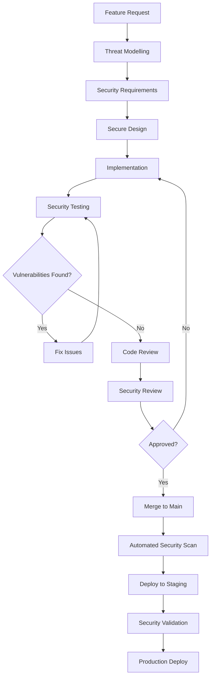

# Developer Security Guide: aclue Platform
## Security-First Development Practices

**Document Version**: 1.0.0
**Date**: September 2025
**Classification**: Developer Reference
**Audience**: Software Engineers, Frontend Developers, Backend Developers

---

## Table of Contents

1. [Security Development Principles](#1-security-development-principles)
2. [Secure Coding Standards](#2-secure-coding-standards)
3. [Input Validation and Sanitisation](#3-input-validation-and-sanitisation)
4. [Authentication and Session Management](#4-authentication-and-session-management)
5. [Cryptography and Secrets Management](#5-cryptography-and-secrets-management)
6. [API Security](#6-api-security)
7. [Frontend Security](#7-frontend-security)
8. [Backend Security](#8-backend-security)
9. [Database Security](#9-database-security)
10. [Security Testing](#10-security-testing)
11. [Common Vulnerabilities and Prevention](#11-common-vulnerabilities-and-prevention)
12. [Security Tools and Integration](#12-security-tools-and-integration)
13. [Code Review Security Checklist](#13-code-review-security-checklist)
14. [Incident Response for Developers](#14-incident-response-for-developers)
15. [Security Resources and Training](#15-security-resources-and-training)

---

## 1. Security Development Principles

### 1.1 Core Security Principles

```yaml
Security by Design:
  - Consider security from project inception
  - Threat model before coding
  - Security requirements alongside functional requirements
  - Regular security reviews during development

Defence in Depth:
  - Multiple layers of security controls
  - Never rely on single security measure
  - Assume each layer might fail
  - Validate at every tier

Principle of Least Privilege:
  - Minimal permissions by default
  - Grant only necessary access
  - Time-bound elevated privileges
  - Regular permission audits

Zero Trust:
  - Never trust, always verify
  - Authenticate every request
  - Validate all inputs
  - Assume breach mentality

Secure Defaults:
  - Security enabled by default
  - Opt-in for less secure options
  - Safe failure modes
  - Secure configuration templates
```

### 1.2 Development Security Workflow



---

## 2. Secure Coding Standards

### 2.1 General Security Guidelines

```python
"""
aclue Platform Secure Coding Standards
All code must follow these security guidelines
"""

# ✅ GOOD: Parameterised queries
def get_user(user_id: str):
    query = "SELECT * FROM users WHERE id = %s"
    return db.execute(query, (user_id,))

# ❌ BAD: String concatenation in queries
def get_user_unsafe(user_id: str):
    query = f"SELECT * FROM users WHERE id = '{user_id}'"  # SQL Injection risk!
    return db.execute(query)

# ✅ GOOD: Input validation
def process_email(email: str):
    if not re.match(r'^[\w\.-]+@[\w\.-]+\.\w+$', email):
        raise ValueError("Invalid email format")
    return email.lower().strip()

# ❌ BAD: No input validation
def process_email_unsafe(email: str):
    return email  # No validation!

# ✅ GOOD: Secure error handling
def authenticate(username: str, password: str):
    try:
        user = get_user(username)
        if verify_password(password, user.password_hash):
            return create_token(user)
    except Exception:
        # Generic error message
        return {"error": "Authentication failed"}

# ❌ BAD: Information disclosure in errors
def authenticate_unsafe(username: str, password: str):
    try:
        user = get_user(username)
        if not user:
            return {"error": "User not found"}  # Information disclosure!
        if not verify_password(password, user.password_hash):
            return {"error": "Wrong password"}  # Information disclosure!
    except Exception as e:
        return {"error": str(e)}  # Stack trace disclosure!
```

### 2.2 Language-Specific Standards

#### Python Security Standards

```python
# Python Security Best Practices

# 1. Use type hints for validation
from typing import Optional, List
from pydantic import BaseModel, validator

class UserInput(BaseModel):
    email: str
    age: int
    name: str

    @validator('email')
    def validate_email(cls, v):
        if '@' not in v:
            raise ValueError('Invalid email')
        return v.lower()

    @validator('age')
    def validate_age(cls, v):
        if v < 0 or v > 150:
            raise ValueError('Invalid age')
        return v

# 2. Secure random generation
import secrets

def generate_token():
    return secrets.token_urlsafe(32)  # Cryptographically secure

# 3. Safe file operations
import os
from pathlib import Path

def read_user_file(filename: str):
    # Prevent path traversal
    safe_name = Path(filename).name
    safe_path = Path('/app/uploads') / safe_name

    # Ensure path is within allowed directory
    if not safe_path.resolve().is_relative_to('/app/uploads'):
        raise ValueError("Invalid file path")

    with open(safe_path, 'r') as f:
        return f.read()

# 4. Secure subprocess execution
import subprocess
import shlex

def run_command(user_input: str):
    # Never use shell=True with user input
    # Always validate and sanitise
    allowed_commands = ['ls', 'echo', 'date']

    parts = shlex.split(user_input)
    if parts[0] not in allowed_commands:
        raise ValueError("Command not allowed")

    result = subprocess.run(
        parts,
        capture_output=True,
        text=True,
        timeout=5,
        check=False  # Don't raise on non-zero exit
    )
    return result.stdout
```

#### TypeScript/JavaScript Security Standards

```typescript
// TypeScript Security Best Practices

// 1. Type safety and validation
interface UserInput {
  email: string;
  password: string;
  age: number;
}

function validateUserInput(input: unknown): UserInput {
  if (typeof input !== 'object' || input === null) {
    throw new Error('Invalid input');
  }

  const obj = input as Record<string, unknown>;

  // Validate each field
  if (typeof obj.email !== 'string' || !obj.email.includes('@')) {
    throw new Error('Invalid email');
  }

  if (typeof obj.password !== 'string' || obj.password.length < 8) {
    throw new Error('Invalid password');
  }

  if (typeof obj.age !== 'number' || obj.age < 0 || obj.age > 150) {
    throw new Error('Invalid age');
  }

  return obj as UserInput;
}

// 2. XSS Prevention
import DOMPurify from 'isomorphic-dompurify';

function sanitizeHTML(dirty: string): string {
  return DOMPurify.sanitize(dirty, {
    ALLOWED_TAGS: ['b', 'i', 'em', 'strong', 'a'],
    ALLOWED_ATTR: ['href']
  });
}

// 3. Secure cookie handling
function setSecureCookie(name: string, value: string): void {
  document.cookie = `${name}=${value}; ` +
    'Secure; ' +          // HTTPS only
    'HttpOnly; ' +        // No JS access
    'SameSite=Strict; ' + // CSRF protection
    'Path=/; ' +
    `Max-Age=${60 * 60 * 24}`; // 24 hours
}

// 4. Content Security Policy
export const securityHeaders = {
  'Content-Security-Policy': [
    "default-src 'self'",
    "script-src 'self' 'unsafe-inline' https://trusted.com",
    "style-src 'self' 'unsafe-inline'",
    "img-src 'self' data: https:",
    "connect-src 'self' https://api.aclue.app",
    "frame-src 'none'",
    "object-src 'none'"
  ].join('; ')
};

// 5. API request security
async function secureAPICall(endpoint: string, data: unknown): Promise<Response> {
  const token = await getAuthToken();

  return fetch(endpoint, {
    method: 'POST',
    headers: {
      'Content-Type': 'application/json',
      'Authorization': `Bearer ${token}`,
      'X-CSRF-Token': await getCSRFToken()
    },
    body: JSON.stringify(data),
    credentials: 'same-origin' // Include cookies for same-origin requests
  });
}
```

---

## 3. Input Validation and Sanitisation

### 3.1 Input Validation Strategy

```python
# Comprehensive Input Validation Framework

from typing import Any, Dict, List, Optional
import re
from datetime import datetime
from decimal import Decimal

class InputValidator:
    """Central input validation for all user inputs"""

    # Validation patterns
    PATTERNS = {
        'email': r'^[a-zA-Z0-9._%+-]+@[a-zA-Z0-9.-]+\.[a-zA-Z]{2,}$',
        'phone': r'^\+?[1-9]\d{1,14}$',  # E.164 format
        'url': r'^https?://[a-zA-Z0-9.-]+\.[a-zA-Z]{2,}',
        'alphanumeric': r'^[a-zA-Z0-9]+$',
        'uuid': r'^[0-9a-f]{8}-[0-9a-f]{4}-[0-9a-f]{4}-[0-9a-f]{4}-[0-9a-f]{12}$'
    }

    @classmethod
    def validate_string(
        cls,
        value: str,
        min_length: int = 1,
        max_length: int = 255,
        pattern: Optional[str] = None,
        allowed_chars: Optional[str] = None
    ) -> str:
        """Validate string input"""
        if not isinstance(value, str):
            raise ValueError("Input must be a string")

        # Length validation
        if len(value) < min_length or len(value) > max_length:
            raise ValueError(f"Length must be between {min_length} and {max_length}")

        # Pattern validation
        if pattern and not re.match(pattern, value):
            raise ValueError("Input does not match required pattern")

        # Character whitelist
        if allowed_chars:
            if not all(c in allowed_chars for c in value):
                raise ValueError("Input contains invalid characters")

        return value.strip()

    @classmethod
    def validate_integer(
        cls,
        value: Any,
        min_value: Optional[int] = None,
        max_value: Optional[int] = None
    ) -> int:
        """Validate integer input"""
        try:
            int_value = int(value)
        except (ValueError, TypeError):
            raise ValueError("Input must be an integer")

        if min_value is not None and int_value < min_value:
            raise ValueError(f"Value must be >= {min_value}")

        if max_value is not None and int_value > max_value:
            raise ValueError(f"Value must be <= {max_value}")

        return int_value

    @classmethod
    def validate_email(cls, email: str) -> str:
        """Validate email address"""
        email = email.lower().strip()

        if not re.match(cls.PATTERNS['email'], email):
            raise ValueError("Invalid email format")

        # Additional checks
        if '..' in email:
            raise ValueError("Invalid email format")

        local, domain = email.split('@')
        if len(local) > 64 or len(domain) > 255:
            raise ValueError("Email too long")

        return email

    @classmethod
    def validate_phone(cls, phone: str) -> str:
        """Validate phone number"""
        # Remove common formatting
        phone = re.sub(r'[\s\-\(\)]', '', phone)

        if not re.match(cls.PATTERNS['phone'], phone):
            raise ValueError("Invalid phone number format")

        return phone

    @classmethod
    def validate_url(cls, url: str) -> str:
        """Validate URL"""
        if not re.match(cls.PATTERNS['url'], url):
            raise ValueError("Invalid URL format")

        # Additional security checks
        if any(danger in url.lower() for danger in ['javascript:', 'data:', 'vbscript:']):
            raise ValueError("Potentially dangerous URL")

        return url

    @classmethod
    def validate_date(
        cls,
        date_str: str,
        format: str = '%Y-%m-%d',
        min_date: Optional[datetime] = None,
        max_date: Optional[datetime] = None
    ) -> datetime:
        """Validate date input"""
        try:
            date = datetime.strptime(date_str, format)
        except ValueError:
            raise ValueError(f"Invalid date format. Expected: {format}")

        if min_date and date < min_date:
            raise ValueError(f"Date must be after {min_date}")

        if max_date and date > max_date:
            raise ValueError(f"Date must be before {max_date}")

        return date

    @classmethod
    def sanitize_html(cls, html: str) -> str:
        """Remove dangerous HTML elements and attributes"""
        import bleach

        # Allowed tags and attributes
        allowed_tags = ['p', 'br', 'strong', 'em', 'u', 'a', 'li', 'ul', 'ol']
        allowed_attrs = {'a': ['href', 'title']}

        # Clean HTML
        cleaned = bleach.clean(
            html,
            tags=allowed_tags,
            attributes=allowed_attrs,
            strip=True
        )

        # Additional sanitisation
        cleaned = cleaned.replace('javascript:', '')
        cleaned = cleaned.replace('data:', '')

        return cleaned

# Usage examples
validator = InputValidator()

# Validate user registration
def register_user(data: Dict[str, Any]):
    validated = {
        'email': validator.validate_email(data.get('email', '')),
        'password': validator.validate_string(
            data.get('password', ''),
            min_length=8,
            max_length=128
        ),
        'name': validator.validate_string(
            data.get('name', ''),
            min_length=1,
            max_length=100,
            pattern=r'^[a-zA-Z\s\-\']+$'
        ),
        'age': validator.validate_integer(
            data.get('age', 0),
            min_value=13,
            max_value=150
        )
    }
    return validated
```

### 3.2 Output Encoding

```typescript
// Output Encoding for Different Contexts

class OutputEncoder {
  // HTML context encoding
  static encodeHTML(input: string): string {
    const map: Record<string, string> = {
      '&': '&amp;',
      '<': '&lt;',
      '>': '&gt;',
      '"': '&quot;',
      "'": '&#x27;',
      '/': '&#x2F;'
    };
    return input.replace(/[&<>"'/]/g, char => map[char]);
  }

  // JavaScript context encoding
  static encodeJS(input: string): string {
    return input
      .replace(/\\/g, '\\\\')
      .replace(/'/g, "\\'")
      .replace(/"/g, '\\"')
      .replace(/\n/g, '\\n')
      .replace(/\r/g, '\\r')
      .replace(/\t/g, '\\t')
      .replace(/\//g, '\\/');
  }

  // URL parameter encoding
  static encodeURL(input: string): string {
    return encodeURIComponent(input);
  }

  // CSS context encoding
  static encodeCSS(input: string): string {
    return input.replace(/[^\w]/g, (char) => {
      return '\\' + char.charCodeAt(0).toString(16) + ' ';
    });
  }

  // SQL identifier encoding (table/column names)
  static encodeSQLIdentifier(input: string): string {
    // Allow only alphanumeric and underscore
    if (!/^[a-zA-Z_][a-zA-Z0-9_]*$/.test(input)) {
      throw new Error('Invalid SQL identifier');
    }
    return input;
  }
}

// Context-aware output function
function safeOutput(data: string, context: 'html' | 'js' | 'url' | 'css'): string {
  switch (context) {
    case 'html':
      return OutputEncoder.encodeHTML(data);
    case 'js':
      return OutputEncoder.encodeJS(data);
    case 'url':
      return OutputEncoder.encodeURL(data);
    case 'css':
      return OutputEncoder.encodeCSS(data);
    default:
      throw new Error(`Unknown context: ${context}`);
  }
}
```

---

## 4. Authentication and Session Management

### 4.1 Secure Authentication Implementation

```python
# Secure Authentication System

import hashlib
import secrets
import jwt
from datetime import datetime, timedelta
from typing import Optional, Dict
import bcrypt
import pyotp

class SecureAuthenticationSystem:
    """Enterprise-grade authentication implementation"""

    def __init__(self):
        self.pepper = os.environ.get('PASSWORD_PEPPER', '')
        self.jwt_secret = os.environ.get('JWT_SECRET')
        self.token_expiry = timedelta(minutes=30)
        self.refresh_expiry = timedelta(days=7)

    def hash_password(self, password: str) -> str:
        """Hash password with bcrypt + pepper"""
        # Add pepper
        peppered = password + self.pepper

        # Generate salt and hash
        salt = bcrypt.gensalt(rounds=12)
        hashed = bcrypt.hashpw(peppered.encode('utf-8'), salt)

        return hashed.decode('utf-8')

    def verify_password(self, password: str, password_hash: str) -> bool:
        """Verify password against hash"""
        peppered = password + self.pepper
        return bcrypt.checkpw(
            peppered.encode('utf-8'),
            password_hash.encode('utf-8')
        )

    def generate_tokens(self, user_id: str, role: str) -> Dict[str, str]:
        """Generate JWT access and refresh tokens"""
        now = datetime.utcnow()

        # Access token claims
        access_claims = {
            'sub': user_id,
            'role': role,
            'type': 'access',
            'iat': now,
            'exp': now + self.token_expiry,
            'jti': secrets.token_urlsafe(16)
        }

        # Refresh token claims
        refresh_claims = {
            'sub': user_id,
            'type': 'refresh',
            'iat': now,
            'exp': now + self.refresh_expiry,
            'jti': secrets.token_urlsafe(16)
        }

        access_token = jwt.encode(access_claims, self.jwt_secret, algorithm='HS256')
        refresh_token = jwt.encode(refresh_claims, self.jwt_secret, algorithm='HS256')

        # Store refresh token in Redis for revocation
        self.store_refresh_token(refresh_claims['jti'], user_id)

        return {
            'access_token': access_token,
            'refresh_token': refresh_token,
            'token_type': 'Bearer',
            'expires_in': int(self.token_expiry.total_seconds())
        }

    def validate_token(self, token: str, token_type: str = 'access') -> Dict:
        """Validate and decode JWT token"""
        try:
            payload = jwt.decode(
                token,
                self.jwt_secret,
                algorithms=['HS256']
            )

            # Verify token type
            if payload.get('type') != token_type:
                raise jwt.InvalidTokenError("Invalid token type")

            # Check if token is revoked
            if self.is_token_revoked(payload.get('jti')):
                raise jwt.InvalidTokenError("Token has been revoked")

            return payload

        except jwt.ExpiredSignatureError:
            raise AuthenticationError("Token has expired")
        except jwt.InvalidTokenError as e:
            raise AuthenticationError(f"Invalid token: {str(e)}")

    def setup_mfa(self, user_id: str) -> Dict[str, str]:
        """Setup MFA for user"""
        # Generate secret
        secret = pyotp.random_base32()

        # Generate provisioning URI
        totp = pyotp.TOTP(secret)
        provisioning_uri = totp.provisioning_uri(
            user_id,
            issuer_name='aclue Platform'
        )

        # Store encrypted secret
        self.store_mfa_secret(user_id, secret)

        return {
            'secret': secret,
            'provisioning_uri': provisioning_uri,
            'backup_codes': self.generate_backup_codes()
        }

    def verify_mfa(self, user_id: str, token: str) -> bool:
        """Verify MFA token"""
        secret = self.get_mfa_secret(user_id)
        if not secret:
            return False

        totp = pyotp.TOTP(secret)
        return totp.verify(token, valid_window=1)

    def generate_backup_codes(self, count: int = 10) -> List[str]:
        """Generate backup codes for account recovery"""
        codes = []
        for _ in range(count):
            code = secrets.token_hex(4)
            codes.append(f"{code[:4]}-{code[4:]}")
        return codes

    def enforce_password_policy(self, password: str) -> bool:
        """Enforce strong password policy"""
        if len(password) < 12:
            raise ValueError("Password must be at least 12 characters")

        if not re.search(r'[A-Z]', password):
            raise ValueError("Password must contain uppercase letter")

        if not re.search(r'[a-z]', password):
            raise ValueError("Password must contain lowercase letter")

        if not re.search(r'[0-9]', password):
            raise ValueError("Password must contain number")

        if not re.search(r'[!@#$%^&*(),.?":{}|<>]', password):
            raise ValueError("Password must contain special character")

        # Check against common passwords
        if self.is_common_password(password):
            raise ValueError("Password is too common")

        # Check for personal information
        if self.contains_user_info(password):
            raise ValueError("Password contains personal information")

        return True

    def is_common_password(self, password: str) -> bool:
        """Check against list of common passwords"""
        # Load from file or database
        common_passwords = [
            'Password123!',
            'Welcome123!',
            'Admin123!',
            # ... more entries
        ]
        return password in common_passwords
```

### 4.2 Session Security

```typescript
// Secure Session Management

import { randomBytes } from 'crypto';
import { Redis } from 'ioredis';

class SecureSessionManager {
  private redis: Redis;
  private sessionTimeout: number = 30 * 60; // 30 minutes
  private maxSessionsPerUser: number = 5;

  constructor() {
    this.redis = new Redis({
      host: process.env.REDIS_HOST,
      port: 6379,
      tls: { rejectUnauthorized: true }
    });
  }

  async createSession(userId: string, metadata: SessionMetadata): Promise<string> {
    // Generate cryptographically secure session ID
    const sessionId = randomBytes(32).toString('hex');

    // Create session fingerprint
    const fingerprint = this.createFingerprint(metadata);

    // Session data
    const sessionData = {
      userId,
      createdAt: Date.now(),
      lastActivity: Date.now(),
      fingerprint,
      ipAddress: metadata.ipAddress,
      userAgent: metadata.userAgent
    };

    // Check session limit
    await this.enforceSessionLimit(userId);

    // Store session
    await this.redis.setex(
      `session:${sessionId}`,
      this.sessionTimeout,
      JSON.stringify(sessionData)
    );

    // Track user sessions
    await this.redis.sadd(`user:${userId}:sessions`, sessionId);

    return sessionId;
  }

  async validateSession(sessionId: string, metadata: SessionMetadata): Promise<boolean> {
    const sessionData = await this.redis.get(`session:${sessionId}`);

    if (!sessionData) {
      return false;
    }

    const session = JSON.parse(sessionData);

    // Verify fingerprint
    const currentFingerprint = this.createFingerprint(metadata);
    if (session.fingerprint !== currentFingerprint) {
      // Possible session hijacking
      await this.handleSuspiciousActivity(sessionId, 'fingerprint_mismatch');
      return false;
    }

    // Check for IP change (warning only)
    if (session.ipAddress !== metadata.ipAddress) {
      await this.logSecurityEvent(sessionId, 'ip_change');
    }

    // Update last activity
    session.lastActivity = Date.now();
    await this.redis.setex(
      `session:${sessionId}`,
      this.sessionTimeout,
      JSON.stringify(session)
    );

    return true;
  }

  private createFingerprint(metadata: SessionMetadata): string {
    // Create browser fingerprint
    const fingerprintData = [
      metadata.userAgent,
      metadata.acceptLanguage,
      metadata.acceptEncoding,
      metadata.screenResolution
    ].join('|');

    return crypto
      .createHash('sha256')
      .update(fingerprintData)
      .digest('hex');
  }

  async revokeSession(sessionId: string): Promise<void> {
    const sessionData = await this.redis.get(`session:${sessionId}`);
    if (sessionData) {
      const session = JSON.parse(sessionData);

      // Remove session
      await this.redis.del(`session:${sessionId}`);
      await this.redis.srem(`user:${session.userId}:sessions`, sessionId);

      // Log revocation
      await this.logSecurityEvent(sessionId, 'session_revoked');
    }
  }

  async revokeAllUserSessions(userId: string): Promise<void> {
    const sessions = await this.redis.smembers(`user:${userId}:sessions`);

    for (const sessionId of sessions) {
      await this.revokeSession(sessionId);
    }
  }

  private async enforceSessionLimit(userId: string): Promise<void> {
    const sessions = await this.redis.smembers(`user:${userId}:sessions`);

    if (sessions.length >= this.maxSessionsPerUser) {
      // Remove oldest session
      const sessionData = await Promise.all(
        sessions.map(async (sid) => {
          const data = await this.redis.get(`session:${sid}`);
          return { id: sid, data: data ? JSON.parse(data) : null };
        })
      );

      const oldest = sessionData
        .filter(s => s.data)
        .sort((a, b) => a.data.createdAt - b.data.createdAt)[0];

      if (oldest) {
        await this.revokeSession(oldest.id);
      }
    }
  }

  private async handleSuspiciousActivity(sessionId: string, reason: string): Promise<void> {
    // Immediate actions
    await this.revokeSession(sessionId);

    // Alert security team
    await this.sendSecurityAlert({
      type: 'suspicious_session',
      sessionId,
      reason,
      timestamp: new Date().toISOString()
    });

    // Log incident
    await this.logSecurityEvent(sessionId, `suspicious_activity:${reason}`);
  }
}
```

---

## 5. Cryptography and Secrets Management

### 5.1 Cryptography Best Practices

```python
# Cryptography Implementation Guidelines

from cryptography.fernet import Fernet
from cryptography.hazmat.primitives import hashes
from cryptography.hazmat.primitives.kdf.pbkdf2 import PBKDF2
from cryptography.hazmat.primitives.ciphers import Cipher, algorithms, modes
from cryptography.hazmat.backends import default_backend
import os
import base64

class CryptographyService:
    """Secure cryptography implementation"""

    def __init__(self):
        self.backend = default_backend()

    # ✅ GOOD: Use established algorithms
    def encrypt_aes_256_gcm(self, plaintext: bytes, key: bytes) -> Dict[str, bytes]:
        """AES-256-GCM encryption (authenticated)"""
        # Generate nonce
        nonce = os.urandom(12)  # 96 bits for GCM

        # Create cipher
        cipher = Cipher(
            algorithms.AES(key),
            modes.GCM(nonce),
            backend=self.backend
        )

        # Encrypt
        encryptor = cipher.encryptor()
        ciphertext = encryptor.update(plaintext) + encryptor.finalize()

        return {
            'ciphertext': ciphertext,
            'nonce': nonce,
            'tag': encryptor.tag
        }

    # ✅ GOOD: Key derivation with salt
    def derive_key(self, password: str, salt: bytes) -> bytes:
        """Derive encryption key from password"""
        kdf = PBKDF2(
            algorithm=hashes.SHA256(),
            length=32,
            salt=salt,
            iterations=100000,
            backend=self.backend
        )
        return kdf.derive(password.encode())

    # ❌ BAD: Weak encryption
    def insecure_encrypt(self, data: str, password: str) -> str:
        """DO NOT USE - Example of insecure encryption"""
        # XOR cipher - completely insecure!
        result = []
        for i, char in enumerate(data):
            result.append(chr(ord(char) ^ ord(password[i % len(password)])))
        return ''.join(result)

    # ✅ GOOD: Secure random generation
    def generate_secure_token(self, length: int = 32) -> str:
        """Generate cryptographically secure random token"""
        return secrets.token_urlsafe(length)

    # ✅ GOOD: Constant-time comparison
    def secure_compare(self, a: bytes, b: bytes) -> bool:
        """Constant-time comparison to prevent timing attacks"""
        return secrets.compare_digest(a, b)

# Encryption usage examples
crypto = CryptographyService()

# Generate encryption key
key = os.urandom(32)  # 256 bits

# Encrypt sensitive data
sensitive_data = b"Credit card: 1234-5678-9012-3456"
encrypted = crypto.encrypt_aes_256_gcm(sensitive_data, key)

# Store encrypted data with metadata
stored_data = {
    'algorithm': 'AES-256-GCM',
    'ciphertext': base64.b64encode(encrypted['ciphertext']).decode(),
    'nonce': base64.b64encode(encrypted['nonce']).decode(),
    'tag': base64.b64encode(encrypted['tag']).decode(),
    'key_id': 'key_2024_q1'  # Reference to key in KMS
}
```

### 5.2 Secrets Management

```yaml
# Secrets Management Best Practices

Development Environment:
  # Use .env.local (never commit)
  - Store in .env.local file
  - Add to .gitignore
  - Use environment variables
  - Rotate regularly

Staging Environment:
  # Use secret management service
  - Store in HashiCorp Vault
  - Use AWS Secrets Manager
  - Use Azure Key Vault
  - Enable audit logging

Production Environment:
  # Enterprise secret management
  - Hardware Security Module (HSM)
  - Key Management Service (KMS)
  - Automatic rotation
  - Access logging
  - MFA for access

Secret Types and Storage:
  API Keys:
    storage: Environment variables
    rotation: Every 90 days
    access: Application only

  Database Passwords:
    storage: Secret manager
    rotation: Every 30 days
    access: Backend only

  Encryption Keys:
    storage: KMS/HSM
    rotation: Yearly
    access: Encryption service only

  JWT Secrets:
    storage: Secret manager
    rotation: Every 90 days
    access: Auth service only

  Third-party Tokens:
    storage: Secret manager
    rotation: Per vendor policy
    access: Integration service only
```

```python
# Secret Management Implementation

class SecretManager:
    """Centralized secret management"""

    def __init__(self):
        self.provider = self._initialize_provider()
        self.cache = {}
        self.cache_ttl = 300  # 5 minutes

    def _initialize_provider(self):
        """Initialize secret provider based on environment"""
        env = os.environ.get('ENVIRONMENT', 'development')

        if env == 'production':
            # Use AWS Secrets Manager
            import boto3
            return boto3.client('secretsmanager')
        elif env == 'staging':
            # Use HashiCorp Vault
            import hvac
            return hvac.Client(url=os.environ.get('VAULT_URL'))
        else:
            # Use environment variables
            return None

    def get_secret(self, secret_name: str) -> str:
        """Retrieve secret with caching"""
        # Check cache
        if secret_name in self.cache:
            cached = self.cache[secret_name]
            if cached['expires'] > datetime.now():
                return cached['value']

        # Retrieve from provider
        if self.provider:
            secret_value = self._get_from_provider(secret_name)
        else:
            secret_value = os.environ.get(secret_name)

        if not secret_value:
            raise SecretNotFoundError(f"Secret {secret_name} not found")

        # Cache the secret
        self.cache[secret_name] = {
            'value': secret_value,
            'expires': datetime.now() + timedelta(seconds=self.cache_ttl)
        }

        return secret_value

    def rotate_secret(self, secret_name: str) -> str:
        """Rotate a secret"""
        # Generate new secret
        new_secret = secrets.token_urlsafe(32)

        # Update in provider
        self._update_in_provider(secret_name, new_secret)

        # Clear cache
        if secret_name in self.cache:
            del self.cache[secret_name]

        # Log rotation
        self._log_rotation(secret_name)

        return new_secret

    def _log_rotation(self, secret_name: str):
        """Log secret rotation for audit"""
        audit_log.info(f"Secret rotated: {secret_name}", extra={
            'event': 'secret_rotation',
            'secret_name': secret_name,
            'timestamp': datetime.utcnow().isoformat(),
            'rotated_by': 'automated_process'
        })
```

---

## 6. API Security

### 6.1 API Security Implementation

```python
# FastAPI Security Implementation

from fastapi import FastAPI, Depends, HTTPException, Security, Request
from fastapi.security import HTTPBearer, HTTPAuthorizationCredentials
from fastapi.middleware.cors import CORSMiddleware
from fastapi.middleware.trustedhost import TrustedHostMiddleware
from slowapi import Limiter, _rate_limit_exceeded_handler
from slowapi.util import get_remote_address
import time

app = FastAPI(title="aclue API", docs_url=None)  # Disable docs in production

# Security configurations
security = HTTPBearer()
limiter = Limiter(key_func=get_remote_address)
app.state.limiter = limiter
app.add_exception_handler(429, _rate_limit_exceeded_handler)

# CORS configuration
app.add_middleware(
    CORSMiddleware,
    allow_origins=["https://aclue.app"],  # Specific origins only
    allow_credentials=True,
    allow_methods=["GET", "POST", "PUT", "DELETE"],
    allow_headers=["Authorization", "Content-Type"],
    max_age=86400  # 24 hours
)

# Trusted host validation
app.add_middleware(
    TrustedHostMiddleware,
    allowed_hosts=["api.aclue.app", "*.aclue.app"]
)

# Custom security middleware
@app.middleware("http")
async def security_headers_middleware(request: Request, call_next):
    """Add security headers to all responses"""
    response = await call_next(request)

    # Security headers
    response.headers["X-Content-Type-Options"] = "nosniff"
    response.headers["X-Frame-Options"] = "DENY"
    response.headers["X-XSS-Protection"] = "1; mode=block"
    response.headers["Strict-Transport-Security"] = "max-age=31536000; includeSubDomains"
    response.headers["Content-Security-Policy"] = "default-src 'self'"

    # Remove sensitive headers
    response.headers.pop("Server", None)
    response.headers.pop("X-Powered-By", None)

    return response

# API key validation
async def validate_api_key(credentials: HTTPAuthorizationCredentials = Security(security)):
    """Validate API key with rate limiting"""
    token = credentials.credentials

    try:
        # Validate JWT token
        payload = jwt.decode(token, SECRET_KEY, algorithms=["HS256"])

        # Check token type
        if payload.get("type") != "access":
            raise HTTPException(status_code=401, detail="Invalid token type")

        # Check if token is revoked
        if is_token_revoked(payload.get("jti")):
            raise HTTPException(status_code=401, detail="Token revoked")

        return payload

    except jwt.ExpiredSignatureError:
        raise HTTPException(status_code=401, detail="Token expired")
    except jwt.InvalidTokenError:
        raise HTTPException(status_code=401, detail="Invalid token")

# Input validation with Pydantic
from pydantic import BaseModel, Field, validator

class ProductCreate(BaseModel):
    name: str = Field(..., min_length=1, max_length=100)
    description: str = Field(..., max_length=1000)
    price: float = Field(..., gt=0, le=1000000)
    category: str = Field(..., pattern="^[a-zA-Z0-9_-]+$")

    @validator('name')
    def validate_name(cls, v):
        if any(char in v for char in ['<', '>', '"', "'"]):
            raise ValueError('Name contains invalid characters')
        return v

    @validator('description')
    def validate_description(cls, v):
        # Sanitize HTML
        return bleach.clean(v, tags=[], strip=True)

# API endpoint with security
@app.post("/api/v1/products")
@limiter.limit("10/minute")  # Rate limiting
async def create_product(
    request: Request,
    product: ProductCreate,
    user=Depends(validate_api_key)
):
    """Create new product with security validation"""

    # Additional authorization check
    if user.get("role") not in ["admin", "manager"]:
        raise HTTPException(status_code=403, detail="Insufficient permissions")

    # Audit log
    audit_log.info(f"Product creation attempt by user {user['sub']}")

    # Business logic with try-catch
    try:
        # Sanitize inputs
        sanitized_product = product.dict()

        # Create product
        result = await db.products.insert_one(sanitized_product)

        return {
            "id": str(result.inserted_id),
            "message": "Product created successfully"
        }

    except Exception as e:
        # Log error but don't expose details
        logger.error(f"Product creation failed: {str(e)}")
        raise HTTPException(status_code=500, detail="Internal server error")

# API versioning
@app.get("/api/v1/health")
async def health_check():
    """Health check endpoint"""
    return {"status": "healthy", "version": "1.0.0"}

@app.get("/api/v2/health")
async def health_check_v2():
    """Health check endpoint v2"""
    return {
        "status": "healthy",
        "version": "2.0.0",
        "timestamp": datetime.utcnow().isoformat()
    }
```

### 6.2 GraphQL Security

```typescript
// GraphQL Security Implementation

import { GraphQLSchema, GraphQLError } from 'graphql';
import { shield, rule, allow, deny } from 'graphql-shield';
import depthLimit from 'graphql-depth-limit';
import costAnalysis from 'graphql-cost-analysis';

// Authentication rule
const isAuthenticated = rule({ cache: 'contextual' })(
  async (parent, args, ctx, info) => {
    return ctx.user !== null;
  }
);

// Authorization rules
const isAdmin = rule({ cache: 'contextual' })(
  async (parent, args, ctx, info) => {
    return ctx.user?.role === 'admin';
  }
);

const isOwner = rule({ cache: 'strict' })(
  async (parent, { id }, ctx, info) => {
    return ctx.user?.id === id;
  }
);

// Permission shield
const permissions = shield({
  Query: {
    '*': deny, // Deny by default
    publicData: allow,
    userData: isAuthenticated,
    adminData: isAdmin,
    userProfile: isOwner
  },
  Mutation: {
    '*': isAuthenticated, // Require auth for all mutations
    adminAction: isAdmin
  }
}, {
  fallbackError: new GraphQLError('Not authorized', {
    extensions: { code: 'UNAUTHORIZED' }
  })
});

// Query complexity limiting
const complexityLimit = costAnalysis({
  maximumCost: 1000,
  defaultCost: 1,
  scalarCost: 1,
  objectCost: 2,
  listFactor: 10,
  introspectionCost: 1000,
  enforceIntrospectionLimit: true,
  onComplete: (cost: number) => {
    console.log(`Query cost: ${cost}`);
  }
});

// Rate limiting
const rateLimiter = new Map();

function rateLimit(userId: string): boolean {
  const now = Date.now();
  const windowStart = now - 60000; // 1 minute window
  const requests = rateLimiter.get(userId) || [];

  // Clean old requests
  const recentRequests = requests.filter((time: number) => time > windowStart);

  if (recentRequests.length >= 100) {
    return false; // Rate limit exceeded
  }

  recentRequests.push(now);
  rateLimiter.set(userId, recentRequests);
  return true;
}

// Apply security middleware
export const secureGraphQLMiddleware = [
  depthLimit(5), // Max query depth
  complexityLimit,
  permissions
];

// Secure resolver example
export const resolvers = {
  Query: {
    sensitiveData: async (parent, args, context) => {
      // Rate limiting
      if (!rateLimit(context.user?.id)) {
        throw new GraphQLError('Rate limit exceeded', {
          extensions: { code: 'RATE_LIMITED' }
        });
      }

      // Input validation
      if (!isValidId(args.id)) {
        throw new GraphQLError('Invalid ID format', {
          extensions: { code: 'BAD_USER_INPUT' }
        });
      }

      // Authorization check (redundant with shield, but explicit)
      if (!context.user) {
        throw new GraphQLError('Authentication required', {
          extensions: { code: 'UNAUTHENTICATED' }
        });
      }

      // Fetch data with try-catch
      try {
        const data = await fetchSensitiveData(args.id);

        // Filter based on permissions
        return filterDataByPermissions(data, context.user);
      } catch (error) {
        // Log error but don't expose details
        console.error('Error fetching sensitive data:', error);
        throw new GraphQLError('Internal server error', {
          extensions: { code: 'INTERNAL_SERVER_ERROR' }
        });
      }
    }
  }
};
```

---

## 7. Frontend Security

### 7.1 React/Next.js Security

```typescript
// Next.js Security Configuration

// next.config.js
module.exports = {
  // Security headers
  async headers() {
    return [
      {
        source: '/:path*',
        headers: [
          {
            key: 'X-DNS-Prefetch-Control',
            value: 'on'
          },
          {
            key: 'Strict-Transport-Security',
            value: 'max-age=63072000; includeSubDomains; preload'
          },
          {
            key: 'X-XSS-Protection',
            value: '1; mode=block'
          },
          {
            key: 'X-Frame-Options',
            value: 'DENY'
          },
          {
            key: 'X-Content-Type-Options',
            value: 'nosniff'
          },
          {
            key: 'Referrer-Policy',
            value: 'origin-when-cross-origin'
          },
          {
            key: 'Content-Security-Policy',
            value: ContentSecurityPolicy.replace(/\s{2,}/g, ' ').trim()
          }
        ]
      }
    ];
  },

  // Disable x-powered-by header
  poweredByHeader: false,

  // Enable strict mode
  reactStrictMode: true,

  // Disable source maps in production
  productionBrowserSourceMaps: false
};

const ContentSecurityPolicy = `
  default-src 'self';
  script-src 'self' 'unsafe-eval' 'unsafe-inline' https://trusted-cdn.com;
  style-src 'self' 'unsafe-inline';
  img-src 'self' blob: data: https:;
  font-src 'self' data:;
  connect-src 'self' https://api.aclue.app wss://aclue.app;
  frame-ancestors 'none';
  base-uri 'self';
  form-action 'self';
`;
```

```tsx
// Secure React Component Patterns

import React, { useState, useEffect } from 'react';
import DOMPurify from 'isomorphic-dompurify';
import { useRouter } from 'next/router';

// ✅ GOOD: Sanitize user content
const SafeUserContent: React.FC<{ content: string }> = ({ content }) => {
  const sanitized = DOMPurify.sanitize(content, {
    ALLOWED_TAGS: ['b', 'i', 'em', 'strong', 'a', 'p', 'br'],
    ALLOWED_ATTR: ['href', 'target']
  });

  return <div dangerouslySetInnerHTML={{ __html: sanitized }} />;
};

// ❌ BAD: Direct HTML injection
const UnsafeUserContent: React.FC<{ content: string }> = ({ content }) => {
  return <div dangerouslySetInnerHTML={{ __html: content }} />;
};

// ✅ GOOD: Validate props
interface SecureFormProps {
  onSubmit: (data: FormData) => void;
  maxLength?: number;
}

const SecureForm: React.FC<SecureFormProps> = ({ onSubmit, maxLength = 1000 }) => {
  const [input, setInput] = useState('');
  const [errors, setErrors] = useState<string[]>([]);

  const validateInput = (value: string): boolean => {
    const errors: string[] = [];

    if (value.length > maxLength) {
      errors.push(`Input too long (max ${maxLength} characters)`);
    }

    if (/<script/i.test(value)) {
      errors.push('Invalid input detected');
    }

    setErrors(errors);
    return errors.length === 0;
  };

  const handleSubmit = (e: React.FormEvent) => {
    e.preventDefault();

    if (validateInput(input)) {
      // Sanitize before sending
      const sanitized = DOMPurify.sanitize(input, { ALLOWED_TAGS: [] });
      onSubmit({ input: sanitized } as FormData);
    }
  };

  return (
    <form onSubmit={handleSubmit}>
      <input
        type="text"
        value={input}
        onChange={(e) => setInput(e.target.value)}
        maxLength={maxLength}
      />
      {errors.map((error, i) => (
        <div key={i} className="error">{error}</div>
      ))}
      <button type="submit">Submit</button>
    </form>
  );
};

// ✅ GOOD: Secure file upload
const SecureFileUpload: React.FC = () => {
  const [file, setFile] = useState<File | null>(null);

  const ALLOWED_TYPES = ['image/jpeg', 'image/png', 'application/pdf'];
  const MAX_SIZE = 5 * 1024 * 1024; // 5MB

  const handleFileChange = (e: React.ChangeEvent<HTMLInputElement>) => {
    const selectedFile = e.target.files?.[0];

    if (!selectedFile) return;

    // Validate file type
    if (!ALLOWED_TYPES.includes(selectedFile.type)) {
      alert('Invalid file type');
      return;
    }

    // Validate file size
    if (selectedFile.size > MAX_SIZE) {
      alert('File too large');
      return;
    }

    // Additional validation
    const reader = new FileReader();
    reader.onload = (e) => {
      // Check file signature (magic numbers)
      const arr = new Uint8Array(e.target?.result as ArrayBuffer);
      const header = arr.slice(0, 4);

      // Verify it's actually an image
      if (!isValidFileSignature(header, selectedFile.type)) {
        alert('File content does not match type');
        return;
      }

      setFile(selectedFile);
    };
    reader.readAsArrayBuffer(selectedFile.slice(0, 4));
  };

  return (
    <input
      type="file"
      accept={ALLOWED_TYPES.join(',')}
      onChange={handleFileChange}
    />
  );
};

// ✅ GOOD: Secure URL handling
const SecureLink: React.FC<{ href: string; children: React.ReactNode }> = ({
  href,
  children
}) => {
  const router = useRouter();

  const handleClick = (e: React.MouseEvent) => {
    e.preventDefault();

    // Validate URL
    try {
      const url = new URL(href, window.location.origin);

      // Check if it's same origin
      if (url.origin === window.location.origin) {
        router.push(url.pathname);
      } else {
        // External link - warn user
        if (confirm(`You are leaving aclue. Continue to ${url.hostname}?`)) {
          window.open(href, '_blank', 'noopener,noreferrer');
        }
      }
    } catch {
      console.error('Invalid URL');
    }
  };

  return (
    <a href={href} onClick={handleClick} rel="noopener noreferrer">
      {children}
    </a>
  );
};
```

### 7.2 Client-side Storage Security

```typescript
// Secure Client-side Storage

class SecureStorage {
  private encryptionKey: CryptoKey | null = null;

  async initialize(): Promise<void> {
    // Generate or retrieve encryption key
    this.encryptionKey = await this.getOrGenerateKey();
  }

  private async getOrGenerateKey(): Promise<CryptoKey> {
    // Try to get existing key from IndexedDB
    const existingKey = await this.retrieveKey();
    if (existingKey) return existingKey;

    // Generate new key
    const key = await crypto.subtle.generateKey(
      { name: 'AES-GCM', length: 256 },
      true,
      ['encrypt', 'decrypt']
    );

    // Store key (in production, use key derivation from user password)
    await this.storeKey(key);
    return key;
  }

  async setSecureItem(key: string, value: any): Promise<void> {
    if (!this.encryptionKey) {
      throw new Error('Storage not initialized');
    }

    // Serialize value
    const serialized = JSON.stringify(value);
    const data = new TextEncoder().encode(serialized);

    // Generate IV
    const iv = crypto.getRandomValues(new Uint8Array(12));

    // Encrypt
    const encrypted = await crypto.subtle.encrypt(
      { name: 'AES-GCM', iv },
      this.encryptionKey,
      data
    );

    // Store encrypted data
    const stored = {
      iv: Array.from(iv),
      data: Array.from(new Uint8Array(encrypted)),
      timestamp: Date.now()
    };

    localStorage.setItem(key, JSON.stringify(stored));
  }

  async getSecureItem(key: string): Promise<any> {
    if (!this.encryptionKey) {
      throw new Error('Storage not initialized');
    }

    const stored = localStorage.getItem(key);
    if (!stored) return null;

    try {
      const parsed = JSON.parse(stored);

      // Check expiry (optional)
      if (Date.now() - parsed.timestamp > 24 * 60 * 60 * 1000) {
        localStorage.removeItem(key);
        return null;
      }

      // Decrypt
      const decrypted = await crypto.subtle.decrypt(
        {
          name: 'AES-GCM',
          iv: new Uint8Array(parsed.iv)
        },
        this.encryptionKey,
        new Uint8Array(parsed.data)
      );

      const decoded = new TextDecoder().decode(decrypted);
      return JSON.parse(decoded);
    } catch (error) {
      console.error('Decryption failed');
      localStorage.removeItem(key);
      return null;
    }
  }

  clearSensitiveData(): void {
    // Clear sensitive items
    const sensitiveKeys = [
      'auth_token',
      'user_data',
      'session_id'
    ];

    sensitiveKeys.forEach(key => {
      localStorage.removeItem(key);
      sessionStorage.removeItem(key);
    });

    // Clear cookies
    document.cookie.split(";").forEach((c) => {
      document.cookie = c
        .replace(/^ +/, "")
        .replace(/=.*/, `=;expires=${new Date().toUTCString()};path=/`);
    });
  }
}

// Usage
const storage = new SecureStorage();
await storage.initialize();

// Store sensitive data
await storage.setSecureItem('user_token', 'sensitive-token-value');

// Retrieve sensitive data
const token = await storage.getSecureItem('user_token');

// Clear on logout
storage.clearSensitiveData();
```

---

## 8. Backend Security

### 8.1 FastAPI Security Patterns

```python
# FastAPI Backend Security Implementation

from fastapi import FastAPI, Depends, HTTPException, Request, status
from fastapi.security import OAuth2PasswordBearer, OAuth2PasswordRequestForm
from sqlalchemy.orm import Session
from typing import Optional
import logging
from datetime import datetime, timedelta

app = FastAPI()
oauth2_scheme = OAuth2PasswordBearer(tokenUrl="token")

# Configure logging
logging.basicConfig(
    level=logging.INFO,
    format='%(asctime)s - %(name)s - %(levelname)s - %(message)s',
    handlers=[
        logging.StreamHandler(),
        logging.handlers.RotatingFileHandler(
            'app.log',
            maxBytes=10485760,  # 10MB
            backupCount=5
        )
    ]
)
logger = logging.getLogger(__name__)

# Security middleware
@app.middleware("http")
async def security_middleware(request: Request, call_next):
    """Apply security controls to all requests"""

    # Request ID for tracking
    request_id = request.headers.get('X-Request-ID', generate_request_id())
    request.state.request_id = request_id

    # Log request
    logger.info(f"Request {request_id}: {request.method} {request.url.path}")

    # IP-based rate limiting
    client_ip = request.client.host
    if not check_rate_limit(client_ip):
        logger.warning(f"Rate limit exceeded for IP: {client_ip}")
        raise HTTPException(
            status_code=status.HTTP_429_TOO_MANY_REQUESTS,
            detail="Rate limit exceeded"
        )

    # Process request
    try:
        response = await call_next(request)

        # Add security headers
        response.headers["X-Request-ID"] = request_id
        response.headers["X-Content-Type-Options"] = "nosniff"
        response.headers["X-Frame-Options"] = "DENY"

        # Log response
        logger.info(f"Response {request_id}: {response.status_code}")

        return response

    except Exception as e:
        logger.error(f"Error processing request {request_id}: {str(e)}")
        raise

# Dependency injection for security
async def get_current_user(token: str = Depends(oauth2_scheme)):
    """Validate token and return current user"""
    try:
        payload = jwt.decode(token, SECRET_KEY, algorithms=[ALGORITHM])
        user_id: str = payload.get("sub")
        if user_id is None:
            raise HTTPException(
                status_code=status.HTTP_401_UNAUTHORIZED,
                detail="Invalid authentication credentials",
                headers={"WWW-Authenticate": "Bearer"},
            )

        # Check if user exists and is active
        user = await get_user(user_id)
        if not user or not user.is_active:
            raise HTTPException(
                status_code=status.HTTP_401_UNAUTHORIZED,
                detail="User inactive or deleted"
            )

        return user

    except JWTError:
        raise HTTPException(
            status_code=status.HTTP_401_UNAUTHORIZED,
            detail="Could not validate credentials",
            headers={"WWW-Authenticate": "Bearer"},
        )

# Secure database operations
class SecureDatabase:
    """Secure database operations with SQL injection prevention"""

    def __init__(self, db: Session):
        self.db = db

    def get_user_by_email(self, email: str):
        """Get user by email with parameterized query"""
        # ✅ GOOD: Parameterized query
        return self.db.query(User).filter(User.email == email).first()

    def search_products(self, query: str, category: Optional[str] = None):
        """Search products with sanitized input"""
        # Sanitize search query
        safe_query = self._sanitize_search(query)

        # Build query
        db_query = self.db.query(Product)

        if safe_query:
            # Use PostgreSQL full-text search
            db_query = db_query.filter(
                Product.search_vector.match(safe_query)
            )

        if category:
            # Validate category against whitelist
            if category not in ALLOWED_CATEGORIES:
                raise ValueError("Invalid category")
            db_query = db_query.filter(Product.category == category)

        return db_query.limit(100).all()  # Always limit results

    def _sanitize_search(self, query: str) -> str:
        """Sanitize search query"""
        # Remove special characters
        import re
        sanitized = re.sub(r'[^\w\s-]', '', query)
        # Limit length
        return sanitized[:100]

# Secure file handling
@app.post("/upload")
async def upload_file(
    file: UploadFile,
    current_user: User = Depends(get_current_user)
):
    """Secure file upload with validation"""

    # Validate file size
    MAX_SIZE = 10 * 1024 * 1024  # 10MB
    contents = await file.read()
    if len(contents) > MAX_SIZE:
        raise HTTPException(
            status_code=status.HTTP_413_REQUEST_ENTITY_TOO_LARGE,
            detail="File too large"
        )

    # Validate file type
    ALLOWED_TYPES = {
        'image/jpeg': 'jpg',
        'image/png': 'png',
        'application/pdf': 'pdf'
    }

    if file.content_type not in ALLOWED_TYPES:
        raise HTTPException(
            status_code=status.HTTP_415_UNSUPPORTED_MEDIA_TYPE,
            detail="File type not allowed"
        )

    # Verify file content matches type
    import magic
    file_type = magic.from_buffer(contents, mime=True)
    if file_type != file.content_type:
        raise HTTPException(
            status_code=status.HTTP_400_BAD_REQUEST,
            detail="File content does not match type"
        )

    # Generate safe filename
    import uuid
    safe_name = f"{uuid.uuid4()}.{ALLOWED_TYPES[file.content_type]}"

    # Scan for malware (integrate with ClamAV or similar)
    if not await scan_for_malware(contents):
        raise HTTPException(
            status_code=status.HTTP_400_BAD_REQUEST,
            detail="File failed security scan"
        )

    # Store file securely
    file_path = UPLOAD_DIR / safe_name

    # Set restrictive permissions
    with open(file_path, 'wb') as f:
        f.write(contents)
    os.chmod(file_path, 0o644)

    # Log upload
    logger.info(f"File uploaded by user {current_user.id}: {safe_name}")

    return {"filename": safe_name}

# Secure error handling
@app.exception_handler(Exception)
async def global_exception_handler(request: Request, exc: Exception):
    """Handle all uncaught exceptions securely"""

    request_id = getattr(request.state, 'request_id', 'unknown')

    # Log full error internally
    logger.error(f"Unhandled exception in request {request_id}: {exc}", exc_info=True)

    # Return generic error to client (don't expose internals)
    return JSONResponse(
        status_code=status.HTTP_500_INTERNAL_SERVER_ERROR,
        content={
            "error": "Internal server error",
            "request_id": request_id,
            "timestamp": datetime.utcnow().isoformat()
        }
    )
```

### 8.2 Background Task Security

```python
# Secure Background Task Implementation

from celery import Celery
from celery.signals import task_prerun, task_postrun, task_failure
import hashlib
import hmac

app = Celery('tasks', broker='redis://localhost:6379')

# Task security configuration
app.conf.update(
    task_serializer='json',
    accept_content=['json'],
    result_serializer='json',
    timezone='UTC',
    enable_utc=True,
    task_always_eager=False,
    task_acks_late=True,
    worker_prefetch_multiplier=1,
    worker_max_tasks_per_child=1000,  # Prevent memory leaks
    task_time_limit=300,  # 5 minutes
    task_soft_time_limit=240,  # 4 minutes
)

# Task authentication
def verify_task_signature(task_id: str, signature: str) -> bool:
    """Verify task signature to prevent unauthorized task execution"""
    expected = hmac.new(
        SECRET_KEY.encode(),
        task_id.encode(),
        hashlib.sha256
    ).hexdigest()
    return hmac.compare_digest(expected, signature)

@task_prerun.connect
def task_prerun_handler(task_id, task, args, kwargs, **kw):
    """Security checks before task execution"""

    # Verify task signature
    signature = kwargs.get('signature')
    if not signature or not verify_task_signature(task_id, signature):
        logger.error(f"Invalid task signature for task {task_id}")
        raise SecurityError("Invalid task signature")

    # Log task start
    logger.info(f"Task {task_id} started: {task.name}")

@task_failure.connect
def task_failure_handler(task_id, exception, args, kwargs, traceback, **kw):
    """Handle task failures securely"""

    # Log failure without exposing sensitive data
    logger.error(f"Task {task_id} failed: {type(exception).__name__}")

    # Send alert for critical tasks
    if task.name in CRITICAL_TASKS:
        send_alert(f"Critical task failed: {task.name}")

@app.task(bind=True, max_retries=3)
def process_sensitive_data(self, user_id: str, data: dict, signature: str):
    """Process sensitive data with security controls"""

    try:
        # Validate input
        if not user_id or not isinstance(data, dict):
            raise ValueError("Invalid input")

        # Check permissions
        user = get_user(user_id)
        if not user or not user.can_process_sensitive_data:
            raise PermissionError("User not authorized")

        # Process data with encryption
        encrypted_data = encrypt_data(data)

        # Audit log
        audit_log.info(f"Sensitive data processed for user {user_id}")

        return {"status": "success", "task_id": self.request.id}

    except Exception as e:
        # Log error without exposing data
        logger.error(f"Task {self.request.id} error: {type(e).__name__}")

        # Retry with exponential backoff
        raise self.retry(exc=e, countdown=2 ** self.request.retries)
```

---

## 9. Database Security

### 9.1 SQL Injection Prevention

```python
# SQL Injection Prevention Patterns

from sqlalchemy import text, select, and_, or_
from sqlalchemy.orm import Session
import re

class SecureQueryBuilder:
    """Build secure database queries"""

    @staticmethod
    def prevent_sql_injection():
        """Examples of SQL injection prevention"""

        # ❌ BAD: String concatenation
        def bad_query(user_input: str):
            query = f"SELECT * FROM users WHERE name = '{user_input}'"
            return db.execute(query)  # SQL INJECTION RISK!

        # ❌ BAD: String formatting
        def bad_query_2(user_input: str):
            query = "SELECT * FROM users WHERE name = '%s'" % user_input
            return db.execute(query)  # SQL INJECTION RISK!

        # ✅ GOOD: Parameterized queries
        def good_query(user_input: str):
            query = text("SELECT * FROM users WHERE name = :name")
            return db.execute(query, {"name": user_input})

        # ✅ GOOD: SQLAlchemy ORM
        def good_query_2(user_input: str):
            return db.query(User).filter(User.name == user_input).all()

        # ✅ GOOD: Prepared statements
        def good_query_3(user_input: str):
            stmt = select(User).where(User.name == user_input)
            return db.execute(stmt).scalars().all()

    @staticmethod
    def safe_dynamic_query(
        table_name: str,
        columns: List[str],
        conditions: Dict[str, Any]
    ):
        """Build dynamic queries safely"""

        # Validate table name against whitelist
        ALLOWED_TABLES = ['users', 'products', 'orders']
        if table_name not in ALLOWED_TABLES:
            raise ValueError("Invalid table name")

        # Validate column names
        ALLOWED_COLUMNS = {
            'users': ['id', 'name', 'email'],
            'products': ['id', 'name', 'price'],
            'orders': ['id', 'user_id', 'total']
        }

        if not all(col in ALLOWED_COLUMNS[table_name] for col in columns):
            raise ValueError("Invalid column name")

        # Build query with SQLAlchemy
        table = Base.metadata.tables[table_name]
        query = select([table.c[col] for col in columns])

        # Add conditions safely
        for key, value in conditions.items():
            if key not in ALLOWED_COLUMNS[table_name]:
                raise ValueError(f"Invalid condition column: {key}")
            query = query.where(table.c[key] == value)

        return db.execute(query)

    @staticmethod
    def sanitize_like_pattern(pattern: str) -> str:
        """Sanitize LIKE patterns to prevent injection"""
        # Escape special characters
        pattern = pattern.replace('\\', '\\\\')
        pattern = pattern.replace('%', '\\%')
        pattern = pattern.replace('_', '\\_')
        pattern = pattern.replace('[', '\\[')

        # Add wildcards for search
        return f"%{pattern}%"

    @staticmethod
    def safe_order_by(order_column: str, order_direction: str = 'ASC'):
        """Safe ORDER BY clause construction"""

        # Whitelist columns
        ALLOWED_ORDER_COLUMNS = ['id', 'created_at', 'name', 'price']
        if order_column not in ALLOWED_ORDER_COLUMNS:
            order_column = 'id'  # Default to safe column

        # Whitelist directions
        order_direction = order_direction.upper()
        if order_direction not in ['ASC', 'DESC']:
            order_direction = 'ASC'

        # Use SQLAlchemy
        column = getattr(Product, order_column)
        if order_direction == 'DESC':
            return column.desc()
        return column.asc()

# Usage examples
query_builder = SecureQueryBuilder()

# Safe search with LIKE
def search_products(search_term: str):
    safe_pattern = query_builder.sanitize_like_pattern(search_term)
    return db.query(Product).filter(
        Product.name.like(safe_pattern)
    ).all()

# Safe ordering
def get_products_sorted(sort_by: str, direction: str):
    order = query_builder.safe_order_by(sort_by, direction)
    return db.query(Product).order_by(order).all()

# Safe dynamic query
def get_filtered_data(table: str, fields: List[str], filters: Dict):
    return query_builder.safe_dynamic_query(table, fields, filters)
```

### 9.2 Database Access Control

```sql
-- PostgreSQL Row-Level Security Example

-- Enable RLS
ALTER TABLE sensitive_data ENABLE ROW LEVEL SECURITY;

-- Create roles
CREATE ROLE app_user;
CREATE ROLE app_admin;

-- User can only see their own data
CREATE POLICY user_isolation ON sensitive_data
    FOR ALL
    TO app_user
    USING (user_id = current_user_id())
    WITH CHECK (user_id = current_user_id());

-- Admin can see all data
CREATE POLICY admin_access ON sensitive_data
    FOR ALL
    TO app_admin
    USING (true)
    WITH CHECK (true);

-- Audit table (append-only)
CREATE TABLE audit_log (
    id SERIAL PRIMARY KEY,
    user_id UUID NOT NULL,
    action VARCHAR(50) NOT NULL,
    table_name VARCHAR(50) NOT NULL,
    record_id UUID,
    old_data JSONB,
    new_data JSONB,
    ip_address INET,
    created_at TIMESTAMP DEFAULT CURRENT_TIMESTAMP
);

-- Only allow INSERT on audit table
REVOKE ALL ON audit_log FROM PUBLIC;
GRANT INSERT ON audit_log TO app_user, app_admin;

-- Create audit trigger
CREATE OR REPLACE FUNCTION audit_trigger_function()
RETURNS TRIGGER AS $$
BEGIN
    INSERT INTO audit_log (
        user_id,
        action,
        table_name,
        record_id,
        old_data,
        new_data,
        ip_address
    ) VALUES (
        current_user_id(),
        TG_OP,
        TG_TABLE_NAME,
        COALESCE(NEW.id, OLD.id),
        to_jsonb(OLD),
        to_jsonb(NEW),
        inet_client_addr()
    );

    RETURN NEW;
END;
$$ LANGUAGE plpgsql SECURITY DEFINER;

-- Apply audit trigger
CREATE TRIGGER audit_trigger
    AFTER INSERT OR UPDATE OR DELETE ON sensitive_data
    FOR EACH ROW
    EXECUTE FUNCTION audit_trigger_function();

-- Column-level encryption
CREATE EXTENSION IF NOT EXISTS pgcrypto;

-- Encrypt sensitive columns
CREATE TABLE users (
    id UUID PRIMARY KEY DEFAULT gen_random_uuid(),
    email VARCHAR(255) UNIQUE NOT NULL,
    -- Encrypt SSN
    ssn_encrypted BYTEA,
    -- Encrypt credit card
    credit_card_encrypted BYTEA,
    created_at TIMESTAMP DEFAULT CURRENT_TIMESTAMP
);

-- Function to encrypt data
CREATE OR REPLACE FUNCTION encrypt_sensitive(data TEXT)
RETURNS BYTEA AS $$
BEGIN
    RETURN pgp_sym_encrypt(data, current_setting('app.encryption_key'));
END;
$$ LANGUAGE plpgsql SECURITY DEFINER;

-- Function to decrypt data
CREATE OR REPLACE FUNCTION decrypt_sensitive(data BYTEA)
RETURNS TEXT AS $$
BEGIN
    RETURN pgp_sym_decrypt(data, current_setting('app.encryption_key'));
END;
$$ LANGUAGE plpgsql SECURITY DEFINER;

-- Usage
INSERT INTO users (email, ssn_encrypted)
VALUES ('user@example.com', encrypt_sensitive('123-45-6789'));

SELECT email, decrypt_sensitive(ssn_encrypted) as ssn
FROM users
WHERE email = 'user@example.com';
```

---

## 10. Security Testing

### 10.1 Security Test Implementation

```python
# Security Testing Suite

import pytest
from hypothesis import given, strategies as st
import requests
from typing import List

class SecurityTestSuite:
    """Comprehensive security testing"""

    @pytest.mark.security
    def test_sql_injection_prevention(self):
        """Test SQL injection prevention"""
        payloads = [
            "' OR '1'='1",
            "'; DROP TABLE users; --",
            "1' UNION SELECT * FROM users--",
            "admin'--",
            "' OR 1=1--",
            "1; DELETE FROM products",
            "' UNION SELECT NULL, username, password FROM users--"
        ]

        for payload in payloads:
            response = self.client.get(f"/api/products?search={payload}")
            assert response.status_code != 500
            assert "error" not in response.json()
            assert "SQL" not in response.text

    @pytest.mark.security
    def test_xss_prevention(self):
        """Test XSS prevention"""
        xss_payloads = [
            "<script>alert('XSS')</script>",
            "",
            "javascript:alert('XSS')",
            "<svg onload=alert('XSS')>",
            "<iframe src='javascript:alert()'></iframe>",
            "<body onload=alert('XSS')>",
            "';alert('XSS');//"
        ]

        for payload in xss_payloads:
            response = self.client.post("/api/comments", json={
                "text": payload
            })

            if response.status_code == 200:
                # Check response doesn't contain unescaped payload
                assert payload not in response.text
                assert "<script>" not in response.text

    @pytest.mark.security
    @given(st.text())
    def test_input_fuzzing(self, input_text):
        """Fuzz test inputs with random data"""
        response = self.client.post("/api/data", json={
            "input": input_text
        })

        # Should handle any input gracefully
        assert response.status_code in [200, 400, 422]
        # Should never expose stack trace
        assert "Traceback" not in response.text
        assert "Exception" not in response.text

    @pytest.mark.security
    def test_authentication_bypass(self):
        """Test authentication bypass attempts"""
        bypass_attempts = [
            {"Authorization": "Bearer null"},
            {"Authorization": "Bearer undefined"},
            {"Authorization": "Bearer "},
            {"Authorization": "Bearer {}"},
            {"Authorization": "Bearer []"},
            {"X-User-ID": "1"},  # Try to inject user ID
            {"X-Admin": "true"},  # Try to inject admin flag
        ]

        for headers in bypass_attempts:
            response = self.client.get("/api/protected", headers=headers)
            assert response.status_code == 401
            assert "Unauthorized" in response.text

    @pytest.mark.security
    def test_path_traversal(self):
        """Test path traversal prevention"""
        payloads = [
            "../../../../etc/passwd",
            "..\\..\\..\\windows\\system32\\config\\sam",
            "../../../etc/shadow",
            "....//....//....//etc/passwd",
            "%2e%2e%2f%2e%2e%2f%2e%2e%2fetc%2fpasswd"
        ]

        for payload in payloads:
            response = self.client.get(f"/api/files/{payload}")
            assert response.status_code in [400, 404]
            assert "passwd" not in response.text.lower()
            assert "shadow" not in response.text.lower()

    @pytest.mark.security
    def test_xxe_injection(self):
        """Test XXE injection prevention"""
        xxe_payload = """
        <?xml version="1.0"?>
        <!DOCTYPE foo [
        <!ENTITY xxe SYSTEM "file:///etc/passwd">
        ]>
        <data>&xxe;</data>
        """

        response = self.client.post("/api/xml",
            data=xxe_payload,
            headers={"Content-Type": "application/xml"}
        )

        assert response.status_code in [400, 415]
        assert "root:" not in response.text

    @pytest.mark.security
    def test_csrf_protection(self):
        """Test CSRF protection"""
        # Try to make request without CSRF token
        response = self.client.post("/api/transfer", json={
            "amount": 1000,
            "to_account": "attacker"
        }, headers={
            "Origin": "https://evil.com",
            "Referer": "https://evil.com"
        })

        assert response.status_code in [403, 401]
        assert "CSRF" in response.text or "Forbidden" in response.text

    @pytest.mark.security
    def test_rate_limiting(self):
        """Test rate limiting enforcement"""
        # Make many requests quickly
        responses = []
        for _ in range(150):
            response = self.client.get("/api/products")
            responses.append(response.status_code)

        # Should hit rate limit
        assert 429 in responses
        # Check for Retry-After header
        limited_response = next(r for r in responses if r.status_code == 429)
        assert "Retry-After" in limited_response.headers

    @pytest.mark.security
    def test_secure_headers(self):
        """Test security headers presence"""
        response = self.client.get("/")

        required_headers = {
            'X-Content-Type-Options': 'nosniff',
            'X-Frame-Options': 'DENY',
            'X-XSS-Protection': '1; mode=block',
            'Strict-Transport-Security': 'max-age=',
            'Content-Security-Policy': 'default-src'
        }

        for header, expected_value in required_headers.items():
            assert header in response.headers
            assert expected_value in response.headers[header]

        # Check for headers that should NOT be present
        assert 'Server' not in response.headers
        assert 'X-Powered-By' not in response.headers

    @pytest.mark.security
    def test_password_policy(self):
        """Test password policy enforcement"""
        weak_passwords = [
            "password",
            "12345678",
            "qwerty",
            "Password",  # No special char
            "Password1",  # No special char
            "Pass1!",  # Too short
        ]

        for password in weak_passwords:
            response = self.client.post("/api/register", json={
                "email": "test@example.com",
                "password": password
            })

            assert response.status_code == 422
            assert "password" in response.json().get("detail", "").lower()
```

### 10.2 Penetration Testing

```yaml
# Automated Penetration Testing Configuration

# OWASP ZAP Configuration
zap_config:
  target: https://aclue.app
  scan_type: full
  authentication:
    method: json
    loginUrl: https://api.aclue.app/auth/login
    loginData: '{"email":"test@example.com","password":"TestPass123!"}'

  scan_policies:
    - name: SQL Injection
      threshold: HIGH
      strength: INSANE
    - name: Cross Site Scripting
      threshold: MEDIUM
      strength: HIGH
    - name: Path Traversal
      threshold: LOW
      strength: HIGH

# Nuclei Security Scanner
nuclei_config:
  templates:
    - cves/
    - vulnerabilities/
    - exposed-panels/
    - exposures/
    - misconfiguration/
    - default-logins/

  severity:
    - critical
    - high
    - medium

  output: security-report.json

# Metasploit Configuration
metasploit_tests:
  - module: auxiliary/scanner/http/ssl
  - module: auxiliary/scanner/http/dir_scanner
  - module: auxiliary/scanner/http/files_dir
  - module: auxiliary/scanner/http/brute_dirs
```

---

## 11. Common Vulnerabilities and Prevention

### 11.1 OWASP Top 10 Prevention

```python
# OWASP Top 10 Prevention Patterns

class OWASPSecurityPatterns:
    """Implementation patterns for OWASP Top 10 prevention"""

    # A01:2021 - Broken Access Control
    def prevent_broken_access_control(self, user_id: str, resource_id: str):
        """Prevent unauthorized access"""
        # Always check ownership
        resource = get_resource(resource_id)
        if resource.owner_id != user_id:
            raise ForbiddenError("Access denied")

        # Check role-based permissions
        if not user.has_permission('read', resource):
            raise ForbiddenError("Insufficient permissions")

    # A02:2021 - Cryptographic Failures
    def prevent_crypto_failures(self, sensitive_data: str):
        """Prevent cryptographic failures"""
        # Use strong encryption
        encrypted = encrypt_aes_256_gcm(sensitive_data.encode(), get_key())

        # Never store sensitive data in plain text
        # Never use weak algorithms (MD5, SHA1, DES)
        # Always use TLS for transmission

    # A03:2021 - Injection
    def prevent_injection(self, user_input: str):
        """Prevent injection attacks"""
        # Use parameterized queries
        query = "SELECT * FROM users WHERE id = %s"
        cursor.execute(query, (user_input,))

        # Validate and sanitize all inputs
        if not validate_input(user_input):
            raise ValueError("Invalid input")

    # A04:2021 - Insecure Design
    def secure_design_patterns(self):
        """Implement secure design"""
        # Threat modeling
        # Security requirements
        # Secure design patterns
        # Defense in depth

    # A05:2021 - Security Misconfiguration
    def prevent_misconfiguration(self):
        """Prevent security misconfiguration"""
        # Disable debug in production
        DEBUG = False

        # Remove default accounts
        # Disable unnecessary features
        # Keep software updated

    # A06:2021 - Vulnerable Components
    def manage_dependencies(self):
        """Manage vulnerable dependencies"""
        # Regular dependency updates
        # Vulnerability scanning
        # Use minimal dependencies
        # Monitor security advisories

    # A07:2021 - Identification and Authentication Failures
    def prevent_auth_failures(self):
        """Prevent authentication failures"""
        # Implement MFA
        # Use strong password policies
        # Secure session management
        # Account lockout mechanisms

    # A08:2021 - Software and Data Integrity Failures
    def ensure_integrity(self, data: bytes):
        """Ensure data integrity"""
        # Verify signatures
        signature = hmac.new(SECRET_KEY, data, hashlib.sha256).digest()

        # Use integrity checks
        # Verify CI/CD pipeline
        # Sign releases

    # A09:2021 - Security Logging and Monitoring Failures
    def implement_logging(self, event: dict):
        """Implement comprehensive logging"""
        logger.info("Security event", extra={
            'user_id': event.get('user_id'),
            'action': event.get('action'),
            'ip_address': event.get('ip'),
            'timestamp': datetime.utcnow().isoformat()
        })

    # A10:2021 - Server-Side Request Forgery (SSRF)
    def prevent_ssrf(self, url: str):
        """Prevent SSRF attacks"""
        # Whitelist allowed domains
        ALLOWED_DOMAINS = ['api.trusted.com', 'cdn.trusted.com']

        parsed = urlparse(url)
        if parsed.hostname not in ALLOWED_DOMAINS:
            raise ValueError("Domain not allowed")

        # Validate URL scheme
        if parsed.scheme not in ['http', 'https']:
            raise ValueError("Invalid scheme")

        # Block internal IPs
        if is_internal_ip(parsed.hostname):
            raise ValueError("Internal IP not allowed")
```

---

## 12. Security Tools and Integration

### 12.1 Pre-commit Security Tools

```yaml
# .pre-commit-config.yaml

repos:
  # Secret Detection
  - repo: https://github.com/Yelp/detect-secrets
    rev: v1.5.0
    hooks:
      - id: detect-secrets
        args: ['--baseline', '.secrets.baseline']

  - repo: https://github.com/gitleaks/gitleaks
    rev: v8.21.2
    hooks:
      - id: gitleaks

  # Python Security
  - repo: https://github.com/PyCQA/bandit
    rev: 1.8.6
    hooks:
      - id: bandit
        args: ['-ll', '--recursive', 'backend/']

  - repo: https://github.com/Lucas-C/pre-commit-hooks-safety
    rev: v1.3.3
    hooks:
      - id: python-safety-dependencies-check

  # JavaScript Security
  - repo: https://github.com/ajinabraham/nodejsscan
    rev: 3.7.5
    hooks:
      - id: nodejsscan

  # General Security
  - repo: https://github.com/pre-commit/pre-commit-hooks
    rev: v5.0.0
    hooks:
      - id: detect-private-key
      - id: check-added-large-files
        args: ['--maxkb=1000']
```

### 12.2 CI/CD Security Integration

```yaml
# GitHub Actions Security Workflow

name: Security Scan

on: [push, pull_request]

jobs:
  security:
    runs-on: ubuntu-latest
    steps:
      - uses: actions/checkout@v3

      # Secret Scanning
      - name: Gitleaks
        uses: gitleaks/gitleaks-action@v2

      - name: TruffleHog
        uses: trufflesecurity/trufflehog@main
        with:
          path: ./
          base: main
          head: HEAD

      # SAST
      - name: Semgrep
        uses: returntocorp/semgrep-action@v1
        with:
          config: >-
            p/security-audit
            p/secrets

      - name: CodeQL
        uses: github/codeql-action/analyze@v2

      # Dependency Scanning
      - name: Snyk
        uses: snyk/actions/python@master
        env:
          SNYK_TOKEN: ${{ secrets.SNYK_TOKEN }}

      # Container Scanning
      - name: Trivy
        uses: aquasecurity/trivy-action@master
        with:
          image-ref: 'aclue-backend:latest'
          severity: 'CRITICAL,HIGH'
```

---

## 13. Code Review Security Checklist

### 13.1 Security Code Review Checklist

```markdown
# Security Code Review Checklist

## Authentication & Authorization
- [ ] Passwords hashed with bcrypt/scrypt/argon2
- [ ] No hardcoded credentials
- [ ] Session timeout implemented
- [ ] MFA available for sensitive operations
- [ ] Proper authorization checks before data access
- [ ] JWT tokens have expiration
- [ ] Refresh tokens properly managed
- [ ] Account lockout after failed attempts

## Input Validation
- [ ] All inputs validated on server side
- [ ] Whitelist validation preferred over blacklist
- [ ] File uploads restricted by type and size
- [ ] SQL injection prevention (parameterized queries)
- [ ] XSS prevention (output encoding)
- [ ] XXE prevention (XML parser configuration)
- [ ] Command injection prevention
- [ ] Path traversal prevention

## Cryptography
- [ ] Strong algorithms used (AES-256, RSA-2048+)
- [ ] No custom crypto implementations
- [ ] Secure random number generation
- [ ] Keys properly managed and rotated
- [ ] Sensitive data encrypted at rest
- [ ] TLS for data in transit

## Error Handling
- [ ] Generic error messages to users
- [ ] Detailed errors logged internally
- [ ] No stack traces exposed
- [ ] No sensitive data in error messages

## Logging & Monitoring
- [ ] Security events logged
- [ ] No sensitive data in logs
- [ ] Log injection prevention
- [ ] Audit trail for sensitive operations
- [ ] Anomaly detection configured

## API Security
- [ ] Rate limiting implemented
- [ ] API authentication required
- [ ] CORS properly configured
- [ ] Input size limits
- [ ] GraphQL query depth limiting

## Third-party Dependencies
- [ ] Dependencies up to date
- [ ] Known vulnerabilities checked
- [ ] Minimal dependency usage
- [ ] License compliance verified

## Infrastructure
- [ ] Secrets in secure storage
- [ ] Environment variables used correctly
- [ ] Debug mode disabled in production
- [ ] Security headers configured
- [ ] HTTPS enforced

## Testing
- [ ] Security tests written
- [ ] Penetration testing performed
- [ ] Fuzzing tests included
- [ ] Security scanning in CI/CD
```

---

## 14. Incident Response for Developers

### 14.1 Developer Incident Response

```python
# Developer Incident Response Procedures

class DeveloperIncidentResponse:
    """Incident response procedures for developers"""

    def security_incident_detected(self, incident_type: str):
        """Immediate developer response to security incident"""

        if incident_type == "ACTIVE_EXPLOITATION":
            # 1. Don't panic
            # 2. Don't try to fix it yourself
            # 3. Follow these steps:

            steps = [
                "IMMEDIATELY notify security team via security hotline",
                "DO NOT modify any code or logs",
                "Document everything you observe",
                "Preserve evidence (screenshots, logs)",
                "Await instructions from incident commander",
                "Be available for investigation"
            ]

            return steps

        elif incident_type == "VULNERABILITY_DISCOVERED":
            # Vulnerability found in your code

            actions = [
                "Assess severity and exploitability",
                "Check if vulnerability is in production",
                "Create private security issue/ticket",
                "Develop fix in separate branch",
                "Request security review of fix",
                "Coordinate deployment with security team"
            ]

            return actions

        elif incident_type == "DEPENDENCY_VULNERABILITY":
            # Vulnerable dependency detected

            response = [
                "Check if vulnerable function is used",
                "Assess impact on application",
                "Look for available patches",
                "Test updated dependency",
                "Deploy fix through normal process",
                "Document in security log"
            ]

            return response

    def post_incident_actions(self):
        """Developer actions after incident"""

        return {
            "immediate": [
                "Attend incident review meeting",
                "Document technical details",
                "Identify root cause",
                "Propose preventive measures"
            ],
            "short_term": [
                "Implement approved fixes",
                "Add security tests",
                "Update documentation",
                "Review similar code for issues"
            ],
            "long_term": [
                "Improve secure coding practices",
                "Share lessons learned",
                "Update development standards",
                "Enhance monitoring"
            ]
        }
```

---

## 15. Security Resources and Training

### 15.1 Security Learning Resources

```yaml
# Security Training Resources

Online Courses:
  - OWASP Top 10 Training
  - SANS Secure Coding
  - Pluralsight Security Courses
  - Coursera Cybersecurity

Books:
  - "The Web Application Hacker's Handbook"
  - "Secure Coding in C and C++"
  - "The Art of Software Security Assessment"
  - "Threat Modeling: Designing for Security"

Practice Platforms:
  - OWASP WebGoat
  - Hack The Box
  - PentesterLab
  - PortSwigger Web Security Academy

Tools to Master:
  - Burp Suite (Web testing)
  - OWASP ZAP (Security scanning)
  - Metasploit (Penetration testing)
  - Wireshark (Network analysis)
  - Git-secrets (Secret detection)

Certifications:
  - CEH (Certified Ethical Hacker)
  - OSCP (Offensive Security Certified Professional)
  - CSSLP (Certified Secure Software Lifecycle Professional)
  - Security+ (CompTIA Security+)

Stay Updated:
  - OWASP.org
  - SANS Internet Storm Center
  - Security Weekly Podcast
  - /r/netsec on Reddit
  - Security conferences (DEF CON, Black Hat)
```

### 15.2 Security Champions Programme

```python
# Security Champions Programme Structure

class SecurityChampionsProgramme:
    """Structure for security champions in development teams"""

    def __init__(self):
        self.champions = []
        self.training_modules = [
            "Threat Modeling",
            "Secure Code Review",
            "Security Testing",
            "Incident Response",
            "Security Tools"
        ]

    def champion_responsibilities(self):
        return {
            "primary": [
                "Security point of contact for team",
                "Conduct security code reviews",
                "Maintain security documentation",
                "Coordinate security testing",
                "Lead threat modeling sessions"
            ],
            "ongoing": [
                "Stay updated on security threats",
                "Share security knowledge with team",
                "Participate in security meetings",
                "Report security metrics",
                "Improve team security practices"
            ]
        }

    def training_path(self):
        return {
            "month_1": [
                "OWASP Top 10 deep dive",
                "Secure coding principles",
                "Security tools introduction"
            ],
            "month_2": [
                "Threat modeling workshop",
                "Code review techniques",
                "Security testing methods"
            ],
            "month_3": [
                "Incident response training",
                "Advanced security tools",
                "Security metrics and reporting"
            ],
            "ongoing": [
                "Monthly security updates",
                "Quarterly skills assessment",
                "Annual security conference"
            ]
        }
```

---

## Appendices

### Appendix A: Security Tool Commands

```bash
# Common Security Commands

# Secret Detection
detect-secrets scan --baseline .secrets.baseline
gitleaks detect --source . --verbose

# Dependency Scanning
safety check --json
snyk test --severity-threshold=high
npm audit fix

# SAST
bandit -r backend/ -f json
semgrep --config=auto .
pylint --disable=all --enable=security backend/

# Container Scanning
trivy image aclue-backend:latest
docker scout cves aclue-backend:latest

# Network Security
nmap -sV -sC -O target.com
nikto -h https://target.com
```

### Appendix B: Security Headers Reference

```nginx
# Nginx Security Headers

add_header X-Frame-Options "DENY" always;
add_header X-Content-Type-Options "nosniff" always;
add_header X-XSS-Protection "1; mode=block" always;
add_header Referrer-Policy "strict-origin-when-cross-origin" always;
add_header Content-Security-Policy "default-src 'self'; script-src 'self' 'unsafe-inline'; style-src 'self' 'unsafe-inline';" always;
add_header Strict-Transport-Security "max-age=31536000; includeSubDomains; preload" always;
add_header Permissions-Policy "geolocation=(), microphone=(), camera=()" always;
```

### Appendix C: Emergency Contacts

```yaml
Security Contacts:
  - Security Team: security@aclue.app
  - Security Hotline: +44 20 XXXX XXXX
  - On-Call: PagerDuty
  - CISO: ciso@aclue.app
```

---

**Document Control**
- **Version**: 1.0.0
- **Last Updated**: September 2025
- **Review Frequency**: Quarterly
- **Owner**: Security Team
- **Classification**: Developer Reference

---

*This document is part of the aclue platform security documentation. All code examples and practices should be reviewed and adapted to specific use cases.*