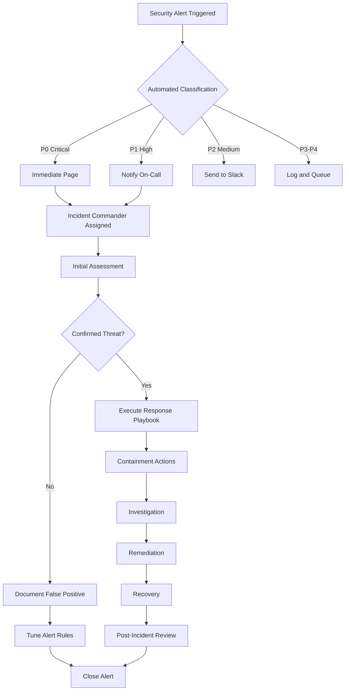
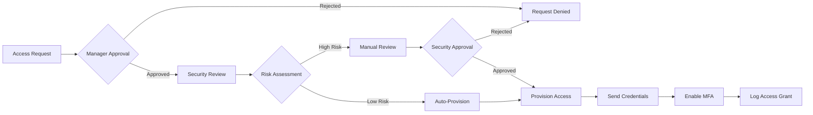

# Security Operations Guide: aclue Platform
## Day-to-Day Security Operations Manual

**Document Version**: 1.0.0
**Date**: September 2025
**Classification**: Operational Procedures
**Audience**: Security Operations Team, DevOps Engineers, On-Call Personnel

---

## Table of Contents

1. [Daily Security Operations](#1-daily-security-operations)
2. [Security Monitoring Procedures](#2-security-monitoring-procedures)
3. [Alert Response Workflows](#3-alert-response-workflows)
4. [Incident Management](#4-incident-management)
5. [Access Management](#5-access-management)
6. [Vulnerability Management](#6-vulnerability-management)
7. [Security Maintenance Tasks](#7-security-maintenance-tasks)
8. [Emergency Procedures](#8-emergency-procedures)
9. [Security Metrics and Reporting](#9-security-metrics-and-reporting)
10. [Team Responsibilities](#10-team-responsibilities)

---

## 1. Daily Security Operations

### 1.1 Morning Security Check (09:00 GMT)

```bash
#!/bin/bash
# Daily security check script
# Run every morning at 09:00 GMT

echo "=== aclue Platform Daily Security Check ==="
echo "Date: $(date '+%Y-%m-%d %H:%M:%S')"
echo ""

# 1. Check security alerts from overnight
echo "📊 Overnight Security Alerts:"
curl -s https://grafana.aclue.app/api/alerts | jq '.[] | select(.labels.category=="security")'

# 2. Review WAF statistics
echo "🛡️ WAF Activity (Last 24 hours):"
curl -s https://api.cloudflare.com/client/v4/zones/${ZONE_ID}/analytics/events \
  -H "Authorization: Bearer ${CF_API_TOKEN}" \
  -d "since=-1440" | jq '.result.totals'

# 3. Check authentication anomalies
echo "🔐 Authentication Metrics:"
prometheus_query 'rate(authentication_failures_total[24h])'

# 4. Review vulnerability scan results
echo "🔍 Latest Vulnerability Scan:"
trivy image --severity CRITICAL,HIGH aclue-backend:latest

# 5. Check certificate expiry
echo "📜 Certificate Status:"
echo | openssl s_client -connect aclue.app:443 2>/dev/null | \
  openssl x509 -noout -dates

# 6. Review backup status
echo "💾 Backup Status:"
check_backup_status

# 7. Security score check
echo "📈 Current Security Score:"
curl -s https://api.aclue.app/internal/security-score

echo ""
echo "Daily check complete. Review any anomalies above."
```

### 1.2 Security Dashboard Review

**Primary Dashboards to Monitor:**

1. **Security Overview Dashboard**
   - URL: `https://grafana.aclue.app/d/security-overview`
   - Key Metrics:
     - Security score (target: > 95)
     - Active threats (target: 0)
     - Failed authentication rate
     - WAF block rate
     - Certificate expiry countdown

2. **Attack Activity Dashboard**
   - URL: `https://grafana.aclue.app/d/attack-activity`
   - Key Metrics:
     - DDoS indicators
     - Brute force attempts
     - SQL injection attempts
     - Geographic threat distribution

3. **Compliance Dashboard**
   - URL: `https://grafana.aclue.app/d/compliance`
   - Key Metrics:
     - Audit log completeness
     - Data access patterns
     - GDPR compliance indicators
     - Security control effectiveness

### 1.3 Daily Security Checklist

| Time | Task | Owner | SLA | Verification |
|------|------|-------|-----|--------------|
| 09:00 | Review overnight alerts | SecOps | 30 min | Alert dashboard clear |
| 09:30 | Check vulnerability scans | SecOps | 15 min | No critical vulns |
| 10:00 | Review authentication logs | SecOps | 20 min | No anomalies |
| 10:30 | Verify backup integrity | DevOps | 15 min | Backup test passed |
| 11:00 | Check security patches | SecOps | 30 min | All systems patched |
| 14:00 | Review access requests | SecOps | 20 min | Requests processed |
| 16:00 | Update security metrics | SecOps | 15 min | Metrics updated |
| 17:00 | End-of-day security report | SecOps | 30 min | Report sent |

---

## 2. Security Monitoring Procedures

### 2.1 Real-Time Monitoring

```yaml
# Monitoring Configuration

Active Monitoring Streams:
  CloudFlare WAF:
    - Stream: wss://api.cloudflare.com/client/v4/stream
    - Events: firewall_events, rate_limit_events, bot_events
    - Action: Auto-block on threshold

  Application Logs:
    - Stream: https://logs.aclue.app/stream
    - Filters:
      - level: ERROR, CRITICAL
      - category: security, authentication, authorization
    - Action: Alert on patterns

  Database Activity:
    - Stream: postgresql://monitor@db.aclue.app/audit
    - Events: failed_auth, privilege_escalation, bulk_export
    - Action: Immediate investigation

  Network Traffic:
    - Tool: Prometheus + Grafana
    - Metrics: request_rate, error_rate, latency
    - Threshold: 5x baseline
    - Action: Traffic analysis
```

### 2.2 Log Analysis Procedures

```python
#!/usr/bin/env python3
"""
Security log analysis script
Runs every hour to detect patterns
"""

import json
import re
from collections import Counter
from datetime import datetime, timedelta

class SecurityLogAnalyzer:
    """Analyse security logs for threats"""

    def __init__(self):
        self.threat_patterns = {
            'sql_injection': [
                r"'\s*OR\s*'1'\s*=\s*'1",
                r"UNION\s+SELECT",
                r"DROP\s+TABLE"
            ],
            'xss_attempt': [
                r"<script[^>]*>",
                r"javascript:",
                r"onerror\s*="
            ],
            'path_traversal': [
                r"\.\./",
                r"\.\.\\",
                r"%2e%2e/"
            ],
            'command_injection': [
                r";\s*cat\s+/etc/passwd",
                r"\|\s*nc\s+",
                r"`.*`"
            ]
        }

    def analyze_logs(self, log_file):
        """Analyze log file for security threats"""
        threats_found = []
        ip_addresses = Counter()
        user_agents = Counter()

        with open(log_file, 'r') as f:
            for line in f:
                # Parse log entry
                try:
                    entry = json.loads(line)
                except:
                    continue

                # Check for threat patterns
                for threat_type, patterns in self.threat_patterns.items():
                    for pattern in patterns:
                        if re.search(pattern, entry.get('request', ''), re.I):
                            threats_found.append({
                                'type': threat_type,
                                'timestamp': entry.get('timestamp'),
                                'source_ip': entry.get('ip'),
                                'request': entry.get('request')
                            })

                # Track IPs and user agents
                ip_addresses[entry.get('ip')] += 1
                user_agents[entry.get('user_agent')] += 1

        # Generate report
        report = {
            'analysis_time': datetime.now().isoformat(),
            'threats_detected': len(threats_found),
            'threat_details': threats_found[:100],  # Limit to 100
            'top_ips': ip_addresses.most_common(10),
            'suspicious_agents': self.find_suspicious_agents(user_agents)
        }

        return report

    def find_suspicious_agents(self, user_agents):
        """Identify suspicious user agents"""
        suspicious = []
        suspicious_keywords = ['bot', 'crawler', 'scanner', 'nikto', 'sqlmap']

        for agent, count in user_agents.items():
            if any(keyword in agent.lower() for keyword in suspicious_keywords):
                suspicious.append({'agent': agent, 'count': count})

        return suspicious

# Usage
analyzer = SecurityLogAnalyzer()
report = analyzer.analyze_logs('/var/log/aclue/access.log')
print(json.dumps(report, indent=2))
```

### 2.3 Threat Intelligence Integration

```yaml
# Threat Intelligence Feeds

Configured Feeds:
  - Name: "Emerging Threats"
    URL: "https://rules.emergingthreats.net/open/ip-reputation"
    Update: Daily
    Action: Auto-block IPs

  - Name: "Abuse.ch SSL Blacklist"
    URL: "https://sslbl.abuse.ch/blacklist/"
    Update: Hourly
    Action: Block SSL certificates

  - Name: "PhishTank"
    URL: "http://data.phishtank.com/data/online-valid.json"
    Update: Daily
    Action: Block phishing URLs

  - Name: "CIRCL MISP"
    URL: "https://www.circl.lu/doc/misp/feed-osint/"
    Update: Daily
    Action: Threat correlation

Integration Process:
  1. Fetch threat feeds
  2. Parse and normalize data
  3. Update WAF rules
  4. Update monitoring filters
  5. Generate threat report
```

---

## 3. Alert Response Workflows

### 3.1 Alert Priority Matrix

| Severity | Response Time | Escalation | Examples |
|----------|--------------|------------|----------|
| **P0 - Critical** | < 5 minutes | Immediate page | Data breach, system compromise, ransomware |
| **P1 - High** | < 15 minutes | Page after 30 min | Active attack, auth bypass, critical vuln |
| **P2 - Medium** | < 1 hour | Email + Slack | Suspicious activity, failed security control |
| **P3 - Low** | < 4 hours | Email only | Anomaly detected, threshold exceeded |
| **P4 - Info** | Next business day | Logged only | Security metrics, routine scans |

### 3.2 Alert Response Procedures



### 3.3 Specific Alert Responses

#### Brute Force Attack Alert

```bash
#!/bin/bash
# Response script for brute force attacks

ALERT_DATA=$1
SOURCE_IP=$(echo $ALERT_DATA | jq -r '.source_ip')
TARGET_ACCOUNT=$(echo $ALERT_DATA | jq -r '.target_account')

echo "[$(date)] Responding to brute force attack from $SOURCE_IP"

# 1. Block IP immediately
cloudflare_block_ip $SOURCE_IP "Brute force attack"
redis-cli SETEX "blocked_ip:$SOURCE_IP" 86400 "brute_force"

# 2. Check if any successful logins occurred
SUCCESS_COUNT=$(check_successful_logins $SOURCE_IP)
if [ $SUCCESS_COUNT -gt 0 ]; then
    echo "⚠️  CRITICAL: Successful login detected after brute force"
    lock_account $TARGET_ACCOUNT
    notify_user $TARGET_ACCOUNT "security_alert"
    escalate_to_incident_response
fi

# 3. Enable additional protection
enable_captcha "login"
increase_login_rate_limit

# 4. Generate report
generate_attack_report "brute_force" $SOURCE_IP > /tmp/attack_report.json

# 5. Notify team
send_slack_alert "security-alerts" "Brute force attack mitigated. IP: $SOURCE_IP"

echo "Response complete. Attack mitigated."
```

#### Data Exfiltration Alert

```python
#!/usr/bin/env python3
"""
Response script for potential data exfiltration
"""

import sys
import json
from datetime import datetime

def respond_to_data_exfiltration(alert_data):
    """Respond to data exfiltration alert"""

    user_id = alert_data['user_id']
    volume = alert_data['data_volume']
    queries = alert_data['suspicious_queries']

    print(f"[{datetime.now()}] Responding to potential data exfiltration")
    print(f"User: {user_id}, Volume: {volume}")

    # 1. Immediate containment
    actions = []

    # Suspend user access
    suspend_user_access(user_id)
    actions.append("User access suspended")

    # Revoke all sessions
    revoke_user_sessions(user_id)
    actions.append("All sessions revoked")

    # 2. Capture evidence
    # Snapshot current activity
    activity_snapshot = capture_user_activity(user_id)
    actions.append("Activity snapshot captured")

    # Export audit logs
    audit_logs = export_audit_logs(user_id, hours=24)
    actions.append("Audit logs exported")

    # 3. Analyze scope
    affected_data = analyze_accessed_data(queries)

    if 'personal_data' in affected_data:
        # GDPR breach protocol
        initiate_gdpr_breach_protocol(affected_data)
        actions.append("GDPR breach protocol initiated")

    # 4. Block further access
    block_database_access(user_id)
    add_to_watchlist(user_id)
    actions.append("Database access blocked")

    # 5. Generate incident
    incident_id = create_security_incident({
        'type': 'DATA_EXFILTRATION',
        'severity': 'HIGH',
        'user': user_id,
        'data_volume': volume,
        'affected_data': affected_data,
        'actions_taken': actions
    })

    print(f"Incident created: {incident_id}")
    return incident_id

if __name__ == "__main__":
    alert_data = json.loads(sys.argv[1])
    respond_to_data_exfiltration(alert_data)
```

---

## 4. Incident Management

### 4.1 Incident Classification

| Type | Severity | Examples | SLA |
|------|----------|----------|-----|
| **Data Breach** | Critical | PII exposure, database compromise | 15 min |
| **Account Compromise** | High | Credential theft, session hijack | 30 min |
| **Service Disruption** | High | DDoS, ransomware, system failure | 15 min |
| **Malware** | High | Virus, trojan, backdoor | 1 hour |
| **Unauthorised Access** | Medium | Privilege escalation, policy violation | 2 hours |
| **Security Misconfiguration** | Medium | Exposed secrets, weak settings | 4 hours |
| **Vulnerability Exploitation** | High | Zero-day, known CVE exploit | 30 min |

### 4.2 Incident Response Team Structure

```yaml
Incident Response Team:
  Incident Commander:
    - Overall incident coordination
    - External communications
    - Decision authority
    - Status updates

  Security Lead:
    - Technical investigation
    - Forensic analysis
    - Threat assessment
    - Remediation planning

  Operations Lead:
    - System stability
    - Service restoration
    - Infrastructure changes
    - Performance monitoring

  Communications Lead:
    - Customer notifications
    - Internal updates
    - Regulatory reporting
    - Media relations

  Legal/Compliance Lead:
    - Regulatory requirements
    - Legal implications
    - Evidence preservation
    - Documentation

On-Call Rotation:
  Primary: 24/7 coverage
  Secondary: Backup coverage
  Escalation: Management chain
  Response Time: < 15 minutes
```

### 4.3 Incident Response Phases

#### Phase 1: Detection & Analysis (0-30 minutes)

```python
# Incident detection and initial analysis

def initial_incident_response(alert):
    """Initial incident response procedure"""

    # 1. Acknowledge alert
    incident = {
        'id': generate_incident_id(),
        'timestamp': datetime.utcnow(),
        'alert': alert,
        'status': 'INVESTIGATING',
        'commander': assign_incident_commander()
    }

    # 2. Initial assessment
    incident['assessment'] = {
        'severity': classify_severity(alert),
        'scope': determine_scope(alert),
        'impact': assess_impact(alert),
        'affected_systems': identify_affected_systems(alert)
    }

    # 3. Activate response team
    if incident['assessment']['severity'] in ['CRITICAL', 'HIGH']:
        activate_response_team(incident)
        create_war_room(incident['id'])

    # 4. Preserve evidence
    incident['evidence'] = {
        'logs': capture_logs(incident['assessment']['affected_systems']),
        'memory': capture_memory_dump() if critical else None,
        'network': capture_network_traffic(),
        'snapshots': create_system_snapshots()
    }

    # 5. Initial containment
    if requires_immediate_containment(incident):
        incident['containment'] = execute_containment(incident)

    return incident
```

#### Phase 2: Containment (30 minutes - 2 hours)

```yaml
Containment Strategies:
  Short-term:
    - Isolate affected systems
    - Block malicious IPs/domains
    - Disable compromised accounts
    - Implement emergency firewall rules

  Long-term:
    - Patch vulnerabilities
    - Reset all credentials
    - Rebuild compromised systems
    - Implement additional monitoring

Containment Decision Tree:
  Data Breach:
    - Disconnect affected database
    - Revoke all access tokens
    - Enable read-only mode
    - Audit all recent access

  Malware:
    - Isolate infected systems
    - Block C&C communications
    - Disable network shares
    - Initiate AV scanning

  Account Compromise:
    - Force password reset
    - Revoke all sessions
    - Enable MFA requirement
    - Review account permissions
```

#### Phase 3: Eradication (2-8 hours)

```bash
#!/bin/bash
# Eradication procedures

# Remove malware
find / -name "*.malware" -type f -delete
systemctl stop malicious-service
rm -rf /opt/malware/

# Patch vulnerabilities
apt-get update && apt-get upgrade -y
npm audit fix --force
pip install --upgrade vulnerable-package

# Reset credentials
reset_all_passwords
rotate_api_keys
regenerate_certificates

# Clean logs of attacker tracks
sanitize_logs /var/log/
```

#### Phase 4: Recovery (8-24 hours)

```python
# Recovery procedures

def system_recovery(incident_id):
    """System recovery after incident"""

    recovery_plan = {
        'restore_order': [
            'database',
            'application_servers',
            'web_servers',
            'cdn_cache',
            'monitoring'
        ],
        'validation_steps': [],
        'rollback_points': []
    }

    for system in recovery_plan['restore_order']:
        print(f"Restoring {system}")

        # Restore from clean backup
        restore_from_backup(system)

        # Validate integrity
        if not validate_system_integrity(system):
            rollback(system)
            raise Exception(f"Failed to restore {system}")

        # Run security scan
        security_scan_results = run_security_scan(system)
        if security_scan_results['vulnerabilities'] > 0:
            apply_security_patches(system)

        # Enable monitoring
        enable_enhanced_monitoring(system)

        recovery_plan['validation_steps'].append({
            'system': system,
            'status': 'restored',
            'timestamp': datetime.utcnow()
        })

    # Gradual service restoration
    restore_services_gradually()

    return recovery_plan
```

#### Phase 5: Post-Incident (24-72 hours)

```markdown
## Post-Incident Review Template

### Incident Summary
- Incident ID:
- Date/Time:
- Duration:
- Severity:
- Systems Affected:

### Timeline
- Detection:
- Response Initiated:
- Contained:
- Eradicated:
- Recovered:
- Closed:

### Root Cause Analysis
- Primary Cause:
- Contributing Factors:
- Attack Vector:
- Vulnerabilities Exploited:

### Impact Assessment
- Data Affected:
- Users Impacted:
- Financial Loss:
- Reputation Impact:
- Compliance Issues:

### Response Effectiveness
- What Went Well:
- What Could Improve:
- Missing Procedures:
- Tool Limitations:

### Lessons Learned
- Security Improvements:
- Process Improvements:
- Training Needs:
- Tool Requirements:

### Action Items
- Priority 1 (Immediate):
- Priority 2 (This Week):
- Priority 3 (This Month):
- Long-term Improvements:
```

---

## 5. Access Management

### 5.1 Access Request Process



### 5.2 Privileged Access Management

```yaml
Privileged Account Types:
  Root/Admin:
    - Approval: CISO + CTO
    - Duration: 4 hours maximum
    - MFA: Required
    - Monitoring: Full session recording
    - Justification: Documented reason

  Database Admin:
    - Approval: Data Owner + Security
    - Duration: 8 hours maximum
    - MFA: Required
    - Monitoring: Query logging
    - Justification: Ticket required

  Service Accounts:
    - Approval: Security Team
    - Rotation: Every 90 days
    - Monitoring: API call logging
    - Restrictions: IP allowlist

Break-Glass Procedures:
  - Emergency access safe
  - Dual control required
  - Automatic alerts on use
  - Password reset after use
  - Full audit review
```

### 5.3 Access Reviews

```python
#!/usr/bin/env python3
"""
Quarterly access review automation
"""

def quarterly_access_review():
    """Perform quarterly access review"""

    print("Starting Quarterly Access Review")
    report = {
        'date': datetime.now().isoformat(),
        'findings': [],
        'actions': []
    }

    # 1. Identify dormant accounts
    dormant = find_dormant_accounts(days=90)
    for account in dormant:
        report['findings'].append({
            'type': 'dormant_account',
            'account': account,
            'last_login': account['last_login']
        })
        disable_account(account['id'])
        report['actions'].append(f"Disabled dormant account: {account['email']}")

    # 2. Review privileged access
    privileged = get_privileged_accounts()
    for account in privileged:
        if not validate_privileged_justification(account):
            report['findings'].append({
                'type': 'unjustified_privilege',
                'account': account
            })
            downgrade_privileges(account['id'])
            report['actions'].append(f"Removed privileges: {account['email']}")

    # 3. Check MFA compliance
    no_mfa = find_accounts_without_mfa()
    for account in no_mfa:
        report['findings'].append({
            'type': 'missing_mfa',
            'account': account
        })
        enforce_mfa(account['id'])
        report['actions'].append(f"MFA enforced: {account['email']}")

    # 4. Validate service accounts
    service_accounts = get_service_accounts()
    for account in service_accounts:
        if is_credential_expired(account):
            rotate_service_account(account)
            report['actions'].append(f"Rotated service account: {account['name']}")

    # 5. Generate compliance report
    save_compliance_report(report)
    notify_stakeholders(report)

    return report
```

---

## 6. Vulnerability Management

### 6.1 Vulnerability Scanning Schedule

| Scan Type | Frequency | Tool | Target | Threshold |
|-----------|-----------|------|--------|-----------|
| **Container Scan** | Every build | Trivy | Docker images | CRITICAL: 0, HIGH: 5 |
| **Dependency Scan** | Daily | Snyk, Safety | npm, pip packages | CRITICAL: 0, HIGH: 10 |
| **Code Scan** | Every commit | Semgrep, Bandit | Source code | CRITICAL: 0, HIGH: 5 |
| **Infrastructure Scan** | Weekly | Checkov | IaC templates | CRITICAL: 0, HIGH: 10 |
| **Web App Scan** | Weekly | OWASP ZAP | Production URLs | CRITICAL: 0, HIGH: 5 |
| **Penetration Test** | Quarterly | External vendor | Full platform | Based on findings |

### 6.2 Vulnerability Response SLAs

```yaml
Response SLAs:
  CRITICAL (CVSS 9.0-10.0):
    - Detection to Triage: 1 hour
    - Triage to Patch: 4 hours
    - Patch to Deployment: 24 hours
    - Verification: Immediate

  HIGH (CVSS 7.0-8.9):
    - Detection to Triage: 4 hours
    - Triage to Patch: 24 hours
    - Patch to Deployment: 72 hours
    - Verification: Within 24 hours

  MEDIUM (CVSS 4.0-6.9):
    - Detection to Triage: 24 hours
    - Triage to Patch: 7 days
    - Patch to Deployment: 14 days
    - Verification: Weekly

  LOW (CVSS 0.0-3.9):
    - Detection to Triage: 7 days
    - Triage to Patch: 30 days
    - Patch to Deployment: Next release
    - Verification: Monthly
```

### 6.3 Patch Management Process

```bash
#!/bin/bash
# Automated patch management script

# 1. Check for available patches
echo "Checking for security patches..."

# System patches
apt-get update
UPGRADABLE=$(apt list --upgradable 2>/dev/null | grep -i security | wc -l)

if [ $UPGRADABLE -gt 0 ]; then
    echo "Found $UPGRADABLE security updates"

    # Test in staging first
    deploy_to_staging() {
        ssh staging-server "sudo apt-get upgrade -y"
        run_smoke_tests staging-server
    }

    if deploy_to_staging; then
        # Schedule production deployment
        schedule_maintenance_window() {
            echo "Scheduling production patch window"
            at 02:00 AM tomorrow <<EOF
                sudo apt-get upgrade -y
                systemctl restart aclue-backend
                verify_services
EOF
        }
        schedule_maintenance_window
    else
        echo "Staging deployment failed. Investigating..."
        create_incident "Patch deployment failure"
    fi
fi

# Application patches
echo "Checking application dependencies..."

# Python packages
pip list --outdated --format=json | \
    jq '.[] | select(.latest_version != .version)' | \
    while read pkg; do
        check_security_advisory $pkg
    done

# Node packages
npm audit --json | jq '.vulnerabilities | to_entries[] | .value' | \
    while read vuln; do
        apply_npm_patch $vuln
    done
```

---

## 7. Security Maintenance Tasks

### 7.1 Weekly Security Tasks

| Day | Task | Duration | Owner |
|-----|------|----------|-------|
| **Monday** | Security metrics review | 1 hour | Security Lead |
| **Monday** | Vulnerability scan review | 2 hours | SecOps |
| **Tuesday** | Access review audit | 1 hour | IAM Team |
| **Tuesday** | Certificate check | 30 min | DevOps |
| **Wednesday** | Threat intel review | 1 hour | Security Analyst |
| **Wednesday** | WAF rule updates | 1 hour | SecOps |
| **Thursday** | Backup verification | 2 hours | DevOps |
| **Thursday** | Incident drill | 1 hour | All |
| **Friday** | Security training | 1 hour | All |
| **Friday** | Week review & planning | 1 hour | Security Lead |

### 7.2 Monthly Security Tasks

```python
#!/usr/bin/env python3
"""
Monthly security maintenance tasks
"""

def monthly_security_maintenance():
    """Execute monthly security tasks"""

    tasks = []

    # 1. Rotate secrets and credentials
    print("Task 1: Rotating secrets...")
    rotated = rotate_secrets([
        'api_keys',
        'service_passwords',
        'encryption_keys'
    ])
    tasks.append(f"Rotated {len(rotated)} secrets")

    # 2. Review and update firewall rules
    print("Task 2: Reviewing firewall rules...")
    obsolete_rules = review_firewall_rules()
    for rule in obsolete_rules:
        remove_firewall_rule(rule)
    tasks.append(f"Removed {len(obsolete_rules)} obsolete rules")

    # 3. Security tool updates
    print("Task 3: Updating security tools...")
    tools_updated = update_security_tools([
        'trivy',
        'semgrep',
        'gitleaks',
        'bandit'
    ])
    tasks.append(f"Updated {len(tools_updated)} security tools")

    # 4. Compliance check
    print("Task 4: Running compliance check...")
    compliance_report = run_compliance_audit()
    tasks.append(f"Compliance score: {compliance_report['score']}/100")

    # 5. Disaster recovery test
    print("Task 5: Testing disaster recovery...")
    dr_test = test_disaster_recovery()
    tasks.append(f"DR test: {dr_test['status']}")

    # 6. Security awareness metrics
    print("Task 6: Collecting security metrics...")
    metrics = collect_security_metrics()
    tasks.append(f"Metrics collected: {len(metrics)} data points")

    # Generate monthly report
    report = generate_monthly_report(tasks)
    send_report_to_stakeholders(report)

    return tasks

# Run on first Monday of month
if is_first_monday():
    monthly_security_maintenance()
```

### 7.3 Quarterly Security Tasks

```yaml
Q1 Tasks (January - March):
  - Annual security strategy review
  - Budget planning for security tools
  - Compliance certification renewal
  - Full platform penetration test

Q2 Tasks (April - June):
  - Security architecture review
  - Vendor security assessments
  - Business continuity plan update
  - Security training programme review

Q3 Tasks (July - September):
  - Mid-year security audit
  - Incident response plan update
  - Security tool evaluation
  - Policy and procedure updates

Q4 Tasks (October - December):
  - Year-end security assessment
  - Next year planning
  - Security metrics annual review
  - Team performance reviews
```

---

## 8. Emergency Procedures

### 8.1 Emergency Contact List

```yaml
Emergency Contacts:
  Security Hotline: +44 20 XXXX XXXX (24/7)

  Incident Response Team:
    - Primary On-Call: [PagerDuty]
    - Secondary On-Call: [PagerDuty]
    - Security Lead: security-lead@aclue.app
    - CISO: ciso@aclue.app

  External Support:
    - CloudFlare Support: +1-650-319-8930
    - AWS Security: https://aws.amazon.com/security/
    - Incident Response Vendor: [Vendor Contact]
    - Legal Counsel: legal@company-law.com

  Regulatory Reporting:
    - ICO (GDPR): +44 303 123 1113
    - Action Fraud (UK): 0300 123 2040
```

### 8.2 Critical Incident Procedures

#### Ransomware Attack

```bash
#!/bin/bash
# CRITICAL: Ransomware response script
# DO NOT PAY RANSOM - FOLLOW THESE STEPS

echo "🚨 RANSOMWARE INCIDENT RESPONSE INITIATED 🚨"

# 1. IMMEDIATE ISOLATION
echo "Step 1: Isolating affected systems..."
disconnect_from_network ALL
disable_remote_access ALL
shutdown_non_critical_services

# 2. PRESERVE EVIDENCE
echo "Step 2: Preserving evidence..."
create_forensic_image /dev/sda
capture_memory_dump
backup_logs /var/log/

# 3. ASSESS SCOPE
echo "Step 3: Assessing infection scope..."
scan_network_for_indicators
check_backup_integrity
identify_patient_zero

# 4. ACTIVATE DR
echo "Step 4: Activating disaster recovery..."
failover_to_dr_site
restore_from_clean_backup
verify_data_integrity

# 5. NOTIFY AUTHORITIES
echo "Step 5: Sending notifications..."
notify_law_enforcement
notify_cyber_insurance
notify_customers_if_required

# 6. INVESTIGATION
echo "Step 6: Beginning investigation..."
analyze_ransomware_variant
identify_initial_vector
document_timeline

echo "Initial response complete. DO NOT POWER OFF affected systems."
echo "Await further instructions from incident commander."
```

#### Complete System Compromise

```python
#!/usr/bin/env python3
"""
CRITICAL: Complete system compromise response
ASSUME ALL SYSTEMS ARE COMPROMISED
"""

import os
import subprocess
from datetime import datetime

def total_compromise_response():
    """Response to complete system compromise"""

    print("🚨 CRITICAL SECURITY INCIDENT - ASSUME TOTAL COMPROMISE 🚨")
    start_time = datetime.now()

    # 1. EMERGENCY SHUTDOWN
    print("\n[1] EMERGENCY SHUTDOWN")
    # Disconnect from internet
    os.system("iptables -P INPUT DROP")
    os.system("iptables -P OUTPUT DROP")
    os.system("iptables -P FORWARD DROP")

    # Stop all services
    services = ['nginx', 'postgresql', 'redis', 'docker']
    for service in services:
        subprocess.run(['systemctl', 'stop', service])

    # 2. EVIDENCE PRESERVATION
    print("\n[2] PRESERVING EVIDENCE")
    evidence_dir = f"/emergency/evidence/{start_time.timestamp()}"
    os.makedirs(evidence_dir, exist_ok=True)

    # Capture system state
    subprocess.run(['tar', '-czf', f'{evidence_dir}/logs.tar.gz', '/var/log/'])
    subprocess.run(['dd', 'if=/dev/mem', f'of={evidence_dir}/memory.img'])
    subprocess.run(['netstat', '-an'], stdout=open(f'{evidence_dir}/netstat.txt', 'w'))
    subprocess.run(['ps', 'aux'], stdout=open(f'{evidence_dir}/processes.txt', 'w'))

    # 3. COMMUNICATION
    print("\n[3] EMERGENCY COMMUNICATIONS")
    # Out-of-band communication only
    print("📱 Call security hotline: +44 20 XXXX XXXX")
    print("📧 Email from personal device to: incident-critical@aclue.app")
    print("🚫 DO NOT use compromised systems for communication")

    # 4. RECOVERY PREPARATION
    print("\n[4] PREPARING RECOVERY")
    print("""
    RECOVERY CHECKLIST:
    [ ] All evidence preserved
    [ ] Management notified via phone
    [ ] Clean rebuild environment ready
    [ ] Incident commander on-site
    [ ] Legal counsel notified
    [ ] PR statement prepared
    [ ] Customer notification ready
    """)

    # 5. REBUILD INSTRUCTIONS
    print("\n[5] REBUILD PROCEDURE")
    print("""
    DO NOT restore from recent backups - they may be compromised

    1. Build new infrastructure from scratch
    2. Use backups from before compromise date
    3. Reset ALL credentials and keys
    4. Implement additional monitoring
    5. Gradual service restoration with validation
    """)

    return {
        'incident_start': start_time,
        'systems_isolated': True,
        'evidence_location': evidence_dir,
        'next_steps': 'Await incident commander'
    }

if __name__ == "__main__":
    # This script should only be run in a true emergency
    confirm = input("Type 'CONFIRM TOTAL COMPROMISE' to proceed: ")
    if confirm == "CONFIRM TOTAL COMPROMISE":
        total_compromise_response()
    else:
        print("Response cancelled")
```

---

## 9. Security Metrics and Reporting

### 9.1 Key Security Metrics

```yaml
Operational Metrics:
  - Mean Time to Detect (MTTD): < 2 minutes
  - Mean Time to Respond (MTTR): < 15 minutes
  - Mean Time to Contain (MTTC): < 1 hour
  - Mean Time to Recover (MTTR): < 4 hours

Security Health Metrics:
  - Security Score: > 95/100
  - Vulnerability Count: CRITICAL: 0, HIGH: < 5
  - Patch Compliance: > 98%
  - Incident Rate: < 2/month
  - False Positive Rate: < 10%

Compliance Metrics:
  - Audit Pass Rate: 100%
  - Policy Compliance: > 98%
  - Training Completion: 100%
  - Access Review Completion: 100%
```

### 9.2 Security Dashboard Configuration

```json
{
  "security_dashboard": {
    "refresh_rate": "30s",
    "panels": [
      {
        "title": "Security Score",
        "query": "security_score_current",
        "visualization": "gauge",
        "thresholds": {
          "red": [0, 80],
          "yellow": [80, 90],
          "green": [90, 100]
        }
      },
      {
        "title": "Active Threats",
        "query": "sum(security_threats_active)",
        "visualization": "stat",
        "alert_on": "> 0"
      },
      {
        "title": "Authentication Failures",
        "query": "rate(auth_failures_total[5m])",
        "visualization": "graph"
      },
      {
        "title": "WAF Blocks",
        "query": "rate(waf_blocks_total[5m])",
        "visualization": "graph"
      },
      {
        "title": "Vulnerability Status",
        "query": "vulnerabilities_by_severity",
        "visualization": "pie_chart"
      }
    ]
  }
}
```

### 9.3 Reporting Templates

#### Daily Security Report

```markdown
# Daily Security Report
**Date**: [DATE]
**Report Generated**: [TIME]

## Executive Summary
- Security Score: [SCORE]/100
- Active Incidents: [COUNT]
- Threats Blocked: [COUNT]
- Systems Status: [OPERATIONAL/DEGRADED]

## Key Metrics (Last 24 Hours)
- Authentication Attempts: [TOTAL] (Failed: [COUNT])
- WAF Blocks: [COUNT]
- Vulnerability Scans: [PASSED/FAILED]
- Alerts Triggered: [COUNT] (P0: [X], P1: [Y], P2: [Z])

## Incidents
[List any incidents with status]

## Action Items
[List any required actions]

## Tomorrow's Focus
[Key tasks for next day]
```

#### Weekly Security Report

```markdown
# Weekly Security Report
**Week Ending**: [DATE]
**Prepared By**: Security Operations Team

## Week Overview
### Highlights
- [Key achievement 1]
- [Key achievement 2]
- [Key concern 1]

### Metrics Summary
| Metric | This Week | Last Week | Change |
|--------|-----------|-----------|---------|
| Security Score | X | Y | +/-Z |
| Incidents | X | Y | +/-Z |
| Vulnerabilities | X | Y | +/-Z |
| Patches Applied | X | Y | +/-Z |

## Incident Analysis
[Detailed analysis of any incidents]

## Vulnerability Management
- New Vulnerabilities: [COUNT]
- Remediated: [COUNT]
- Pending: [COUNT]

## Compliance Status
- [Compliance area 1]: [STATUS]
- [Compliance area 2]: [STATUS]

## Next Week Priorities
1. [Priority 1]
2. [Priority 2]
3. [Priority 3]
```

---

## 10. Team Responsibilities

### 10.1 Role Definitions

```yaml
Security Operations Team:
  Security Operations Lead:
    - Daily operations oversight
    - Incident commander rotation
    - Metrics and reporting
    - Team coordination
    - Stakeholder communication

  Security Analyst (Tier 1):
    - Monitor security alerts
    - Initial triage and response
    - Log analysis
    - Documentation
    - Escalation to Tier 2

  Security Engineer (Tier 2):
    - Advanced incident response
    - Security tool management
    - Vulnerability remediation
    - Automation development
    - Architecture improvements

  DevSecOps Engineer:
    - CI/CD security integration
    - Infrastructure security
    - Container security
    - Cloud security
    - Security automation
```

### 10.2 RACI Matrix

| Task | Security Lead | Security Analyst | DevSecOps | DevOps | Management |
|------|--------------|-----------------|-----------|--------|------------|
| Daily Monitoring | A | R | C | I | I |
| Incident Response | A/R | R | C | C | I |
| Vulnerability Mgmt | A | R | R | C | I |
| Access Reviews | A | R | C | C | I |
| Security Training | R | C | C | C | A |
| Tool Management | A | C | R | C | I |
| Reporting | R | C | C | I | A |
| Policy Updates | R | C | C | I | A |

**Legend**: R = Responsible, A = Accountable, C = Consulted, I = Informed

### 10.3 Training Requirements

```yaml
Mandatory Training:
  All Staff:
    - Security Awareness: Quarterly
    - Phishing Simulation: Monthly
    - Data Protection: Annual
    - Incident Reporting: On-boarding

  Security Team:
    - SANS Training: Annual
    - Cloud Security: Annual
    - Incident Response: Bi-annual
    - Tool-specific: As needed

  Developers:
    - Secure Coding: Quarterly
    - OWASP Top 10: Annual
    - Security Testing: Bi-annual

Certifications:
  Recommended:
    - CISSP (Security Lead)
    - GCIH (Incident Response)
    - GSEC (Security Analyst)
    - AWS Security (Cloud Team)
```

---

## Appendices

### Appendix A: Security Tools Quick Reference

| Tool | Purpose | Access | Documentation |
|------|---------|--------|---------------|
| Grafana | Security dashboards | https://grafana.aclue.app | [Internal Wiki] |
| Prometheus | Metrics collection | https://prometheus.aclue.app | [Internal Wiki] |
| CloudFlare | WAF management | https://dash.cloudflare.com | [CF Docs] |
| PagerDuty | Alert management | https://aclue.pagerduty.com | [PD Docs] |
| Slack | Team communication | https://aclue.slack.com | #security-ops |

### Appendix B: Common Commands

```bash
# Check security status
security-check --full

# Review recent alerts
get-alerts --severity=high --hours=24

# Check vulnerability status
trivy image aclue-backend:latest

# Review access logs
tail -f /var/log/aclue/access.log | grep -E "40[0-9]|50[0-9]"

# Check SSL certificate
echo | openssl s_client -connect aclue.app:443 2>/dev/null | openssl x509 -noout -dates

# Block IP address
cloudflare-block-ip 192.168.1.1 "Reason for block"

# Generate security report
generate-security-report --weekly
```

### Appendix C: Escalation Procedures

```yaml
Escalation Path:
  Level 1 (0-15 min):
    - Security Analyst on-call
    - Can handle: P2-P4 alerts

  Level 2 (15-30 min):
    - Security Engineer on-call
    - Can handle: P1-P2 incidents

  Level 3 (30-60 min):
    - Security Lead
    - Can handle: P0-P1 incidents

  Level 4 (60+ min):
    - CISO / CTO
    - Can handle: Critical business decisions

After Hours:
  - Primary: Follow PagerDuty rotation
  - Backup: Security Lead mobile
  - Emergency: Security hotline
```

---

**Document Control**
- **Version**: 1.0.0
- **Last Updated**: September 2025
- **Review Frequency**: Monthly
- **Owner**: Security Operations Team
- **Classification**: Operational Procedures

---

*This document contains operational security procedures. Authorised personnel only.*