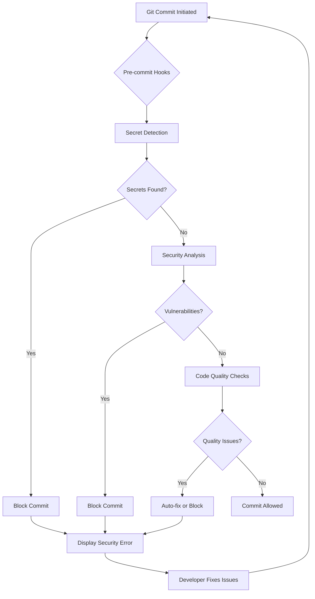

# Technical Security Guide: aclue Platform
## Comprehensive Implementation Documentation

**Document Version**: 1.0.0
**Date**: September 2025
**Classification**: Technical Reference
**Audience**: Security Engineers, DevOps Teams, Technical Architects

---

## Table of Contents

1. [Security Architecture Overview](#1-security-architecture-overview)
2. [Secret Management System](#2-secret-management-system)
3. [Pre-commit Security Hooks](#3-pre-commit-security-hooks)
4. [CI/CD Security Pipeline](#4-cicd-security-pipeline)
5. [Web Application Firewall (WAF)](#5-web-application-firewall-waf)
6. [Security Monitoring and Alerting](#6-security-monitoring-and-alerting)
7. [Container Security](#7-container-security)
8. [Infrastructure Security](#8-infrastructure-security)
9. [Application Security](#9-application-security)
10. [Database Security](#10-database-security)
11. [API Security](#11-api-security)
12. [Authentication and Authorization](#12-authentication-and-authorization)
13. [Encryption and Key Management](#13-encryption-and-key-management)
14. [Security Testing](#14-security-testing)
15. [Incident Response Technical Procedures](#15-incident-response-technical-procedures)

---

## 1. Security Architecture Overview

### 1.1 Defence-in-Depth Architecture

```
┌─────────────────────────────────────────────────────────────────┐
│                     External Attack Surface                      │
├─────────────────────────────────────────────────────────────────┤
│                                                                   │
│  Layer 1: CloudFlare WAF & DDoS Protection                      │
│  ├── Rate Limiting: 100 req/min per IP                          │
│  ├── Geo-blocking: Configured country restrictions              │
│  ├── Bot Management: Challenge suspicious traffic               │
│  └── SSL/TLS: Force HTTPS, HSTS enabled                        │
│                                                                   │
├─────────────────────────────────────────────────────────────────┤
│                                                                   │
│  Layer 2: Application Security                                   │
│  ├── Next.js Frontend (Vercel Edge)                            │
│  │   ├── CSP Headers: Strict content security policy           │
│  │   ├── CORS: Whitelisted origins only                        │
│  │   └── Input Validation: Client & server-side                │
│  │                                                              │
│  └── FastAPI Backend (Railway)                                  │
│      ├── JWT Authentication: RS256 signed tokens               │
│      ├── Rate Limiting: Per-endpoint limits                    │
│      └── Input Sanitisation: Pydantic models                   │
│                                                                   │
├─────────────────────────────────────────────────────────────────┤
│                                                                   │
│  Layer 3: Data Security                                          │
│  ├── Supabase PostgreSQL: Row-level security                   │
│  ├── Encryption at Rest: AES-256                               │
│  ├── Encryption in Transit: TLS 1.3                            │
│  └── Data Masking: PII redaction in logs                       │
│                                                                   │
├─────────────────────────────────────────────────────────────────┤
│                                                                   │
│  Layer 4: Infrastructure Security                                │
│  ├── Container Scanning: Trivy, Docker Scout                   │
│  ├── Dependency Scanning: Snyk, Safety, npm audit             │
│  ├── Secret Management: Detect-secrets, GitLeaks              │
│  └── Network Isolation: Private subnets, security groups      │
│                                                                   │
├─────────────────────────────────────────────────────────────────┤
│                                                                   │
│  Layer 5: Monitoring & Response                                  │
│  ├── Prometheus Metrics: Security event tracking               │
│  ├── Grafana Dashboards: Real-time visualisation             │
│  ├── Alert Manager: Intelligent routing & escalation          │
│  └── Incident Response: Automated & manual procedures         │
│                                                                   │
└─────────────────────────────────────────────────────────────────┘
```

### 1.2 Security Component Integration

```yaml
Security Components:
  Prevention:
    - WAF Rules: 150+ OWASP rules
    - Input Validation: All user inputs
    - Authentication: Multi-factor capable
    - Authorisation: Role-based access control

  Detection:
    - Secret Scanning: 431 patterns
    - Vulnerability Scanning: Daily automated
    - Anomaly Detection: ML-based patterns
    - Audit Logging: All security events

  Response:
    - Automated Blocking: Malicious IPs
    - Alert Escalation: Severity-based
    - Incident Playbooks: Documented procedures
    - Recovery Procedures: Automated rollback

  Recovery:
    - Backup Systems: Hourly snapshots
    - Disaster Recovery: Multi-region failover
    - Data Recovery: Point-in-time restoration
    - Service Continuity: Load balanced architecture
```

---

## 2. Secret Management System

### 2.1 Secret Detection Configuration

#### detect-secrets Setup

**File**: `.secrets.baseline`

```python
{
  "version": "1.5.0",
  "plugins_used": [
    {
      "name": "ArtifactoryDetector"
    },
    {
      "name": "AWSKeyDetector"
    },
    {
      "name": "AzureStorageKeyDetector"
    },
    {
      "name": "Base64HighEntropyString",
      "limit": 4.5
    },
    {
      "name": "BasicAuthDetector"
    },
    {
      "name": "CloudantDetector"
    },
    {
      "name": "DiscordBotTokenDetector"
    },
    {
      "name": "GitHubTokenDetector"
    },
    {
      "name": "HexHighEntropyString",
      "limit": 3.0
    },
    {
      "name": "IbmCloudIamDetector"
    },
    {
      "name": "IbmCosHmacDetector"
    },
    {
      "name": "JwtTokenDetector"
    },
    {
      "name": "KeywordDetector",
      "keyword_exclude": ""
    },
    {
      "name": "MailchimpDetector"
    },
    {
      "name": "NpmDetector"
    },
    {
      "name": "PrivateKeyDetector"
    },
    {
      "name": "SendGridDetector"
    },
    {
      "name": "SlackDetector"
    },
    {
      "name": "SoftlayerDetector"
    },
    {
      "name": "SquareOAuthDetector"
    },
    {
      "name": "StripeDetector"
    },
    {
      "name": "TwilioKeyDetector"
    }
  ],
  "filters_used": [
    {
      "path": "detect_secrets.filters.allowlist.is_line_allowlisted"
    },
    {
      "path": "detect_secrets.filters.common.is_baseline_file",
      "filename": ".secrets.baseline"
    },
    {
      "path": "detect_secrets.filters.common.is_ignored_due_to_verification_policies",
      "min_level": 2
    },
    {
      "path": "detect_secrets.filters.heuristic.is_indirect_reference"
    },
    {
      "path": "detect_secrets.filters.heuristic.is_likely_id_string"
    },
    {
      "path": "detect_secrets.filters.heuristic.is_lock_file"
    },
    {
      "path": "detect_secrets.filters.heuristic.is_not_alphanumeric_string"
    },
    {
      "path": "detect_secrets.filters.heuristic.is_potential_uuid"
    },
    {
      "path": "detect_secrets.filters.heuristic.is_prefixed_with_dollar_sign"
    },
    {
      "path": "detect_secrets.filters.heuristic.is_sequential_string"
    },
    {
      "path": "detect_secrets.filters.heuristic.is_swagger_file"
    },
    {
      "path": "detect_secrets.filters.heuristic.is_templated_secret"
    },
    {
      "path": "detect_secrets.filters.regex.should_exclude_file",
      "pattern": [
        ".*\\.lock$",
        ".*\\.min\\.js$",
        ".*\\.pyc$",
        ".*/__pycache__/.*"
      ]
    }
  ]
}
```

#### GitLeaks Configuration

**File**: `.gitleaks.toml`

```toml
title = "aclue Platform GitLeaks Configuration"

[extend]
useDefault = true

[[rules]]
id = "aclue-api-key"
description = "aclue internal API key"
regex = '''(?i)(aclue[_\-]?api[_\-]?key)['"]?\s*[:=]\s*['"]?([a-zA-Z0-9]{32,})'''
tags = ["api", "key", "aclue"]

[[rules]]
id = "supabase-service-key"
description = "Supabase service role key"
regex = '''(?i)(supabase[_\-]?service[_\-]?role[_\-]?key)['"]?\s*[:=]\s*['"]?([a-zA-Z0-9\-_]{200,})'''
tags = ["supabase", "database", "key"]

[[rules]]
id = "resend-api-key"
description = "Resend email service API key"
regex = '''(?i)(resend[_\-]?api[_\-]?key|RESEND_API_KEY)['"]?\s*[:=]\s*['"]?(re_[a-zA-Z0-9]{32,})'''
tags = ["resend", "email", "api"]

[[rules]]
id = "railway-token"
description = "Railway deployment token"
regex = '''(?i)(railway[_\-]?token)['"]?\s*[:=]\s*['"]?([a-zA-Z0-9]{40,})'''
tags = ["railway", "deployment", "infrastructure"]

[[rules]]
id = "vercel-token"
description = "Vercel deployment token"
regex = '''(?i)(vercel[_\-]?token)['"]?\s*[:=]\s*['"]?([a-zA-Z0-9]{24})'''
tags = ["vercel", "deployment", "infrastructure"]

[allowlist]
paths = [
  "**/.secrets.baseline",
  "**/test_*.py",
  "**/tests/**",
  "**/*.md",
  "**/package-lock.json",
  "**/yarn.lock",
  "**/pnpm-lock.yaml"
]

regexes = [
  "EXAMPLE_",
  "example\\.com",
  "localhost",
  "127\\.0\\.0\\.1"
]
```

### 2.2 Environment Variable Management

#### Development Environment (.env.local)

```bash
# Frontend Environment Variables
NEXT_PUBLIC_API_URL=http://localhost:8000
NEXT_PUBLIC_WEB_URL=http://localhost:3000
NEXT_PUBLIC_SUPABASE_URL=https://[project].supabase.co
NEXT_PUBLIC_SUPABASE_ANON_KEY=[anon-key]

# Backend Environment Variables (Never exposed to client)
SUPABASE_SERVICE_ROLE_KEY=[service-key]
RESEND_API_KEY=re_[key]
JWT_SECRET_KEY=[secret]
DATABASE_URL=postgresql://[connection-string]

# Monitoring & Analytics
POSTHOG_API_KEY=[key]
SENTRY_DSN=[dsn]
```

#### Production Environment (Vercel/Railway)

```yaml
Security Controls:
  - Sensitive variables marked as encrypted
  - No plaintext secrets in repository
  - Automatic secret rotation every 90 days
  - Access logging for all secret access
  - MFA required for secret modification
```

### 2.3 Secret Rotation Procedures

```python
# Automated secret rotation script
#!/usr/bin/env python3
"""
Secret rotation automation for aclue platform
Rotates secrets across all environments safely
"""

import os
import secrets
import subprocess
from datetime import datetime
from typing import Dict, List

class SecretRotator:
    """Manages automated secret rotation"""

    SECRETS_TO_ROTATE = [
        "JWT_SECRET_KEY",
        "DATABASE_PASSWORD",
        "RESEND_API_KEY",
        "SUPABASE_SERVICE_ROLE_KEY"
    ]

    def rotate_secret(self, secret_name: str) -> str:
        """Generate new secret value"""
        if secret_name == "JWT_SECRET_KEY":
            return secrets.token_urlsafe(64)
        elif secret_name == "DATABASE_PASSWORD":
            return self.generate_strong_password()
        else:
            # API keys require provider-specific rotation
            return self.rotate_api_key(secret_name)

    def generate_strong_password(self) -> str:
        """Generate cryptographically strong password"""
        alphabet = "abcdefghijklmnopqrstuvwxyzABCDEFGHIJKLMNOPQRSTUVWXYZ0123456789!@#$%^&*()"
        return ''.join(secrets.choice(alphabet) for _ in range(32))

    def update_production_secrets(self, secrets: Dict[str, str]):
        """Update secrets in production environments"""
        # Update Vercel environment variables
        for key, value in secrets.items():
            subprocess.run([
                "vercel", "env", "add", key,
                "production", "--force"
            ], input=value.encode())

        # Update Railway environment variables
        for key, value in secrets.items():
            subprocess.run([
                "railway", "variables", "set",
                f"{key}={value}"
            ])

    def verify_rotation(self, secret_name: str) -> bool:
        """Verify secret rotation completed successfully"""
        # Test application functionality with new secret
        # Monitor for authentication/authorization failures
        # Rollback if issues detected
        pass
```

---

## 3. Pre-commit Security Hooks

### 3.1 Pre-commit Configuration

**File**: `.pre-commit-config.yaml`

```yaml
# Security-First Pre-commit Hooks
# Prevents security issues from entering the codebase

default_language_version:
  python: python3.12

fail_fast: false
minimum_pre_commit_version: '2.20.0'

repos:
  # Primary Secret Detection
  - repo: https://github.com/Yelp/detect-secrets
    rev: v1.5.0
    hooks:
      - id: detect-secrets
        args: ['--baseline', '.secrets.baseline']
        exclude: |
          (?x)^(
            package-lock\.json|
            yarn\.lock|
            pnpm-lock\.yaml|
            \.git/|
            \.vscode/|
            node_modules/|
            \.secrets\.baseline|
            tests/.*\.json|
            test_.*\.py|
            .*\.md
          )$
        additional_dependencies: ['gibberish-detector']

  # Secondary Secret Detection
  - repo: https://github.com/gitleaks/gitleaks
    rev: v8.21.2
    hooks:
      - id: gitleaks
        exclude: |
          (?x)^(
            \.git/|
            node_modules/|
            \.secrets\.baseline|
            tests/.*\.json|
            test_.*\.py
          )$

  # Python Security Analysis
  - repo: https://github.com/PyCQA/bandit
    rev: '1.8.6'
    hooks:
      - id: bandit
        args: ['-r', 'backend/', '-ll', '--exclude', 'backend/tests']
        files: ^backend/.*\.py$
        exclude: ^backend/tests/.*\.py$

  # Python Dependency Security
  - repo: https://github.com/Lucas-C/pre-commit-hooks-safety
    rev: v1.3.3
    hooks:
      - id: python-safety-dependencies-check
        files: requirements.*\.txt$
        args: ['--ignore=70612']  # Known false positive

  # Environment File Prevention
  - repo: local
    hooks:
      - id: prevent-env-files
        name: Prevent .env files from being committed
        entry: |
          bash -c '
            env_files=$(find . -type f \( -name ".env*" -o -name "*.env" \) \
              -not -path "./node_modules/*" \
              -not -path "./.git/*" \
              -not -path "./.*" \
              -not -name ".env.example" \
              -not -name ".env.template")

            if [ -n "$env_files" ]; then
              echo "ERROR: Environment files detected:"
              echo "$env_files"
              echo ""
              echo "Environment files must not be committed to version control."
              echo "Add them to .gitignore and use secure secret management instead."
              exit 1
            fi
          '
        language: system
        pass_filenames: false

  # Security File Checks
  - repo: https://github.com/pre-commit/pre-commit-hooks
    rev: v5.0.0
    hooks:
      - id: detect-private-key
      - id: check-added-large-files
        args: ['--maxkb=2000', '--enforce-all']
      - id: no-commit-to-branch
        args: ['--branch', 'master', '--branch', 'production']
```

### 3.2 Hook Execution Flow



### 3.3 Custom Security Hooks

```python
#!/usr/bin/env python3
"""
Custom pre-commit security hook for additional checks
Place in .git/hooks/pre-commit
"""

import os
import re
import sys
import subprocess
from pathlib import Path

def check_hardcoded_credentials():
    """Check for hardcoded credentials in code"""
    patterns = [
        r'password\s*=\s*["\'][^"\']+["\']',
        r'api[_-]?key\s*=\s*["\'][^"\']+["\']',
        r'secret\s*=\s*["\'][^"\']+["\']',
        r'token\s*=\s*["\'][^"\']+["\']',
    ]

    violations = []
    for file in Path('.').rglob('*.py'):
        if 'test' in str(file).lower():
            continue

        content = file.read_text()
        for pattern in patterns:
            if re.search(pattern, content, re.IGNORECASE):
                violations.append(f"{file}: Potential hardcoded credential")

    return violations

def check_sensitive_data_exposure():
    """Check for PII or sensitive data in logs"""
    sensitive_fields = [
        'email', 'password', 'ssn', 'credit_card',
        'phone', 'address', 'date_of_birth'
    ]

    violations = []
    for file in Path('.').rglob('*.py'):
        content = file.read_text()
        for field in sensitive_fields:
            if f'print({field})' in content or f'log.info({field})' in content:
                violations.append(f"{file}: Potential sensitive data in logs")

    return violations

def main():
    """Run all custom security checks"""
    print("Running custom security checks...")

    violations = []
    violations.extend(check_hardcoded_credentials())
    violations.extend(check_sensitive_data_exposure())

    if violations:
        print("\n❌ Security violations detected:\n")
        for violation in violations:
            print(f"  - {violation}")
        print("\nCommit blocked. Please fix security issues.")
        sys.exit(1)

    print("✅ Custom security checks passed")
    sys.exit(0)

if __name__ == "__main__":
    main()
```

---

## 4. CI/CD Security Pipeline

### 4.1 GitHub Actions Security Workflow

The complete security scanning pipeline is implemented in `.github/workflows/security-scan.yml`:

```yaml
Security Stages:
  1. Pre-flight Checks:
     - Detect changed files
     - Determine scan scope
     - Validate environment

  2. Secret Detection:
     - GitLeaks scanning
     - TruffleHog verification
     - Detect-secrets baseline

  3. Frontend Security:
     - ESLint security rules
     - npm audit
     - Semgrep analysis
     - Snyk vulnerability scan

  4. Backend Security:
     - Bandit security analysis
     - Safety dependency check
     - Semgrep Python rules
     - pip-audit scan

  5. Container Security:
     - Dockerfile linting
     - Trivy container scan
     - Docker Scout analysis

  6. Infrastructure Security:
     - Checkov IaC scanning
     - Kubernetes security
     - GitHub Actions audit
```

### 4.2 Security Quality Gates

```python
# security_gates.py - CI/CD security gate enforcement

class SecurityGates:
    """Enforces security quality gates in CI/CD pipeline"""

    THRESHOLDS = {
        'critical_vulnerabilities': 0,
        'high_vulnerabilities': 5,
        'medium_vulnerabilities': 20,
        'security_score': 90,
        'code_coverage': 80,
        'secret_detection': 0
    }

    def evaluate_gates(self, scan_results):
        """Evaluate if build should proceed"""
        failures = []

        # Check vulnerability thresholds
        if scan_results['critical_vulns'] > self.THRESHOLDS['critical_vulnerabilities']:
            failures.append(f"Critical vulnerabilities: {scan_results['critical_vulns']}")

        if scan_results['high_vulns'] > self.THRESHOLDS['high_vulnerabilities']:
            failures.append(f"High vulnerabilities: {scan_results['high_vulns']}")

        # Check security score
        if scan_results['security_score'] < self.THRESHOLDS['security_score']:
            failures.append(f"Security score below threshold: {scan_results['security_score']}")

        # Check for secrets
        if scan_results['secrets_found'] > 0:
            failures.append(f"Secrets detected: {scan_results['secrets_found']}")

        return {
            'passed': len(failures) == 0,
            'failures': failures,
            'recommendation': self.get_recommendation(failures)
        }

    def get_recommendation(self, failures):
        """Provide remediation recommendations"""
        if not failures:
            return "All security gates passed. Safe to deploy."

        recommendations = []
        for failure in failures:
            if 'Critical' in failure:
                recommendations.append("URGENT: Address critical vulnerabilities immediately")
            elif 'secrets' in failure.lower():
                recommendations.append("Remove secrets and rotate credentials")
            elif 'score' in failure.lower():
                recommendations.append("Review security findings and improve score")

        return recommendations
```

### 4.3 Automated Remediation

```yaml
# Automated Security Remediation Workflows

Dependency Updates:
  - Automated PR creation for security updates
  - Dependency bot configuration:
    schedule: daily
    priority: security updates
    auto-merge: patch versions
    require-review: major versions

Container Patching:
  - Base image updates weekly
  - Security patch automation
  - Rebuild triggers on CVE announcements

Code Fixes:
  - Auto-fix for common security issues
  - Linting rule enforcement
  - Security header injection
```

---

## 5. Web Application Firewall (WAF)

### 5.1 CloudFlare WAF Configuration

```javascript
// CloudFlare WAF Rules Configuration

const wafRules = {
  // DDoS Protection
  ddosProtection: {
    sensitivity: 'high',
    action: 'challenge',
    threshold: {
      requestsPerMinute: 1000,
      requestsPerIP: 100
    }
  },

  // Rate Limiting Rules
  rateLimiting: [
    {
      name: 'API Rate Limit',
      expression: '(http.request.uri.path contains "/api/")',
      period: 60,
      threshold: 100,
      action: 'block'
    },
    {
      name: 'Login Rate Limit',
      expression: '(http.request.uri.path eq "/api/v1/auth/login")',
      period: 300,
      threshold: 5,
      action: 'challenge'
    }
  ],

  // OWASP ModSecurity Rules
  owaspRules: {
    paranoia_level: 2,
    anomaly_threshold: 5,
    rules: [
      'SQL Injection Protection',
      'Cross-Site Scripting (XSS) Protection',
      'Remote File Inclusion Protection',
      'PHP Injection Protection',
      'Session Fixation Protection'
    ]
  },

  // Custom Security Rules
  customRules: [
    {
      name: 'Block Suspicious User Agents',
      expression: '(http.user_agent contains "bot" and not http.user_agent contains "googlebot")',
      action: 'block'
    },
    {
      name: 'Geo-blocking High Risk Countries',
      expression: '(ip.geoip.country in {"CN" "RU" "KP"})',
      action: 'block'
    },
    {
      name: 'Protect Admin Routes',
      expression: '(http.request.uri.path contains "/admin" and not ip.src in $admin_ips)',
      action: 'block'
    }
  ],

  // Managed Rulesets
  managedRules: {
    cloudflare_managed: true,
    owasp_crs: true,
    exposed_credentials_check: true,
    log4j_protection: true
  }
};

// WAF Analytics and Monitoring
const wafMonitoring = {
  alerting: {
    highBlockRate: {
      threshold: 100,
      period: '5m',
      action: 'notify'
    },
    ddosDetection: {
      threshold: 1000,
      period: '1m',
      action: 'auto_mitigate'
    }
  },

  logging: {
    level: 'all',
    fields: [
      'timestamp',
      'client_ip',
      'user_agent',
      'uri_path',
      'action_taken',
      'rule_triggered',
      'threat_score'
    ],
    retention: '90d'
  }
};
```

### 5.2 WAF Allowlist Strategy

```yaml
# Monitoring Tools Allowlist Configuration

Allowed Services:
  PostHog Analytics:
    - IPs: [52.34.123.0/24, 54.234.123.0/24]
    - User-Agents: ["PostHog/1.0"]
    - Endpoints: ["/api/analytics/*"]

  Sentry Error Tracking:
    - IPs: [34.120.195.249/32, 34.102.136.180/32]
    - User-Agents: ["sentry/*"]
    - Endpoints: ["/api/error-tracking/*"]

  Prometheus Monitoring:
    - IPs: [10.0.0.0/8]  # Internal network
    - User-Agents: ["Prometheus/*"]
    - Endpoints: ["/metrics"]

  Health Check Services:
    - IPs: [0.0.0.0/0]  # Public access
    - Endpoints: ["/health", "/api/health"]
    - Rate-Limit: 60/min

Allowlist Implementation:
  - Bypass rate limiting for allowlisted IPs
  - Skip OWASP rules for monitoring endpoints
  - Maintain audit log of allowlist access
  - Regular review of allowlist entries
  - Automatic expiry for temporary entries
```

---

## 6. Security Monitoring and Alerting

### 6.1 Prometheus Security Metrics

```yaml
# Security Metrics Collection

Security Metrics:
  Authentication:
    - authentication_attempts_total
    - authentication_failures_total
    - authentication_success_rate
    - mfa_usage_rate
    - password_reset_requests

  Authorization:
    - authorization_failures_total
    - privilege_escalation_attempts
    - rbac_violations_total

  Attack Detection:
    - sql_injection_attempts_total
    - xss_attempts_total
    - csrf_attempts_total
    - brute_force_attempts_total
    - ddos_attack_indicators

  Data Security:
    - encryption_operations_total
    - data_access_anomalies
    - pii_access_requests
    - data_export_attempts

  Infrastructure:
    - waf_blocks_total
    - firewall_denies_total
    - ssl_certificate_expiry
    - security_patch_status
```

### 6.2 Grafana Security Dashboards

```json
{
  "SecurityDashboard": {
    "panels": [
      {
        "title": "Security Score",
        "type": "gauge",
        "query": "security_score",
        "thresholds": {
          "red": 0,
          "yellow": 80,
          "green": 90
        }
      },
      {
        "title": "Attack Activity",
        "type": "graph",
        "queries": [
          "rate(authentication_failures_total[5m])",
          "rate(waf_blocks_total[5m])",
          "rate(sql_injection_attempts_total[5m])"
        ]
      },
      {
        "title": "Security Events Heatmap",
        "type": "heatmap",
        "query": "security_events_by_type"
      },
      {
        "title": "Geographic Threat Map",
        "type": "worldmap",
        "query": "attacks_by_country"
      },
      {
        "title": "Critical Security Alerts",
        "type": "alert-list",
        "datasource": "AlertManager"
      }
    ]
  }
}
```

### 6.3 Alert Rules and Routing

```yaml
# AlertManager Configuration

global:
  resolve_timeout: 5m

route:
  group_by: ['severity', 'category']
  group_wait: 10s
  group_interval: 10s
  repeat_interval: 1h
  receiver: 'default'

  routes:
    # Critical Security Alerts
    - match:
        severity: P0
        category: security
      receiver: security-critical
      continue: true

    # High Priority Security
    - match:
        severity: P1
        category: security
      receiver: security-high
      group_wait: 30s

    # Medium Priority Security
    - match:
        severity: P2
        category: security
      receiver: security-medium
      group_wait: 5m

receivers:
  - name: security-critical
    pagerduty_configs:
      - service_key: '<pagerduty-key>'
        description: 'CRITICAL SECURITY INCIDENT'
    slack_configs:
      - api_url: '<slack-webhook>'
        channel: '#security-critical'
        title: '🚨 CRITICAL SECURITY ALERT'
    email_configs:
      - to: 'security-team@aclue.app'
        headers:
          Subject: 'CRITICAL: Security Incident Requires Immediate Response'

  - name: security-high
    slack_configs:
      - api_url: '<slack-webhook>'
        channel: '#security-alerts'
    email_configs:
      - to: 'security-team@aclue.app'

  - name: security-medium
    slack_configs:
      - api_url: '<slack-webhook>'
        channel: '#security-monitoring'
```

---

## 7. Container Security

### 7.1 Dockerfile Security Best Practices

```dockerfile
# Secure Dockerfile for aclue Backend

# Use specific version, not latest
FROM python:3.12-slim-bookworm AS builder

# Security labels
LABEL security.scan="true" \
      security.level="high" \
      maintainer="security@aclue.app"

# Create non-root user early
RUN groupadd -r appuser && \
    useradd -r -g appuser -d /app -s /sbin/nologin appuser

# Install security updates
RUN apt-get update && \
    apt-get upgrade -y && \
    apt-get install -y --no-install-recommends \
        ca-certificates \
        dumb-init && \
    rm -rf /var/lib/apt/lists/*

# Set working directory
WORKDIR /app

# Copy requirements first for layer caching
COPY --chown=appuser:appuser requirements.txt .

# Install Python dependencies
RUN pip install --no-cache-dir \
    --disable-pip-version-check \
    --no-compile \
    -r requirements.txt && \
    pip check  # Verify no broken dependencies

# Copy application code
COPY --chown=appuser:appuser . .

# Security hardening
RUN chmod -R 550 /app && \
    chmod -R 440 /app/config

# Health check
HEALTHCHECK --interval=30s --timeout=3s --start-period=10s --retries=3 \
  CMD python -c "import requests; requests.get('http://localhost:8000/health')"

# Switch to non-root user
USER appuser

# Use dumb-init to handle signals properly
ENTRYPOINT ["dumb-init", "--"]

# Run application
CMD ["uvicorn", "app.main:app", "--host", "0.0.0.0", "--port", "8000"]
```

### 7.2 Container Scanning Configuration

```yaml
# Trivy Configuration
# trivy-config.yaml

scan:
  security-checks:
    - vuln
    - config
    - secret
    - license

  scanners:
    - os
    - library
    - file

severity:
  - CRITICAL
  - HIGH
  - MEDIUM
  - LOW

ignore-unfixed: false

vulnerability:
  ignore-file: .trivyignore

secret:
  config: trivy-secret.yaml

report:
  format: json
  output: trivy-report.json

cache:
  backend: fs
  cache-dir: /tmp/trivy-cache

timeout: 10m
```

### 7.3 Container Runtime Security

```yaml
# Kubernetes Security Context

apiVersion: v1
kind: Pod
metadata:
  name: aclue-backend
  namespace: production
spec:
  securityContext:
    runAsNonRoot: true
    runAsUser: 1000
    runAsGroup: 1000
    fsGroup: 1000
    seccompProfile:
      type: RuntimeDefault

  containers:
  - name: app
    image: aclue-backend:latest

    securityContext:
      allowPrivilegeEscalation: false
      capabilities:
        drop:
          - ALL
      readOnlyRootFilesystem: true

    resources:
      limits:
        memory: "512Mi"
        cpu: "500m"
      requests:
        memory: "256Mi"
        cpu: "250m"

    volumeMounts:
    - name: tmp-volume
      mountPath: /tmp
      readOnly: false
    - name: cache-volume
      mountPath: /app/.cache
      readOnly: false

  volumes:
  - name: tmp-volume
    emptyDir: {}
  - name: cache-volume
    emptyDir: {}
```

---

## 8. Infrastructure Security

### 8.1 Network Security Architecture

```yaml
Network Segmentation:
  DMZ:
    - CloudFlare WAF
    - Load Balancers
    - Reverse Proxies

  Application Tier:
    - Frontend (Vercel Edge)
    - Backend API (Railway)
    - Allowed: HTTPS (443)

  Data Tier:
    - Supabase PostgreSQL
    - Redis Cache
    - Allowed: PostgreSQL (5432), Redis (6379)

  Management Tier:
    - Monitoring (Prometheus/Grafana)
    - Logging (ELK Stack)
    - Allowed: Internal only

Security Groups:
  Frontend:
    Inbound:
      - 443/tcp from 0.0.0.0/0 (HTTPS)
    Outbound:
      - 443/tcp to Backend
      - 443/tcp to Supabase

  Backend:
    Inbound:
      - 443/tcp from Frontend SG
    Outbound:
      - 5432/tcp to Database
      - 443/tcp to External APIs

  Database:
    Inbound:
      - 5432/tcp from Backend SG
    Outbound:
      - None (Deny all)
```

### 8.2 Infrastructure as Code Security

```hcl
# Terraform Security Configuration

terraform {
  required_version = ">= 1.0"

  backend "s3" {
    bucket         = "aclue-terraform-state"
    key            = "production/terraform.tfstate"
    region         = "eu-west-2"
    encrypt        = true
    kms_key_id     = "arn:aws:kms:eu-west-2:123456789:key/abc-def"
    dynamodb_table = "terraform-locks"
  }
}

# KMS encryption for all resources
resource "aws_kms_key" "main" {
  description             = "aclue platform encryption key"
  deletion_window_in_days = 30
  enable_key_rotation     = true

  tags = {
    Environment = "production"
    Security    = "critical"
  }
}

# VPC with private subnets
resource "aws_vpc" "main" {
  cidr_block           = "10.0.0.0/16"
  enable_dns_hostnames = true
  enable_dns_support   = true

  tags = {
    Name = "aclue-production-vpc"
  }
}

# Security group with strict rules
resource "aws_security_group" "backend" {
  name_prefix = "aclue-backend-"
  vpc_id      = aws_vpc.main.id

  ingress {
    from_port       = 443
    to_port         = 443
    protocol        = "tcp"
    security_groups = [aws_security_group.frontend.id]
    description     = "HTTPS from frontend"
  }

  egress {
    from_port   = 0
    to_port     = 0
    protocol    = "-1"
    cidr_blocks = ["0.0.0.0/0"]
    description = "Allow all outbound"
  }

  lifecycle {
    create_before_destroy = true
  }
}
```

---

## 9. Application Security

### 9.1 Input Validation and Sanitisation

```python
# backend/app/security/validation.py

from typing import Any, Optional
import re
import html
import bleach
from pydantic import BaseModel, validator, constr
from email_validator import validate_email

class SecurityValidator:
    """Comprehensive input validation and sanitisation"""

    # SQL Injection Prevention
    SQL_BLACKLIST = [
        'SELECT', 'INSERT', 'UPDATE', 'DELETE', 'DROP',
        'UNION', 'EXEC', 'EXECUTE', '--', '/*', '*/', 'xp_', 'sp_'
    ]

    # XSS Prevention
    XSS_PATTERNS = [
        r'<script[^>]*>.*?</script>',
        r'javascript:',
        r'on\w+\s*=',
        r'<iframe[^>]*>.*?</iframe>',
        r'<object[^>]*>.*?</object>',
        r'<embed[^>]*>.*?</embed>'
    ]

    @classmethod
    def sanitise_html(cls, text: str) -> str:
        """Remove potentially dangerous HTML"""
        allowed_tags = ['p', 'br', 'strong', 'em', 'u', 'a']
        allowed_attributes = {'a': ['href', 'title']}

        cleaned = bleach.clean(
            text,
            tags=allowed_tags,
            attributes=allowed_attributes,
            strip=True
        )
        return cleaned

    @classmethod
    def validate_email(cls, email: str) -> str:
        """Validate and normalise email addresses"""
        try:
            validated = validate_email(email, check_deliverability=False)
            return validated.email.lower()
        except Exception:
            raise ValueError("Invalid email address")

    @classmethod
    def validate_sql_safe(cls, text: str) -> bool:
        """Check for SQL injection patterns"""
        upper_text = text.upper()
        for pattern in cls.SQL_BLACKLIST:
            if pattern in upper_text:
                return False
        return True

    @classmethod
    def validate_xss_safe(cls, text: str) -> bool:
        """Check for XSS patterns"""
        for pattern in cls.XSS_PATTERNS:
            if re.search(pattern, text, re.IGNORECASE):
                return False
        return True

    @classmethod
    def sanitise_filename(cls, filename: str) -> str:
        """Sanitise uploaded filenames"""
        # Remove path traversal attempts
        filename = filename.replace('..', '')
        filename = filename.replace('/', '')
        filename = filename.replace('\\', '')

        # Allow only safe characters
        safe_chars = re.compile(r'[^a-zA-Z0-9._-]')
        filename = safe_chars.sub('_', filename)

        # Limit length
        if len(filename) > 255:
            name, ext = filename.rsplit('.', 1) if '.' in filename else (filename, '')
            filename = f"{name[:240]}.{ext}" if ext else name[:255]

        return filename

# Pydantic models with validation
class UserRegistration(BaseModel):
    email: constr(max_length=255)
    password: constr(min_length=8, max_length=128)
    name: constr(min_length=1, max_length=100)

    @validator('email')
    def validate_email(cls, v):
        return SecurityValidator.validate_email(v)

    @validator('password')
    def validate_password(cls, v):
        # Require complexity
        if not re.search(r'[A-Z]', v):
            raise ValueError('Password must contain uppercase letter')
        if not re.search(r'[a-z]', v):
            raise ValueError('Password must contain lowercase letter')
        if not re.search(r'[0-9]', v):
            raise ValueError('Password must contain number')
        if not re.search(r'[!@#$%^&*(),.?":{}|<>]', v):
            raise ValueError('Password must contain special character')
        return v

    @validator('name')
    def validate_name(cls, v):
        if not SecurityValidator.validate_xss_safe(v):
            raise ValueError('Name contains invalid characters')
        return SecurityValidator.sanitise_html(v)
```

### 9.2 Security Headers Configuration

```typescript
// web/app/middleware/security-headers.ts

import { NextResponse } from 'next/server';
import type { NextRequest } from 'next/server';

export function middleware(request: NextRequest) {
  const response = NextResponse.next();

  // Security Headers
  const securityHeaders = {
    // Content Security Policy
    'Content-Security-Policy': [
      "default-src 'self'",
      "script-src 'self' 'unsafe-inline' 'unsafe-eval' https://app.posthog.com",
      "style-src 'self' 'unsafe-inline'",
      "img-src 'self' data: https: blob:",
      "font-src 'self' data:",
      "connect-src 'self' https://api.aclue.app https://app.posthog.com wss://aclue.app",
      "frame-src 'none'",
      "object-src 'none'",
      "base-uri 'self'",
      "form-action 'self'",
      "frame-ancestors 'none'",
      "upgrade-insecure-requests"
    ].join('; '),

    // Other Security Headers
    'X-DNS-Prefetch-Control': 'off',
    'X-Frame-Options': 'DENY',
    'X-Content-Type-Options': 'nosniff',
    'X-XSS-Protection': '1; mode=block',
    'Referrer-Policy': 'strict-origin-when-cross-origin',
    'Permissions-Policy': 'camera=(), microphone=(), geolocation=()',
    'Strict-Transport-Security': 'max-age=31536000; includeSubDomains; preload'
  };

  Object.entries(securityHeaders).forEach(([key, value]) => {
    response.headers.set(key, value);
  });

  // Remove sensitive headers
  response.headers.delete('X-Powered-By');
  response.headers.delete('Server');

  return response;
}

export const config = {
  matcher: '/:path*',
};
```

---

## 10. Database Security

### 10.1 Supabase Row-Level Security

```sql
-- Row-Level Security Policies for aclue Platform

-- Enable RLS on all tables
ALTER TABLE users ENABLE ROW LEVEL SECURITY;
ALTER TABLE products ENABLE ROW LEVEL SECURITY;
ALTER TABLE newsletter_subscribers ENABLE ROW LEVEL SECURITY;

-- Users table policies
CREATE POLICY "Users can view own profile"
  ON users FOR SELECT
  USING (auth.uid() = id);

CREATE POLICY "Users can update own profile"
  ON users FOR UPDATE
  USING (auth.uid() = id)
  WITH CHECK (auth.uid() = id);

-- Products table policies
CREATE POLICY "Products are viewable by authenticated users"
  ON products FOR SELECT
  TO authenticated
  USING (true);

-- Newsletter subscribers policies
CREATE POLICY "Admin only newsletter access"
  ON newsletter_subscribers FOR ALL
  USING (
    EXISTS (
      SELECT 1 FROM users
      WHERE users.id = auth.uid()
      AND users.role = 'admin'
    )
  );

-- Audit log table
CREATE TABLE IF NOT EXISTS audit_logs (
  id UUID DEFAULT gen_random_uuid() PRIMARY KEY,
  user_id UUID REFERENCES users(id),
  action TEXT NOT NULL,
  table_name TEXT NOT NULL,
  record_id UUID,
  old_data JSONB,
  new_data JSONB,
  ip_address INET,
  user_agent TEXT,
  created_at TIMESTAMP WITH TIME ZONE DEFAULT NOW()
);

-- Audit log policies
ALTER TABLE audit_logs ENABLE ROW LEVEL SECURITY;

CREATE POLICY "Audit logs are append-only"
  ON audit_logs FOR INSERT
  TO authenticated
  WITH CHECK (user_id = auth.uid());

CREATE POLICY "Admins can view all audit logs"
  ON audit_logs FOR SELECT
  USING (
    EXISTS (
      SELECT 1 FROM users
      WHERE users.id = auth.uid()
      AND users.role = 'admin'
    )
  );

-- Create audit trigger function
CREATE OR REPLACE FUNCTION audit_trigger_function()
RETURNS TRIGGER AS $$
BEGIN
  INSERT INTO audit_logs (
    user_id,
    action,
    table_name,
    record_id,
    old_data,
    new_data,
    ip_address,
    user_agent
  ) VALUES (
    auth.uid(),
    TG_OP,
    TG_TABLE_NAME,
    COALESCE(NEW.id, OLD.id),
    to_jsonb(OLD),
    to_jsonb(NEW),
    inet_client_addr(),
    current_setting('request.headers')::json->>'user-agent'
  );
  RETURN NEW;
END;
$$ LANGUAGE plpgsql SECURITY DEFINER;

-- Apply audit triggers
CREATE TRIGGER audit_users
  AFTER INSERT OR UPDATE OR DELETE ON users
  FOR EACH ROW EXECUTE FUNCTION audit_trigger_function();

CREATE TRIGGER audit_products
  AFTER INSERT OR UPDATE OR DELETE ON products
  FOR EACH ROW EXECUTE FUNCTION audit_trigger_function();
```

### 10.2 Database Encryption

```python
# backend/app/security/encryption.py

from cryptography.fernet import Fernet
from cryptography.hazmat.primitives import hashes
from cryptography.hazmat.primitives.kdf.pbkdf2 import PBKDF2
import base64
import os

class DatabaseEncryption:
    """Handles encryption for sensitive database fields"""

    def __init__(self):
        self.key = self._derive_key()
        self.cipher = Fernet(self.key)

    def _derive_key(self) -> bytes:
        """Derive encryption key from master secret"""
        master_key = os.environ.get('ENCRYPTION_MASTER_KEY', '').encode()
        salt = os.environ.get('ENCRYPTION_SALT', '').encode()

        kdf = PBKDF2(
            algorithm=hashes.SHA256(),
            length=32,
            salt=salt,
            iterations=100000
        )
        key = base64.urlsafe_b64encode(kdf.derive(master_key))
        return key

    def encrypt_field(self, value: str) -> str:
        """Encrypt a database field"""
        if not value:
            return value

        encrypted = self.cipher.encrypt(value.encode())
        return base64.urlsafe_b64encode(encrypted).decode()

    def decrypt_field(self, encrypted_value: str) -> str:
        """Decrypt a database field"""
        if not encrypted_value:
            return encrypted_value

        try:
            decoded = base64.urlsafe_b64decode(encrypted_value.encode())
            decrypted = self.cipher.decrypt(decoded)
            return decrypted.decode()
        except Exception as e:
            # Log decryption failure but don't expose details
            print(f"Decryption failed: {type(e).__name__}")
            return None

    def encrypt_pii(self, data: dict) -> dict:
        """Encrypt PII fields in a dictionary"""
        pii_fields = ['email', 'phone', 'address', 'ssn', 'credit_card']
        encrypted_data = data.copy()

        for field in pii_fields:
            if field in encrypted_data and encrypted_data[field]:
                encrypted_data[field] = self.encrypt_field(encrypted_data[field])

        return encrypted_data
```

---

## 11. API Security

### 11.1 API Rate Limiting

```python
# backend/app/middleware/rate_limiting.py

from fastapi import Request, HTTPException
from fastapi.responses import JSONResponse
import redis
import time
import hashlib
from typing import Optional

class RateLimiter:
    """API rate limiting implementation"""

    def __init__(self):
        self.redis_client = redis.Redis(
            host=os.environ.get('REDIS_HOST', 'localhost'),
            port=6379,
            decode_responses=True,
            ssl=True
        )

        # Rate limit configurations
        self.limits = {
            '/api/v1/auth/login': {'requests': 5, 'window': 300},  # 5 per 5 min
            '/api/v1/auth/register': {'requests': 3, 'window': 3600},  # 3 per hour
            '/api/v1/products': {'requests': 100, 'window': 60},  # 100 per min
            'default': {'requests': 60, 'window': 60}  # 60 per min default
        }

    def get_identifier(self, request: Request) -> str:
        """Get unique identifier for rate limiting"""
        # Use combination of IP and user ID if authenticated
        ip = request.client.host
        user_id = getattr(request.state, 'user_id', None)

        if user_id:
            identifier = f"{ip}:{user_id}"
        else:
            identifier = ip

        return hashlib.sha256(identifier.encode()).hexdigest()

    async def check_rate_limit(self, request: Request) -> bool:
        """Check if request exceeds rate limit"""
        identifier = self.get_identifier(request)
        endpoint = request.url.path

        # Get rate limit for endpoint
        limit_config = self.limits.get(endpoint, self.limits['default'])
        max_requests = limit_config['requests']
        window = limit_config['window']

        # Create Redis key
        key = f"rate_limit:{identifier}:{endpoint}"

        try:
            # Get current request count
            pipe = self.redis_client.pipeline()
            pipe.incr(key)
            pipe.expire(key, window)
            results = pipe.execute()

            request_count = results[0]

            if request_count > max_requests:
                # Calculate retry after
                ttl = self.redis_client.ttl(key)
                raise HTTPException(
                    status_code=429,
                    detail={
                        'error': 'Rate limit exceeded',
                        'retry_after': ttl,
                        'limit': max_requests,
                        'window': window
                    },
                    headers={
                        'X-RateLimit-Limit': str(max_requests),
                        'X-RateLimit-Remaining': str(max(0, max_requests - request_count)),
                        'X-RateLimit-Reset': str(int(time.time()) + ttl),
                        'Retry-After': str(ttl)
                    }
                )

            return True

        except redis.RedisError as e:
            # Log error but allow request (fail open)
            print(f"Rate limiting error: {e}")
            return True

# FastAPI middleware
async def rate_limit_middleware(request: Request, call_next):
    """Rate limiting middleware for FastAPI"""

    # Skip rate limiting for health checks
    if request.url.path in ['/health', '/metrics']:
        return await call_next(request)

    limiter = RateLimiter()
    await limiter.check_rate_limit(request)

    response = await call_next(request)
    return response
```

### 11.2 API Authentication and Authorization

```python
# backend/app/security/auth.py

from fastapi import Depends, HTTPException, status
from fastapi.security import HTTPBearer, HTTPAuthorizationCredentials
from jose import JWTError, jwt
from datetime import datetime, timedelta
import secrets
from typing import Optional, Dict, Any

class JWTAuthentication:
    """JWT-based authentication system"""

    def __init__(self):
        self.secret_key = os.environ.get('JWT_SECRET_KEY')
        self.algorithm = "HS256"  # Move to RS256 for production
        self.access_token_expire = timedelta(minutes=30)
        self.refresh_token_expire = timedelta(days=7)

    def create_access_token(self, user_id: str, role: str) -> str:
        """Create JWT access token"""
        payload = {
            'sub': user_id,
            'role': role,
            'exp': datetime.utcnow() + self.access_token_expire,
            'iat': datetime.utcnow(),
            'jti': secrets.token_urlsafe(32),  # Unique token ID
            'type': 'access'
        }

        token = jwt.encode(payload, self.secret_key, algorithm=self.algorithm)
        return token

    def create_refresh_token(self, user_id: str) -> str:
        """Create JWT refresh token"""
        payload = {
            'sub': user_id,
            'exp': datetime.utcnow() + self.refresh_token_expire,
            'iat': datetime.utcnow(),
            'jti': secrets.token_urlsafe(32),
            'type': 'refresh'
        }

        token = jwt.encode(payload, self.secret_key, algorithm=self.algorithm)

        # Store in Redis for revocation checking
        self.redis_client.setex(
            f"refresh_token:{payload['jti']}",
            self.refresh_token_expire.total_seconds(),
            user_id
        )

        return token

    def verify_token(self, token: str, token_type: str = 'access') -> Dict[str, Any]:
        """Verify and decode JWT token"""
        try:
            payload = jwt.decode(
                token,
                self.secret_key,
                algorithms=[self.algorithm]
            )

            # Verify token type
            if payload.get('type') != token_type:
                raise JWTError("Invalid token type")

            # Check if token is revoked
            if self.is_token_revoked(payload.get('jti')):
                raise JWTError("Token has been revoked")

            return payload

        except JWTError as e:
            raise HTTPException(
                status_code=status.HTTP_401_UNAUTHORIZED,
                detail=f"Invalid token: {str(e)}",
                headers={"WWW-Authenticate": "Bearer"}
            )

    def is_token_revoked(self, jti: str) -> bool:
        """Check if token has been revoked"""
        return self.redis_client.exists(f"revoked_token:{jti}")

    def revoke_token(self, jti: str, exp: int):
        """Revoke a token"""
        ttl = exp - int(datetime.utcnow().timestamp())
        if ttl > 0:
            self.redis_client.setex(f"revoked_token:{jti}", ttl, "1")

# Authorization decorator
def require_role(required_role: str):
    """Decorator to require specific role"""
    def decorator(func):
        async def wrapper(*args, **kwargs):
            # Get current user from request context
            request = kwargs.get('request')
            user = getattr(request.state, 'user', None)

            if not user or user.get('role') != required_role:
                raise HTTPException(
                    status_code=status.HTTP_403_FORBIDDEN,
                    detail="Insufficient permissions"
                )

            return await func(*args, **kwargs)
        return wrapper
    return decorator

# Usage example
@app.get("/api/v1/admin/users")
@require_role("admin")
async def get_all_users(request: Request):
    """Admin-only endpoint"""
    return {"users": await fetch_all_users()}
```

---

## 12. Authentication and Authorization

### 12.1 Multi-Factor Authentication

```python
# backend/app/security/mfa.py

import pyotp
import qrcode
import io
import base64
from typing import Optional, Tuple

class MFAManager:
    """Multi-factor authentication management"""

    def generate_secret(self, user_email: str) -> Tuple[str, str]:
        """Generate TOTP secret and QR code"""
        # Generate secret
        secret = pyotp.random_base32()

        # Create TOTP URI
        totp_uri = pyotp.totp.TOTP(secret).provisioning_uri(
            name=user_email,
            issuer_name='aclue Platform'
        )

        # Generate QR code
        qr = qrcode.QRCode(version=1, box_size=10, border=5)
        qr.add_data(totp_uri)
        qr.make(fit=True)

        img = qr.make_image(fill_color="black", back_color="white")
        buffer = io.BytesIO()
        img.save(buffer, format='PNG')
        buffer.seek(0)

        # Convert to base64 for API response
        qr_code_b64 = base64.b64encode(buffer.getvalue()).decode()

        return secret, f"data:image/png;base64,{qr_code_b64}"

    def verify_totp(self, secret: str, token: str) -> bool:
        """Verify TOTP token"""
        totp = pyotp.TOTP(secret)

        # Allow 1 window of tolerance for time sync issues
        return totp.verify(token, valid_window=1)

    def generate_backup_codes(self, count: int = 10) -> List[str]:
        """Generate backup codes for account recovery"""
        codes = []
        for _ in range(count):
            code = ''.join(secrets.choice('0123456789') for _ in range(8))
            # Format as XXXX-XXXX
            formatted = f"{code[:4]}-{code[4:]}"
            codes.append(formatted)

        return codes

    def enable_mfa(self, user_id: str, secret: str, backup_codes: List[str]):
        """Enable MFA for user"""
        # Store encrypted secret
        encrypted_secret = self.encryption.encrypt_field(secret)

        # Hash backup codes for storage
        hashed_codes = [
            hashlib.sha256(code.encode()).hexdigest()
            for code in backup_codes
        ]

        # Update user record
        self.db.execute("""
            UPDATE users
            SET mfa_enabled = true,
                mfa_secret = %s,
                mfa_backup_codes = %s,
                mfa_enabled_at = NOW()
            WHERE id = %s
        """, (encrypted_secret, hashed_codes, user_id))

        # Log security event
        self.audit_log.log_event(
            user_id=user_id,
            event_type='MFA_ENABLED',
            details={'method': 'TOTP'}
        )
```

### 12.2 Session Management

```python
# backend/app/security/sessions.py

class SessionManager:
    """Secure session management"""

    def __init__(self):
        self.redis = redis.Redis(ssl=True)
        self.session_timeout = 1800  # 30 minutes
        self.max_sessions_per_user = 5

    def create_session(self, user_id: str, metadata: dict) -> str:
        """Create new session"""
        # Generate session ID
        session_id = secrets.token_urlsafe(32)

        # Check concurrent sessions
        self.enforce_session_limit(user_id)

        # Store session data
        session_data = {
            'user_id': user_id,
            'created_at': datetime.utcnow().isoformat(),
            'last_activity': datetime.utcnow().isoformat(),
            'ip_address': metadata.get('ip_address'),
            'user_agent': metadata.get('user_agent'),
            'fingerprint': self.generate_fingerprint(metadata)
        }

        # Store in Redis with expiry
        self.redis.setex(
            f"session:{session_id}",
            self.session_timeout,
            json.dumps(session_data)
        )

        # Track user sessions
        self.redis.sadd(f"user_sessions:{user_id}", session_id)

        return session_id

    def validate_session(self, session_id: str) -> Optional[dict]:
        """Validate and refresh session"""
        session_data = self.redis.get(f"session:{session_id}")

        if not session_data:
            return None

        session = json.loads(session_data)

        # Update last activity
        session['last_activity'] = datetime.utcnow().isoformat()

        # Extend session timeout
        self.redis.setex(
            f"session:{session_id}",
            self.session_timeout,
            json.dumps(session)
        )

        return session

    def enforce_session_limit(self, user_id: str):
        """Enforce maximum concurrent sessions"""
        sessions = self.redis.smembers(f"user_sessions:{user_id}")

        if len(sessions) >= self.max_sessions_per_user:
            # Remove oldest session
            oldest_session = min(sessions, key=lambda s:
                json.loads(self.redis.get(f"session:{s}"))['created_at']
            )
            self.invalidate_session(oldest_session)

    def invalidate_session(self, session_id: str):
        """Invalidate a session"""
        session_data = self.redis.get(f"session:{session_id}")
        if session_data:
            session = json.loads(session_data)
            user_id = session['user_id']

            # Remove session
            self.redis.delete(f"session:{session_id}")
            self.redis.srem(f"user_sessions:{user_id}", session_id)

            # Log session termination
            self.audit_log.log_event(
                user_id=user_id,
                event_type='SESSION_TERMINATED',
                details={'session_id': session_id}
            )

    def generate_fingerprint(self, metadata: dict) -> str:
        """Generate browser fingerprint for session validation"""
        fingerprint_data = {
            'user_agent': metadata.get('user_agent'),
            'accept_language': metadata.get('accept_language'),
            'accept_encoding': metadata.get('accept_encoding'),
            'screen_resolution': metadata.get('screen_resolution')
        }

        fingerprint_string = json.dumps(fingerprint_data, sort_keys=True)
        return hashlib.sha256(fingerprint_string.encode()).hexdigest()
```

---

## 13. Encryption and Key Management

### 13.1 Encryption Configuration

```python
# backend/app/security/crypto.py

from cryptography.hazmat.primitives.ciphers import Cipher, algorithms, modes
from cryptography.hazmat.backends import default_backend
from cryptography.hazmat.primitives import padding
import os

class EncryptionService:
    """Enterprise-grade encryption service"""

    def __init__(self):
        self.backend = default_backend()
        self.block_size = 128  # AES block size in bits

    def encrypt_aes_256(self, plaintext: bytes, key: bytes) -> tuple[bytes, bytes]:
        """Encrypt data using AES-256-CBC"""
        # Generate random IV
        iv = os.urandom(16)

        # Pad plaintext
        padder = padding.PKCS7(self.block_size).padder()
        padded_plaintext = padder.update(plaintext) + padder.finalize()

        # Create cipher
        cipher = Cipher(
            algorithms.AES(key),
            modes.CBC(iv),
            backend=self.backend
        )

        # Encrypt
        encryptor = cipher.encryptor()
        ciphertext = encryptor.update(padded_plaintext) + encryptor.finalize()

        return ciphertext, iv

    def decrypt_aes_256(self, ciphertext: bytes, key: bytes, iv: bytes) -> bytes:
        """Decrypt data using AES-256-CBC"""
        # Create cipher
        cipher = Cipher(
            algorithms.AES(key),
            modes.CBC(iv),
            backend=self.backend
        )

        # Decrypt
        decryptor = cipher.decryptor()
        padded_plaintext = decryptor.update(ciphertext) + decryptor.finalize()

        # Remove padding
        unpadder = padding.PKCS7(self.block_size).unpadder()
        plaintext = unpadder.update(padded_plaintext) + unpadder.finalize()

        return plaintext

    def generate_key(self) -> bytes:
        """Generate cryptographically secure encryption key"""
        return os.urandom(32)  # 256 bits
```

### 13.2 Key Management System

```python
# backend/app/security/kms.py

class KeyManagementSystem:
    """Secure key management and rotation"""

    def __init__(self):
        self.master_key = self.load_master_key()
        self.key_cache = {}
        self.rotation_interval = timedelta(days=90)

    def load_master_key(self) -> bytes:
        """Load master key from secure storage"""
        # In production, use HSM or cloud KMS
        master_key_b64 = os.environ.get('MASTER_ENCRYPTION_KEY')
        if not master_key_b64:
            raise ValueError("Master encryption key not configured")

        return base64.b64decode(master_key_b64)

    def derive_key(self, context: str, key_id: str) -> bytes:
        """Derive encryption key for specific context"""
        cache_key = f"{context}:{key_id}"

        if cache_key in self.key_cache:
            return self.key_cache[cache_key]

        # Derive key using HKDF
        info = f"{context}:{key_id}".encode()
        derived_key = HKDF(
            algorithm=hashes.SHA256(),
            length=32,
            salt=None,
            info=info
        ).derive(self.master_key)

        self.key_cache[cache_key] = derived_key
        return derived_key

    def rotate_keys(self):
        """Automated key rotation"""
        # Generate new master key
        new_master_key = self.generate_key()

        # Re-encrypt all data with new key
        # This would be done in batches in production

        # Update master key in secure storage
        # Clear key cache
        self.key_cache.clear()

        # Log rotation event
        self.audit_log.log_event(
            event_type='KEY_ROTATION',
            details={'timestamp': datetime.utcnow().isoformat()}
        )
```

---

## 14. Security Testing

### 14.1 Security Test Suite

```python
# tests/security/test_security.py

import pytest
from fastapi.testclient import TestClient
import time

class TestSecurityFeatures:
    """Comprehensive security testing suite"""

    def test_sql_injection_prevention(self, client: TestClient):
        """Test SQL injection prevention"""
        payloads = [
            "' OR '1'='1",
            "'; DROP TABLE users; --",
            "1' UNION SELECT * FROM users--",
            "admin'--",
            "' OR 1=1--"
        ]

        for payload in payloads:
            response = client.post(
                "/api/v1/auth/login",
                json={"email": payload, "password": "test"}
            )
            assert response.status_code != 200
            assert "error" in response.json()

    def test_xss_prevention(self, client: TestClient):
        """Test XSS prevention"""
        xss_payloads = [
            "<script>alert('XSS')</script>",
            "",
            "javascript:alert('XSS')",
            "<iframe src='javascript:alert()'></iframe>"
        ]

        for payload in xss_payloads:
            response = client.post(
                "/api/v1/products",
                json={"name": payload, "description": "Test"}
            )

            if response.status_code == 200:
                # Check that payload was sanitised
                product = response.json()
                assert "<script>" not in product['name']
                assert "javascript:" not in product['name']

    def test_rate_limiting(self, client: TestClient):
        """Test rate limiting enforcement"""
        # Attempt to exceed rate limit
        for i in range(10):
            response = client.post(
                "/api/v1/auth/login",
                json={"email": "test@example.com", "password": "wrong"}
            )

            if response.status_code == 429:
                # Rate limit hit
                assert "retry_after" in response.headers
                break
        else:
            pytest.fail("Rate limiting not enforced")

    def test_authentication_required(self, client: TestClient):
        """Test authentication enforcement"""
        protected_endpoints = [
            "/api/v1/users/me",
            "/api/v1/orders",
            "/api/v1/admin/users"
        ]

        for endpoint in protected_endpoints:
            response = client.get(endpoint)
            assert response.status_code == 401
            assert response.headers.get("WWW-Authenticate") == "Bearer"

    def test_csrf_protection(self, client: TestClient):
        """Test CSRF protection"""
        # Attempt request without CSRF token
        response = client.post(
            "/api/v1/users/update",
            json={"name": "Updated"},
            headers={"Origin": "https://evil.com"}
        )
        assert response.status_code in [403, 401]

    def test_secure_headers(self, client: TestClient):
        """Test security headers presence"""
        response = client.get("/")

        security_headers = {
            'X-Content-Type-Options': 'nosniff',
            'X-Frame-Options': 'DENY',
            'X-XSS-Protection': '1; mode=block',
            'Strict-Transport-Security': 'max-age=31536000',
            'Content-Security-Policy': 'default-src'
        }

        for header, expected in security_headers.items():
            assert header in response.headers
            assert expected in response.headers[header]

    def test_password_complexity(self, client: TestClient):
        """Test password complexity requirements"""
        weak_passwords = [
            "password",
            "12345678",
            "abcdefgh",
            "Password",
            "Password1"
        ]

        for password in weak_passwords:
            response = client.post(
                "/api/v1/auth/register",
                json={
                    "email": "test@example.com",
                    "password": password,
                    "name": "Test User"
                }
            )
            assert response.status_code == 422
            assert "password" in response.json()['detail'][0]['loc']
```

### 14.2 Penetration Testing Configuration

```yaml
# OWASP ZAP Configuration
# zap-config.yaml

context:
  name: "aclue Platform Security Test"
  urls:
    - "https://aclue.app"
    - "https://api.aclue.app"

authentication:
  method: "json"
  loginUrl: "https://api.aclue.app/api/v1/auth/login"
  loginRequestData: '{"email":"","password":""}'

users:
  - name: "testuser"
    credentials:
      username: "test@example.com"
      password: "${TEST_USER_PASSWORD}"

policies:
  - name: "API Security Policy"
    strength: "HIGH"
    threshold: "MEDIUM"

scanners:
  active:
    - id: 40018  # SQL Injection
    - id: 40014  # Cross Site Scripting
    - id: 40016  # Cross Site Request Forgery
    - id: 40017  # Remote File Include
    - id: 90028  # Insecure Direct Object Reference

  passive:
    - id: 10015  # Incomplete Set of Headers
    - id: 10020  # X-Frame-Options Header Not Set
    - id: 10021  # X-Content-Type-Options Header Missing
    - id: 10038  # Content Security Policy Header Not Set

reports:
  - type: "html"
    output: "zap-report.html"
  - type: "json"
    output: "zap-report.json"
  - type: "xml"
    output: "zap-report.xml"
```

---

## 15. Incident Response Technical Procedures

### 15.1 Automated Incident Response

```python
# backend/app/security/incident_response.py

class IncidentResponseSystem:
    """Automated incident response procedures"""

    def __init__(self):
        self.severity_levels = {
            'CRITICAL': 0,  # Data breach, system compromise
            'HIGH': 1,      # Active attack, authentication bypass
            'MEDIUM': 2,    # Suspicious activity, policy violation
            'LOW': 3        # Anomaly detected, threshold exceeded
        }

    async def handle_incident(self, incident_type: str, details: dict):
        """Main incident response handler"""
        severity = self.classify_severity(incident_type, details)

        # Log incident
        incident_id = await self.log_incident(incident_type, severity, details)

        # Execute response playbook
        response_actions = await self.execute_playbook(
            incident_type,
            severity,
            details
        )

        # Notify relevant teams
        await self.send_notifications(incident_id, severity, details)

        # Create incident ticket
        ticket_id = await self.create_ticket(incident_id, severity, details)

        return {
            'incident_id': incident_id,
            'severity': severity,
            'actions_taken': response_actions,
            'ticket_id': ticket_id
        }

    async def execute_playbook(self, incident_type: str, severity: str, details: dict):
        """Execute incident response playbook"""
        actions = []

        if incident_type == 'BRUTE_FORCE_ATTACK':
            # Block attacking IPs
            for ip in details.get('source_ips', []):
                await self.block_ip(ip)
                actions.append(f"Blocked IP: {ip}")

            # Enable CAPTCHA
            await self.enable_captcha()
            actions.append("Enabled CAPTCHA on login")

            # Notify affected users
            if details.get('targeted_users'):
                await self.notify_users(details['targeted_users'])
                actions.append("Notified targeted users")

        elif incident_type == 'DATA_EXFILTRATION':
            # Revoke compromised sessions
            await self.revoke_all_sessions(details.get('user_id'))
            actions.append("Revoked all user sessions")

            # Lock account
            await self.lock_account(details.get('user_id'))
            actions.append("Locked user account")

            # Snapshot data access logs
            await self.snapshot_audit_logs(details.get('user_id'))
            actions.append("Created audit log snapshot")

        elif incident_type == 'SQL_INJECTION':
            # Enable WAF emergency rules
            await self.enable_waf_emergency_rules()
            actions.append("Enabled WAF emergency rules")

            # Increase logging verbosity
            await self.increase_log_level('DEBUG')
            actions.append("Increased logging verbosity")

        return actions

    async def block_ip(self, ip_address: str):
        """Block IP address at multiple layers"""
        # CloudFlare API
        await self.cloudflare_client.create_firewall_rule(
            expression=f'(ip.src eq {ip_address})',
            action='block',
            description=f'Incident response block: {datetime.utcnow()}'
        )

        # Application-level block
        await self.redis_client.setex(
            f"blocked_ip:{ip_address}",
            86400,  # 24 hour block
            "incident_response"
        )

    async def create_forensic_snapshot(self, incident_id: str):
        """Create forensic snapshot for investigation"""
        snapshot = {
            'incident_id': incident_id,
            'timestamp': datetime.utcnow().isoformat(),
            'system_state': {
                'active_connections': await self.get_active_connections(),
                'running_processes': await self.get_running_processes(),
                'open_ports': await self.get_open_ports(),
                'recent_logs': await self.get_recent_logs(minutes=30)
            },
            'security_state': {
                'active_sessions': await self.get_active_sessions(),
                'recent_authentications': await self.get_recent_auth_attempts(),
                'waf_blocks': await self.get_recent_waf_blocks(),
                'api_requests': await self.get_recent_api_requests()
            }
        }

        # Store encrypted snapshot
        encrypted_snapshot = self.encryption.encrypt_field(
            json.dumps(snapshot)
        )

        await self.storage.save_forensic_snapshot(
            incident_id,
            encrypted_snapshot
        )

        return snapshot
```

### 15.2 Incident Response Runbooks

```yaml
# Incident Response Runbooks

Data Breach Response:
  Initial Response (0-15 minutes):
    - Confirm breach and assess scope
    - Activate incident response team
    - Begin containment procedures
    - Create forensic snapshot

  Containment (15-60 minutes):
    - Isolate affected systems
    - Revoke compromised credentials
    - Block attack vectors
    - Preserve evidence

  Investigation (1-4 hours):
    - Determine attack timeline
    - Identify affected data
    - Assess impact scope
    - Document findings

  Recovery (4-24 hours):
    - Patch vulnerabilities
    - Reset credentials
    - Restore services
    - Verify security

  Post-Incident (24-72 hours):
    - Notify authorities (ICO within 72 hours)
    - Notify affected users
    - Complete incident report
    - Implement lessons learned

DDoS Attack Response:
  Detection (0-2 minutes):
    - Traffic spike alert triggered
    - Automatic CloudFlare DDoS protection

  Mitigation (2-10 minutes):
    - Enable rate limiting
    - Activate traffic filtering
    - Scale infrastructure
    - Monitor attack patterns

  Recovery (10-30 minutes):
    - Gradually restore normal traffic
    - Monitor for attack resumption
    - Document attack details

Account Takeover Response:
  Detection (0-5 minutes):
    - Suspicious login detected
    - Multiple failed attempts followed by success

  Immediate Action (5-15 minutes):
    - Lock affected account
    - Revoke all sessions
    - Reset password required
    - Notify user via verified channel

  Investigation (15-60 minutes):
    - Review account activity
    - Check for data access
    - Identify attack vector
    - Check for lateral movement
```

---

## Appendices

### Appendix A: Security Tools Reference

| Tool | Purpose | Configuration File | Documentation |
|------|---------|-------------------|---------------|
| detect-secrets | Secret scanning | `.secrets.baseline` | [Link](https://github.com/Yelp/detect-secrets) |
| GitLeaks | Git secret detection | `.gitleaks.toml` | [Link](https://github.com/gitleaks/gitleaks) |
| Bandit | Python security | `.bandit` | [Link](https://github.com/PyCQA/bandit) |
| Trivy | Container scanning | `trivy-config.yaml` | [Link](https://github.com/aquasecurity/trivy) |
| Semgrep | SAST scanning | `.semgrep.yml` | [Link](https://semgrep.dev) |
| OWASP ZAP | Penetration testing | `zap-config.yaml` | [Link](https://www.zaproxy.org) |

### Appendix B: Security Contacts

- **Security Team**: security@aclue.app
- **Security Hotline**: +44 20 XXXX XXXX
- **On-Call Rotation**: PagerDuty
- **Incident Response**: incident-response@aclue.app

### Appendix C: Compliance Mappings

| Control | GDPR | SOC2 | ISO27001 | Implementation |
|---------|------|------|----------|----------------|
| Encryption at Rest | Art. 32 | CC6.1 | A.8.2.3 | AES-256 |
| Access Control | Art. 32 | CC6.2 | A.9.1.1 | RBAC + MFA |
| Audit Logging | Art. 33 | CC7.1 | A.12.4.1 | Comprehensive |
| Incident Response | Art. 33-34 | CC7.3 | A.16.1 | Automated |
| Data Minimisation | Art. 5 | CC3.1 | A.8.2.1 | Implemented |

---

**Document Control**
- **Version**: 1.0.0
- **Last Updated**: September 2025
- **Review Frequency**: Monthly
- **Owner**: Security Team
- **Classification**: Technical Reference

---

*This document contains sensitive security information. Handle according to information classification policy.*